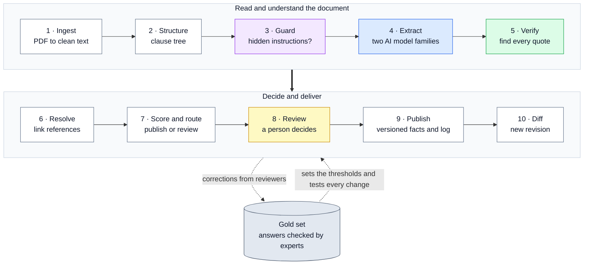
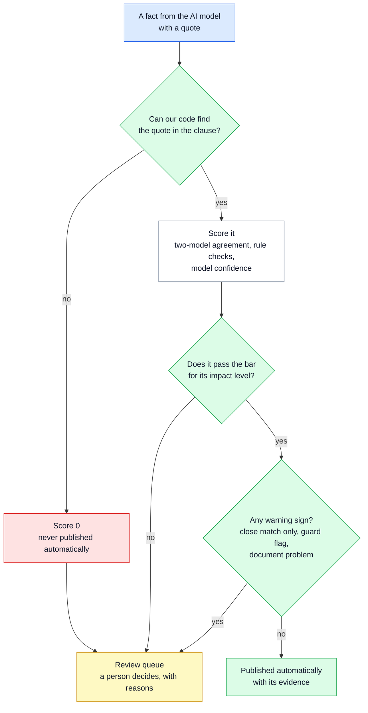

# 🤖 01 — System Overview: What regextract does, in simple words

> **In one line:** regextract reads a regulation, pulls out the important facts, and publishes a fact only if our code finds its exact words in the document.

---

## 📌 The task we were given

Adherent (formerly Compliance & Risks) gave a take-home exercise for a Senior AI Engineer role. They asked for two things:

1. **A design** for an AI system. The system reads regulatory documents and pulls out:
   - important **clauses** (numbered parts of the document, such as a definition or a rule), and
   - important **entities** (names of organisations, dates, money amounts, product types, references to other laws or standards).

   Every result must link to **evidence** (where it came from) and carry a **confidence or review signal** (how sure we are, or whether a person must check it).
2. **A small proof of concept.** Working code for one part of the design that is important or risky.

They gave one sample document: **CARL-01**, an 8-page document from the UAE about registering low-voltage electrical products. [02 — The Task and the Sample Document](02_THE_TASK_AND_THE_SAMPLE_DOCUMENT.md) explains it in detail.

**What we submitted:**

| File | What it is |
|---|---|
| `Solution Highlights.pdf` | The whole piece of work on one page |
| `Solution Design.pdf` | The design (6 pages). Page 1 shows the whole system |
| `Solution Diagrams.pdf` | 14 diagrams, one per page |
| `regextract.zip` | The proof of concept: code, 109 automated tests, sample outputs, recorded model replies |
| `SUBMISSION.md` | The index and a 10-minute reading order |

---

## 🌟 The one idea

**A simple picture.** A student writes an essay and uses quotes from a book. The student also writes the page number for each quote. A careful teacher does not trust those page numbers. The teacher opens the book and looks for each quote. If the quote is not in the book, the point does not count, however confident the student sounds.

In regextract, **the AI model is the student** and **our code is the careful teacher.**

**Why this matters.** Most errors are loud: a program crashes, or an answer is obviously empty. The dangerous error is quiet. A fact that looks correct, but is not in the source, flows into a compliance system and nobody notices. We call this a **silent failure**. The whole design exists to stop it.

So the centre of the system is the **grounding gate**:

- The model gives us a fact and a **quote** (the exact words that support it).
- Our code searches for that quote in the document.
- Our code works out the page and the character position from where it found the quote. The model never gives us a position.
- If our code cannot find the quote, the fact is **never published**, no matter how confident the model was.

[06 — Grounding Gate and Verify](06_GROUNDING_GATE_AND_VERIFY.md) explains exactly how the search works.

---

## ❓ The three questions every fact must answer

Downstream systems (other software that uses our output) act on these facts. So before any fact is published, the system must answer three questions:

| Question | How the system answers it |
|---|---|
| **Where did this fact come from?** | **Evidence:** the exact words, the page, and the character position. Our code finds them. |
| **How sure are we?** | **A score** from checks we run ourselves: Are the words really in the source? Do two different AI models agree? Do simple rule checks pass? The model's own confidence counts least. |
| **Who checks it?** | **A routing decision with reasons:** publish automatically, or send to a person. The more harm a mistake can cause, the higher the bar. |

---

## 🏗️ The ten steps

The system works like a factory line. A document goes in at step 1. Checked facts come out at step 9. Step 10 compares a new version of a document with the old one.

The diagram below shows the ten steps. Colours: white = code, purple = guard, blue = AI model, green = check or gate, yellow = person, grey = stored data.



There are two loops. **First**, every correction a reviewer makes is saved as a checked answer (the "gold set"). The gold set tests every future change and sets the publishing thresholds. **Second**, when a new revision of a document arrives, it starts again at step 1, and step 10 finds what changed.

| Step | What it does, in simple words | Who does it | Read more |
|---|---|---|---|
| **1 · Ingest** | Turns the PDF into one clean text. Removes the header and footer that repeat on every page. Remembers where every character came from. | Code | [04](04_INGEST_AND_STRUCTURE.md) |
| **2 · Structure** | Splits the text into clauses (1, 2.1, 7.1.1.6 ...) and builds a tree from the numbering. | Code (AI only if the numbering fails) | [04](04_INGEST_AND_STRUCTURE.md) |
| **3 · Guard** | Checks the text for hidden instructions aimed at the AI, such as "ignore previous instructions". | Code, plus an optional safety model | [08](08_GUARDRAILS.md) |
| **4 · Extract** | Sends each clause to two AI models from different companies. Each returns facts in a fixed format. | AI model | [05](05_EXTRACTION_AND_MODEL_GATEWAY.md) |
| **5 · Verify** | Finds every quote in the source. Runs simple rule checks. Compares the two models' answers. | Code | [06](06_GROUNDING_GATE_AND_VERIFY.md) |
| **6 · Resolve** | Links a reference such as "ECAS General Requirements" to a document we already hold, or says NOT_FOUND. | Code (with search) | [09](09_REFERENCE_LINKING.md) |
| **7 · Score and route** | Gives each fact a score. Decides: publish now, or send to a person, with reasons. | Code | [07](07_SCORING_AND_ROUTING.md) |
| **8 · Review** | A person accepts, corrects or rejects a fact. A correction is checked again. | Person | [10](10_HUMAN_REVIEW_AND_PUBLISH_LOG.md) |
| **9 · Publish** | Writes versioned facts and adds each publication to a log that shows any tampering. | Code | [10](10_HUMAN_REVIEW_AND_PUBLISH_LOG.md) |
| **10 · Diff** | When a new revision of the document arrives, finds what changed. Only changes go back to review. | Code | [11](11_CHANGE_DETECTION.md) |

> [!IMPORTANT]
> Only step 4 needs an AI model to extract facts. Every decision (what to trust, what to publish, what a person must check) is made by normal code with automated tests.

---

## 🧱 Four rules for every step

1. **We check the evidence. We do not ask the model for it.** A fact is published only if our code finds its quote in the source.
2. **Every failure must be visible.** A failed AI call must never look like "this clause has no facts". We say it failed. This is called **failing closed**: when in doubt, stop and ask a person.
3. **AI models extract. Code decides.** Structure, checking, scoring, routing and publishing are normal code.
4. **Spend review time where the risk is.** The bar for automatic publishing rises with the harm a mistake can cause. Every fact sent to a person carries a clear reason.

---

## 🚦 How one fact is published or sent to a person

This diagram shows the decision for one fact, from the moment the AI model returns it.



The bar depends on **impact** (how much harm a wrong fact can cause):

| Impact | Examples | Published automatically only if |
|---|---|---|
| **High** | dates, time periods, money and number limits; obligations about validity, enforcement, exemptions or scope | score ≥ 0.90 **and** both models agree **and** every rule check passes |
| **Medium** | other obligations, references to other laws and standards, product categories | score ≥ 0.80 |
| **Low** | organisations, people, roles, places | score ≥ 0.75 |

> [!NOTE]
> These numbers are **starting values**, not measured ones. In production they come from a "gold set" (answers checked by experts). See [07 — Scoring and Routing](07_SCORING_AND_ROUTING.md).

---

## 📊 What the proof of concept shows

The code runs in two modes. **Offline** (the default) needs no API key and costs nothing. A rule-based stand-in plays the part of the AI model. So offline numbers prove that the **checks** work. They do not measure how good an AI model is. **Live** mode calls real AI models.

| Measure | Offline (stand-in, no cost) | Live run (real free-tier models) |
|---|---|---|
| Clauses found in CARL-01 | 73 | 73 |
| Facts extracted | 153 | 353 |
| Quotes our code found in the source | 153 of 153 | 335 of 353 (320 exact, 15 close) |
| Facts stopped because the quote was not found | 0 | 18 |
| Published automatically | 133 | 0 (the whole document was held for review: the safe result) |
| Planted fake facts stopped | 18 of 18 | — |
| Failure classes passed (9 common problems) | 9 of 9 | 6 of 9 |
| Hidden-instruction attacks caught (7 in total) | 5 of 7 (pattern scanner only) | 6 of 7 (with the safety model, in a separate live attack test) |
| Automated tests | 109 pass | — |
| Cost | $0 | about $0.02 |

Details: [12 — Evaluation and Testing](12_EVALUATION_AND_TESTING.md) and [13 — Live Run Results](13_LIVE_RUN_RESULTS.md).

---

## 🧑‍💻 Run it yourself (no API key needed)

```bash
cd regextract
pip install -r requirements.txt
python run.py doctor                                           # check the setup
python run.py evaluate --pdf data/CARL-01.pdf                  # run everything and score it
python run.py evaluate --pdf data/CARL-01.pdf --inject-faults  # plant fake facts, watch them get stopped
python run.py redteam  --pdf data/CARL-01.pdf                  # attack the guard step
python -m pytest -q                                            # 109 tests
```

All commands: [16 — Tech Stack, Config and Commands](16_TECH_STACK_CONFIG_AND_COMMANDS.md).

---

## 📂 Project organisation

The code has one folder (package) for each step of the pipeline:

*   **`regextract/contract.py`**: the output format. Every other part uses it.
*   **`regextract/normalize.py`**: text cleaning and quote finding (the heart of the grounding gate).
*   **`regextract/document/`**: steps 1 and 2. Reads the PDF and builds the clause tree.
*   **`regextract/guardrails/`**: step 3. Looks for hidden instructions.
*   **`regextract/extraction/`**: step 4. One AI call per clause, and the prompts.
*   **`regextract/llm/`**: how we call AI models: routes, fallbacks, recorded replies, the offline stand-in.
*   **`regextract/verification/`**: step 5. The grounding gate, rule checks, document-level checks.
*   **`regextract/resolution/`**: step 6. Links references to documents we hold.
*   **`regextract/routing/`**: step 7. Scores and routes facts; the optional judge orders the queue.
*   **`regextract/review/`**: step 8. A reviewer's accept, reject and correct decisions.
*   **`regextract/publishing/`**: steps 9 and 10. Outputs, the tamper-evident log, and the diff.
*   **`regextract/pipeline/`**: joins all steps into one run (LangGraph), with pause, resume and the run record.
*   **`regextract/evaluation/`**: the evaluation report and the attack test (red team).
*   **`run.py`**: the command line. **`tests/`**: 109 automated tests.

---

## 🗣️ Say it like this

> "The model reads. Our code decides. The model gives us a fact and the exact words it came from. Our code looks for those words in the document. If we cannot find them, the fact is never published. On top of that, two different AI models read every clause. Simple rules check each fact. And the riskier the fact, the higher the bar before it is published without a person."

---

## 🚀 Quick navigation

1.  **The task**: [02_THE_TASK_AND_THE_SAMPLE_DOCUMENT.md](02_THE_TASK_AND_THE_SAMPLE_DOCUMENT.md)
2.  **The output format**: [03_OUTPUT_CONTRACT.md](03_OUTPUT_CONTRACT.md)
3.  **Steps 1-2**: [04_INGEST_AND_STRUCTURE.md](04_INGEST_AND_STRUCTURE.md)
4.  **Step 4**: [05_EXTRACTION_AND_MODEL_GATEWAY.md](05_EXTRACTION_AND_MODEL_GATEWAY.md)
5.  **Step 5**: [06_GROUNDING_GATE_AND_VERIFY.md](06_GROUNDING_GATE_AND_VERIFY.md)
6.  **Step 7**: [07_SCORING_AND_ROUTING.md](07_SCORING_AND_ROUTING.md)
7.  **Step 3**: [08_GUARDRAILS.md](08_GUARDRAILS.md)
8.  **Step 6**: [09_REFERENCE_LINKING.md](09_REFERENCE_LINKING.md)
9.  **Steps 8-9**: [10_HUMAN_REVIEW_AND_PUBLISH_LOG.md](10_HUMAN_REVIEW_AND_PUBLISH_LOG.md)
10. **Step 10**: [11_CHANGE_DETECTION.md](11_CHANGE_DETECTION.md)
11. **Testing**: [12_EVALUATION_AND_TESTING.md](12_EVALUATION_AND_TESTING.md)
12. **Live run**: [13_LIVE_RUN_RESULTS.md](13_LIVE_RUN_RESULTS.md)
13. **Production**: [14_PATH_TO_PRODUCTION.md](14_PATH_TO_PRODUCTION.md)
14. **Decisions and limits**: [15_DECISIONS_TRADEOFFS_AND_LIMITS.md](15_DECISIONS_TRADEOFFS_AND_LIMITS.md)
15. **Tools and commands**: [16_TECH_STACK_CONFIG_AND_COMMANDS.md](16_TECH_STACK_CONFIG_AND_COMMANDS.md)
16. **Word list**: [17_GLOSSARY.md](17_GLOSSARY.md)
17. **Presenting**: [18_PRESENTATION_GUIDE.md](18_PRESENTATION_GUIDE.md)
