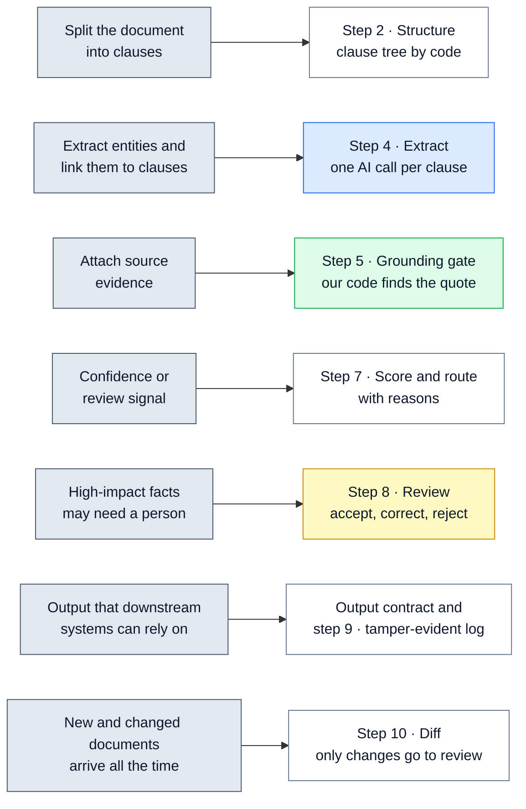
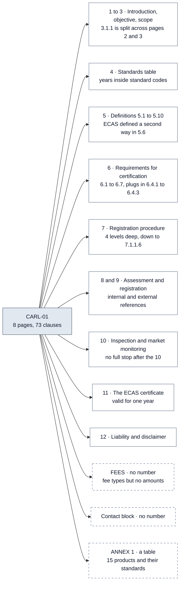

# 📋 02 — The Task and the Sample Document: what was asked, and what CARL-01 looks like

> **In one line:** Adherent asked for a trustworthy way to turn legal documents into facts, and gave us one short UAE document full of small traps to test it on.

---

## 🧭 Where this fits

This doc comes before all the technical docs. It explains **the problem**: what the company asked for, how we broke the problem into parts, and what the sample document looks like. Every design choice in the later docs is an answer to something on this page.

---

## 📌 What Adherent asked for

Adherent (formerly Compliance & Risks) helps large companies follow the rules in many countries. Its software reads laws and standards and turns them into facts that other systems can act on. The take-home exercise is a small version of that job.

**The task, in simple words:**

| Part | What they asked for |
|---|---|
| **A design** | A reliable AI system that reads regulatory documents and pulls out **clauses** (numbered parts, such as a definition or a rule) and **entities** (organisations, people, places, dates, money limits, product types, references to other laws or standards). Each result must link to its **source evidence** and carry a **confidence or review signal**. |
| **A proof of concept** | A small piece of working code for **one part** of the design that is important or high-risk. It must produce output that they can inspect. |
| **Supporting material** | Sample output, assumptions, README notes. Only what adds value. |

They also said: keep the code part narrow. No user interface and no production deployment are expected.

### The assumptions they suggested

| Area | Suggested assumption |
|---|---|
| **Volume** | Thousands of documents per jurisdiction (per country or region). New and changed documents arrive all the time. Sometimes a big batch of old documents arrives at once (a **backfill**). |
| **Documents** | 5 to 300+ pages. PDF and HTML (web pages). Tables, footnotes, cross-references, some scanned pages. |
| **Languages** | English first. Other languages must be possible later. |
| **Accuracy** | High precision matters more than speed. **Precision** means: when we say something is a fact, it really is. High-impact or low-confidence facts may need a person before they are published. |

### What they look for

- How we break a problem into parts and decide what matters first.
- How we think about reliability, evidence, evaluation (testing quality), uncertainty and human review.
- How the system could be deployed, observed, maintained and grown.
- How practical and clear the code is.
- Clear communication, owning our decisions, and discussing alternatives and limits.

### The interview

The interview is **90 minutes**. We walk through the submission, the decisions, the alternatives we considered, how things can fail, and how we would take it to production. They may **change a constraint** ("what if half the documents are scanned?") and ask us to think out loud. There is no live coding test. They care more about reasoning than about polish.

---

## 🧩 How we broke the problem down

**The simple picture.** Imagine a bank that copies numbers from paper forms into a computer. A typo that makes the computer crash is annoying, but someone notices it. A typo that puts a wrong but believable number into an account is much worse. Nobody notices until real harm is done.

The same is true here. Other systems (compliance, risk, workflow software) will **act** on our facts. So we asked one question first: **which failure is the most dangerous?**

| Kind of failure | Is it loud or quiet? | Example |
|---|---|---|
| The program crashes | Loud: someone sees an error | A PDF cannot be opened |
| A clause is missing from the output | Can be quiet | The model call failed and returned nothing |
| A fact is invented or changed | **Quiet**: it looks exactly like a real fact | The model writes "valid for two years" when the text says "one year" |

The quiet failures are the dangerous ones. We call them **silent failures**. So the design centres on three questions that every fact must answer (see [01 — System Overview](01_SYSTEM_OVERVIEW.md)):

1. **Where did this fact come from?** (evidence)
2. **How sure are we?** (a score from checks we run ourselves)
3. **Who checks it?** (publish automatically, or send to a person)

**Why the proof of concept focuses on the grounding gate.** The brief asked us to build the part that is "important or high-risk". The riskiest part is trusting what an AI model says. So the proof of concept makes the **grounding gate** real. The model gives a quote. Our code must find that quote in the document before the fact can go anywhere. Around it, the proof of concept also builds the checks that decide what a person must review. [06 — Grounding Gate and Verify](06_GROUNDING_GATE_AND_VERIFY.md) explains the gate.

The diagram below shows how each thing the brief asks for maps to a part of our system.

Grey boxes on the left are what the brief asks for. Boxes on the right are the parts of our system that answer each one.

---

## ➕ The assumptions we added

The brief allowed us to add our own assumptions. We added six, because each one changes the design:

| Our assumption | What it changes in the design |
|---|---|
| **Batch processing is acceptable** (results can take minutes or hours, not seconds) | Two AI runs per clause and a strong main model are affordable. Backfills can use a cheaper batch service. |
| **Text-based English PDFs come first** | HTML and scanned pages reuse the same document model later. The proof of concept only reads text PDFs. |
| **Sources are public regulatory texts** | A hosted AI service is acceptable. Client documents would need a private setup. |
| **Analysts own the taxonomy** (the list of fact types) | Engineers version it. Any change re-runs the regression tests (tests that check nothing got worse). |
| **Review capacity is fixed** (a team can only check so many facts a day) | Thresholds follow the queue the team can actually clear. |
| **One clause at a time, with its parent headings** | Exact positions, parallel work, fixed cost per call, and retry and testing per clause. [05](05_EXTRACTION_AND_MODEL_GATEWAY.md) compares this with sending the whole document at once. |

---

## 📄 The sample document: CARL-01

**What it is.** "Requirements for Registration of Low Voltage Equipment". It belongs to the **Emirates Conformity Assessment Scheme (ECAS)** and is issued by **ESMA** (the Emirates Authority for Standardization and Metrology) in the **UAE**. It is **Revision 4**, it has **8 pages**, and its footer shows a **Date of Review: March 1, 2014**.

**What it is about.** Before a company can sell electrical products (such as water heaters, irons or fans) in the UAE, the product must be registered. The document lists the rules: what documents to submit, how products are tested, how long the certificate is valid, and so on.

### A guided tour of the sections

This diagram shows how CARL-01 is organised. Our code turns it into **73 clauses**, up to **4 levels** deep.

The boxes with a dashed border are the parts with **no clause number**. Our code gives them made-up ids: `FEES`, `CONTACT` and `ANNEX-1` ([04](04_INGEST_AND_STRUCTURE.md) explains how).

| Section | What it says, in short |
|---|---|
| **1 Introduction** | This document sets the criteria to register products under ECAS, for manufacturers and traders. |
| **2 Objective** | Electrical equipment must be safe for people, animals and property. 2.1: technical requirements (IEC and UAE standards). 2.2: administrative requirements (procedures, marking, files). |
| **3 Scope** | 3.1.1: covers equipment rated 50 to 1000 volts AC and 75 to 1500 volts DC ("Low Voltage Equipment"). 3.1.2: does not apply to products excluded by UAE / IEC 60335-1. |
| **4 Standards** | A table: UAE / IEC 60335-1: 2007, IEC 60335 Part 2's (see Annex 1), IEC 60884-1 for extension cords. |
| **5 Definitions** | 5.1 ESMA (mandated by Federal Law No. 28), 5.2 low voltage equipment, 5.3 approved supplier, up to 5.10 approved standard. |
| **6 Requirements** | Components must comply, a Declaration of Conformity, plugs to BS 1363 or BS 546, a user manual in Arabic and English, country-of-origin marking. |
| **7 Registration** | 7.1.1: submit an application form with six documents (7.1.1.1 to 7.1.1.6), fees, a location map, product samples. |
| **8 Assessment** | 8.1 points to "clause no. 6 of ECAS General Requirements". 8.3 points to "clause 4 of this document". Samples are tested by an ESMA-recognised lab. The applicant pays. |
| **9 Registration** | The product is registered after full confirmation; failed products can reapply; a certificate is issued. |
| **10 Inspection** | Products are inspected at the port of entry. ESMA "reserves the right" to inspect factories and take market samples. |
| **11 Certificate** | 11.2: the supplier "may" use the certificate. 11.3: care "should" be taken. 11.4: the certificate is "valid for one year", with renewal "a month before the expiration". |
| **12 Liability** | ESMA is not responsible for legal actions against suppliers. It keeps documents confidential. |
| **FEES** | Three fee types (application, operational, certification decision). **No amounts at all.** |
| **Contact** | ESMA address, phone, email and website in Dubai. |
| **Annex 1** | A table of 15 products (water heater, microwave oven, fans ...) and the standards each one must meet. |

### The traps inside CARL-01

The document is short, but it contains many small problems that real regulatory documents have. Each trap is tested by one of the **nine failure classes** (A to I), our list of common problems. [12 — Evaluation and Testing](12_EVALUATION_AND_TESTING.md) shows the results.

| Trap | Where in CARL-01 | Why it is hard | Failure class | How the system handles it |
|---|---|---|---|---|
| Damaged headings | Section headings are underlined; the underline leaks into the text as a stray letter "U" | Depending on the PDF reader, the "U" is glued to the heading ("UINTRODUCTIONU:", "U12. LIABILITY") or sits on its own line. A careless fix would also break "UAE". | A | Repeated lone "U" lines are removed with the header and footer. A glued "U" is repaired only on lines that look like headings. "UAE" is left alone. |
| Header and footer on every page | "Form: Requirements for ... Identification no.: CARL-01", "Page (2) of (8) Revision: 4 ..." | Repeated text would end up inside clauses | A | Lines seen on most pages are removed. The document id, revision and review date are read from them first. |
| A clause split across two pages | Clause 3.1.1 starts on page 2 and ends on page 3 | A page-by-page reader would cut it in half | B | All pages are joined into one text before clauses are found. 3.1.1 is one clause, pages 2 to 3. |
| Irregular numbering | "10 INSPECTION" has no full stop; 4 levels (7.1.1.6); FEES, contact and Annex have no number | Numbering rules that work for "6." miss "10" | C | Special rules plus made-up ids (`FEES`, `CONTACT`, `ANNEX-1`). |
| Table rows that look like clause numbers | Annex rows "1 Water Heater ...", "10 Electromechanical Kitchen Appliances" | They start with a number, like a clause | C, I | A number with no full stop starts a clause only if the rest of the line is in capital letters. |
| Years inside standard codes | "IEC 60335-1: 2007", "2002 5th Ed.", "+ A1:2004" | A model may call 2007 a date | D | A prompt rule says these years are part of the standard. The failure class checks there are zero dates in section 4 and the Annex. |
| Voltage and current limits | 50 to 1000 V AC, 75 to 1500 V DC, 15 Ampere | Numbers must be exact, with units | D | Extracted as numeric thresholds. A rule check makes sure the number appears in the quote. |
| No money amounts | The FEES section lists fee types but no amounts | A model may "helpfully" invent an amount | E | "An empty list is a correct answer" is in the prompt. The failure class checks there are zero money facts. |
| No effective date | The only date is the footer's **review** date, March 1, 2014 | A review date is not the date the rules start | E | `review_date` is set to 2014-03-01. `effective_date` is left empty on purpose. |
| No named people | Only organisations and roles appear | A model may invent a person | E | The failure class checks there are zero "individual" facts. |
| References inside and outside the document | 8.3 "clause 4 of this document" (internal); 8.1 "clause no. 6 of ECAS General Requirements" (external); 2.1 "Annex I" | Internal and external look alike. "Annex I" is written "ANNEX 1" elsewhere. | F | The prompt explains internal and external. External references are linked to known documents or marked NOT_FOUND ([09](09_REFERENCE_LINKING.md)). |
| A term defined two ways | Section 1: "Emirates Conformity Assessment **Scheme** (ECAS)". Clause 5.6: "ECAS – Emirates Conformity Assessment **Systems**" | A downstream system might pick one at random | G | Code finds an acronym with two expansions and flags it. Facts that use "ECAS" go to a person. |
| Typos in the source | "low voltage equipments", "raise by any party", "misused the certificate" | A model may silently correct them, and then the quote no longer matches | G | The prompt says: never correct the source. The failure class checks all three typos are kept. |
| Hidden or passive subjects | 8.3 "Samples shall be collected by ESMA"; 11.4 renewal "shall be required" but never says by whom | Who must act is not at the start of the sentence, or is missing | H | Prompt rules for passive voice. An empty subject is allowed. If the two models disagree, a person checks. |
| Different strengths of rule | "shall", "must", "should" (11.3), "may" (11.2), "reserves the right" (10.4, 10.5) | A permission is not an obligation | H | Five modality values: shall, must, should, may, reserves_right. |
| A table of products and standards | Annex 1: 15 products, each linked to one or more standards | Tables are hard to read from plain text | I | The Annex is kept as one clause. Its 15 product-to-standard links are recovered from the text and each quote is checked. |

> [!NOTE]
> Most of these traps are not special to CARL-01. Every one is a general problem (for example "a clause split across pages") with a CARL-01 example. That is how the design stays general while being tested on one document.

---

## 🗣️ Say it like this

> "The brief asked for a design and a small proof of concept for the riskiest part. We decided the riskiest part is trusting what the AI model says, because an invented fact looks exactly like a real one. So the proof of concept makes the evidence check real. CARL-01 is only 8 pages, but it has most of the traps real documents have. For example: a clause split across pages, a term defined two ways, a fees section with no amounts, and a table. We turned each trap into an automated check."

---

## ⚠️ Limits and honest notes

- **One document.** Everything was built and tested on CARL-01 only. The failure classes are general, but real coverage needs many more documents.
- **Text PDFs only.** HTML and scanned pages are in the design, not in the code.
- **Our added assumptions matter.** If results were needed in seconds instead of minutes, or if documents were confidential client files, parts of the design would change. Docs [14 — Path to Production](14_PATH_TO_PRODUCTION.md) and [15 — Decisions, Trade-offs and Limits](15_DECISIONS_TRADEOFFS_AND_LIMITS.md) discuss this.
- **A stray "U U" line stays in clause 1.** With the PDF reader version we use, one line holding only the letters "U U" is not removed. It does no harm (quotes are still found), but it shows that text cleaning is never perfect.

---

## 📚 See also

- [01 — System Overview](01_SYSTEM_OVERVIEW.md): the whole system on one page
- [03 — Output Contract](03_OUTPUT_CONTRACT.md): the exact shape of every fact
- [04 — Ingest and Structure](04_INGEST_AND_STRUCTURE.md): how CARL-01 becomes 73 clauses
- [12 — Evaluation and Testing](12_EVALUATION_AND_TESTING.md): the nine failure classes and their results
- [17 — Glossary](17_GLOSSARY.md): every technical word in plain English
