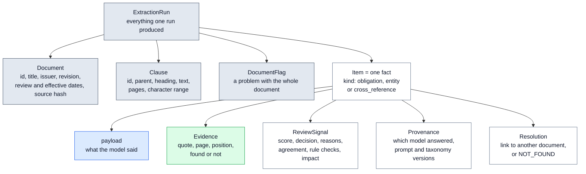
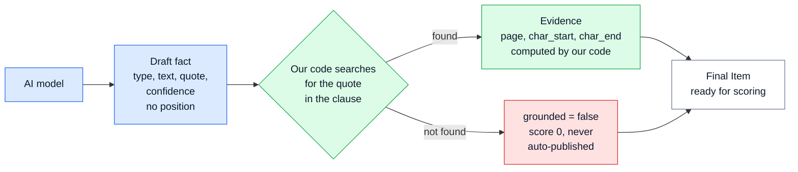
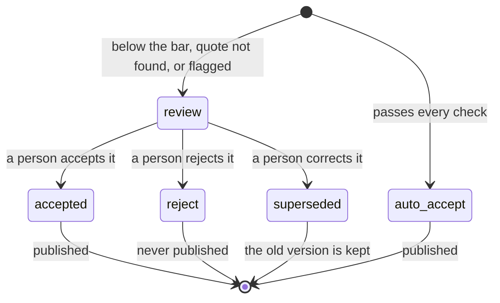

# 📐 03 — Output Contract: the exact shape of every fact

> **In one line:** the contract is a fixed form that every fact must fill in. Our code, not the AI model, fills in where the fact came from.

---

## 🧭 Where this fits

The contract is used by **every step**. The AI model fills part of it in step 4. Our code checks it in step 5, scores it in step 7, and publishes it in step 9. Downstream systems (other software that uses our output) read it. It lives in one file: `regextract/contract.py`.

---

## 🤔 The simple picture

Think of a passport office. Every passport has the same boxes in the same places: name, date of birth, photo, number, stamp. A border guard in any country knows where to look. Nobody writes a passport as a free-form letter.

Our output works the same way. Every fact has the same boxes: what the fact is, the exact quote, the page, the character position, the score, the decision, and which model produced it. A compliance system can read any fact without guessing.

There is one more rule, like a passport office that fills in the passport number itself. The applicant writes their name, but **the office** adds the official number and stamp. In our system the AI model writes the fact and the quote, but **our code** adds the page and the position after it finds the quote.

---

## ❓ Why we need it

| Problem | What goes wrong without it |
|---|---|
| Each model call returns a slightly different shape | Downstream systems break, or silently read the wrong field |
| The model reports where it found a fact | The model can invent a page number or position, and nobody can tell |
| The prompt is treated as the product | Changing a sentence in the prompt quietly changes what customers receive |
| Facts have random ids | Running the same document twice gives different ids, so "what changed?" cannot be answered |
| A correction overwrites the old fact | Nobody can prove what was published last month |

> [!IMPORTANT]
> **The contract is the product, not the prompt.** Downstream systems read the contract. The prompt is only one way to fill it in. We could change the model, the prompt or the provider, and customers would still receive the same shape.

---

## ⚙️ How it works

### One definition, used four ways

The contract is written once, in **pydantic** (a Python library that describes data shapes and checks them). The same definition is used four times:

1. **The form the model fills in.** It becomes the JSON schema (a machine-readable description of the fields) sent to the model.
2. **The check on every reply.** A reply that does not fit is rejected and sent back with the error ([05](05_EXTRACTION_AND_MODEL_GATEWAY.md)).
3. **The data the pipeline works on.** Verification and routing read these objects.
4. **What downstream systems receive.** The published JSON has exactly this shape.

### The objects

This diagram shows what one run produces and what each fact carries.



Only the blue box comes from the AI model. Everything else is filled in by our code.

| Object | What it holds | Who fills it in |
|---|---|---|
| **Document** | id, title, issuer, jurisdiction, revision, review date, effective date (empty when absent), language, source hash, page count, pipeline version | Code (read from the PDF footer in step 1) |
| **Clause** | id (such as `7.1.1.6`), parent, path, heading, exact text, first and last page, start and end character | Code (step 2) |
| **Item** (one fact) | a stable id, the kind, the type, the clause id, the payload, and the four objects below | Code builds it around the model's payload |
| **Evidence** | clause id, page, `char_start`, `char_end`, the quote, `grounded` (found or not), how it was matched (exact or fuzzy) and the match score | Code (step 5). **Never the model.** |
| **ReviewSignal** | score, decision, reasons, agreement, rule-check results, impact tier, judge priority, notes, and who reviewed it and when | Code (steps 5, 7 and 8) |
| **Provenance** | the model asked for, the model that actually answered, prompt version, taxonomy version, run id, date | Code (from the model call's record) |
| **Resolution** | for external references only: the linked document, or NOT_FOUND with a reason | Code (step 6) |
| **DocumentFlag** | a code (such as `extraction_failed`) and details, for problems with the whole document | Code (step 5) |

### Draft versus final: the model never gives a position

This is the most important design choice in the contract. The model fills in a **draft**. A draft has a `quote` but **no page and no character position**. Our code finds the quote and adds the position.



Why? If the model could say "page 6, characters 100 to 180", it could also be wrong about it, and we would publish a wrong location with full confidence. The model can only **claim** a quote. Our code **checks** the claim.

Here is the real draft for an obligation, from `regextract/contract.py`. Notice there is no page or position field:

```python
class ObligationDraft(BaseModel):
    model_config = ConfigDict(extra="forbid")

    subject: str = Field(description="Who must act. A role, e.g. 'supplier'. Empty string if the source never says.")
    modality: Modality
    action: str = Field(description="What must be done.")
    condition: str = Field(description="Any condition or timing attached. Empty string if none.")
    quote: str = Field(description="The sentence from the clause that supports this, word for word.")
    confidence: float = Field(ge=0.0, le=1.0)
```

`extra="forbid"` means the model may not add fields of its own. A reply with an unknown field fails the check.

One reply covers one clause. It has four lists: `clause_types`, `obligations`, `entities` and `cross_references`. An empty list is a correct answer when the clause has nothing of that kind.

> [!NOTE]
> Some models wrap their reply in a list with one item. The contract accepts exactly that shape and unwraps it. Anything looser still fails. This fix came from the live run ([13](13_LIVE_RUN_RESULTS.md)).

---

## 🏷️ The taxonomy: the kinds of facts

The **taxonomy** is the fixed list of categories. Analysts own it. Its version is `taxonomy-v1-10types`, and the version is recorded on every fact.

### Three kinds of fact

| Kind | What it is | CARL-01 example |
|---|---|---|
| **obligation** | Who must do what, how strongly, under what condition | "Applicant shall bear all the cost related to the conformity assessment" (8.5) |
| **entity** | A named thing: an organisation, a date, a limit, a product, a standard ... | "ESMA", "one year", "IEC 60335-1: 2007" |
| **cross_reference** | A pointer to another clause or another document | "clause 4 of this document" (8.3), "clause no. 6 of ECAS General Requirements" (8.1) |

### Ten clause types

Each clause gets one or more types. The examples come from the prompt in `regextract/extraction/prompts.py`.

| Clause type | Meaning | CARL-01 example |
|---|---|---|
| `definition` | A term is being defined | "ESMA - The Emirates Authority for Standardization and Metrology" |
| `scope` | What the document covers | "input voltage rating between 50 and 1000 volts" |
| `exemption` | What is excluded | "shall not apply to the products excluded by UAE / IEC 60335-1" |
| `requirement` | Something that must be satisfied | "Users Manual in Arabic and English language" |
| `responsibility` | Who carries a duty, cost or risk | "Applicant shall bear all the cost" |
| `procedure` | An ordered process | "Upon the acceptance of the Application, Product shall be evaluated" |
| `enforcement` | A consequence, or an authority's power | "ESMA reserves the right to inspect" |
| `validity_and_dates` | Validity periods, renewal, dates | "shall be valid for one year" |
| `normative_reference` | A list of standards or references | "IEC 60335-1 : 2006" |
| `administrative` | Contact details, fee types, admin | "Conformity Affairs Department" |

### Eleven entity types

| Entity type | CARL-01 example |
|---|---|
| `organisation` | ESMA, Ports and Customs Authorities |
| `individual` | **none**: CARL-01 names no people, so this list must stay empty |
| `role` | manufacturer, trader, supplier, applicant |
| `location` | UAE, Dubai, Port of Entry |
| `date` | **none in the clauses**: the only date is the footer's review date, which goes on the Document |
| `time_period` | "one year" (11.4), "a month" (11.4) |
| `monetary_threshold` | **none**: the FEES section names fee types but no amounts |
| `numeric_threshold` | "between 50 and 1000 volts", "1500 volts", "15 Ampere" |
| `product_category` | Water Heater, Microwave Ovens, Room Air Conditioners (Annex 1) |
| `standard_reference` | "IEC 60335-1: 2007", "BS 1363", "UAE.S 60335-2-13" |
| `legal_reference` | "Federal Law No. 28" (5.1), "ECAS General Requirements" (8.1) |

> [!TIP]
> The three "none" rows are deliberate tests. A model that invents a fee amount, a person or a date fails failure class E ([12](12_EVALUATION_AND_TESTING.md)).

### Obligation strength (modality)

| Value | Meaning | CARL-01 example |
|---|---|---|
| `shall`, `must` | Mandatory | "Samples shall be tested by an ESMA recognized third party testing laboratory" (8.4) |
| `should` | Recommendation | "Care should be taken so as not to misused the certificate" (11.3) |
| `may` | Permission | "The supplier may also use the Certificate in trading their product" (11.2) |
| `reserves_right` | The authority may act if it chooses | "ESMA reserves the right to inspect" (10.4) |

The design groups these five values into four strengths: mandatory, recommendation, permission and authority discretion.

---

## 🔑 Stable ids: the same fact always gets the same id

Every fact's id is built from its content:

```python
@staticmethod
def make_id(document_id: str, clause_id: str, kind: str, payload: dict) -> str:
    basis = f"{kind}|{sorted(payload.items())!r}"
    digest = hashlib.sha256(basis.encode("utf-8")).hexdigest()[:12]
    return f"{document_id}:{clause_id}:{digest}"
```

In simple words: take the kind of fact and everything it says. Run it through **SHA-256** (a function that turns any text into a fixed "fingerprint"). Keep the first 12 characters. So `CARL-01:1:bdf7fa4d0bb5` means "document CARL-01, clause 1, fact with fingerprint bdf7fa4d0bb5".

**Why it matters:**

- Running the same document twice gives the same ids. A test checks this.
- The publish log can tell "already published" from "new" ([10](10_HUMAN_REVIEW_AND_PUBLISH_LOG.md)).
- A reviewer's correction gets a **new** id, and it points back to the old one with `supersedes`. Nothing is overwritten.

---

## 🚦 Decisions: the life of a fact

Every fact carries one decision. This diagram shows how it moves between them.



| Decision | Meaning | Published? |
|---|---|---|
| `auto_accept` | Passed every gate. No person needed. | Yes |
| `review` | Waiting for a person. | Not yet |
| `accepted` | A reviewer accepted it as extracted. | Yes |
| `reject` | A reviewer rejected it. | Never |
| `superseded` | A reviewer corrected it. A new version (with `accepted`) replaces it. The old one is kept. | The old one: no. The new one: yes. |

A fact is published only if its decision is `auto_accept` or `accepted` **and** its quote was found. That second condition is checked again at the very end, just before publishing, as cheap insurance.

---

## 🔬 A real fact, field by field

This is one real fact from `samples/extractions.sample.json`. It comes from an **offline** run, so the "model" is the rule-based stand-in (you can see "(stub)" in the provenance).

```json
{
 "item_id": "CARL-01:1:bdf7fa4d0bb5",
 "kind": "entity",
 "type_name": "organisation",
 "clause_id": "1",
 "payload": {
  "type": "organisation",
  "text": "ESMA",
  "normalized": "",
  "quote": "for Standardization and Metrology (ESMA).",
  "confidence": 0.7
 },
 "evidence": {
  "clause_id": "1",
  "page": 2,
  "char_start": 277,
  "char_end": 318,
  "quote": "for Standardization and Metrology (ESMA).",
  "grounded": true,
  "match_kind": "exact",
  "match_score": 100.0
 },
 "review": {
  "score": 0.94,
  "decision": "auto_accept",
  "reasons": [],
  "agreement": 1.0,
  "validators": {
   "evidence_grounded": true,
   "entity_text_in_quote": true
  },
  "impact": "low",
  "judge_priority": null,
  "notes": [],
  "reviewer": "",
  "reviewed_at": "",
  "review_note": ""
 },
 "provenance": {
  "model": "anthropic/claude-opus-5 (stub)",
  "model_version": "anthropic/claude-opus-5 (stub)",
  "prompt_version": "extract-v1",
  "taxonomy_version": "taxonomy-v1-10types",
  "run_id": "6ba6d6e403d4",
  "timestamp": "2026-09-10"
 },
 "resolution": null,
 "supersedes": null
}
```

| Field | Value here | What it means |
|---|---|---|
| `item_id` | `CARL-01:1:bdf7fa4d0bb5` | Document, clause, and a fingerprint of the content |
| `kind` / `type_name` | entity / organisation | An organisation was found |
| `payload.text` | ESMA | The entity, word for word |
| `payload.quote` | "for Standardization and Metrology (ESMA)." | The words the model says support it |
| `payload.confidence` | 0.7 | The model's own confidence. It counts least in the score. |
| `evidence.page` | 2 | Computed by our code from where the quote was found |
| `evidence.char_start` / `char_end` | 277 / 318 | The exact position in the clean document text |
| `evidence.grounded` | true | Our code found the quote |
| `evidence.match_kind` / `match_score` | exact / 100.0 | Found word for word, not a close match |
| `review.agreement` | 1.0 | The second model found the same fact |
| `review.validators` | both true | The quote was found, and "ESMA" appears inside the quote |
| `review.score` | 0.94 | 0.45 × 1.0 (agreement) + 0.35 × 1.0 (rule checks) + 0.20 × 0.7 (confidence) |
| `review.impact` | low | Organisations are low impact, so the bar is 0.75 |
| `review.decision` | auto_accept | 0.94 is above 0.75 and there are no warning signs |
| `provenance.*` | model, versions, run id, date | Which model answered, with which prompt and taxonomy |
| `resolution` | null | Only external references get a link |
| `supersedes` | null | This is not a correction of an older fact |

### The clause 11.4 example: when the models disagree

Clause 11.4 says: "ECAS Registration Certificate shall be valid for one year. Renewal of registration shall be required a month before the expiration of the Registration Certificate." It never says **who** must renew.

That missing subject is a real risk. One model may leave the subject empty. Another may guess "supplier". The design's rule: this obligation is **high impact**, because it is in a clause about validity. If the two model families disagree on it, the fact goes to a person with the reason `models_disagree`.

The offline run shows exactly this row in `samples/review_queue.csv`:

| item_id | impact | score | agreement | reasons |
|---|---|---|---|---|
| `CARL-01:11.4:9dc7920e40e0` | high | 0.494 | 0.0 | models_disagree; high_impact_requires_full_agreement; high_impact_type |

The score is 0.45 × 0.0 + 0.35 × 1.0 + 0.20 × 0.72 = 0.494. Offline, the disagreement is simulated: the stand-in's second run drops one obligation, so the agreement signal has something to catch.

---

## 🗣️ Say it like this

> "The output format is the product, not the prompt. It is defined once in code and used four ways. It is the form the model fills in, the check on every reply, the data the pipeline uses, and what customers receive. The model fills in a draft with a quote but no position. Our code finds the quote and adds the page and position. Ids come from the content, so the same fact always gets the same id, and a correction creates a new version instead of overwriting the old one."

---

## ⚠️ Limits and honest notes

- **The id includes the model's confidence number.** With a real model, a re-run can give a slightly different confidence, and so a different id. The change detection step does not depend on ids (it compares clause and meaning, see [11](11_CHANGE_DETECTION.md)). But the publish log would record a withdrawal and a new publication. In production, unchanged clauses are not sent to the model again, so their facts and ids carry over.
- **The impact tier of an obligation depends on the clause type the primary model gives.** If the model labels a validity clause as "requirement", the obligation drops from high to medium impact. A safer rule would take the stricter tier from both models, or set clause types by code rules.
- **The taxonomy was designed from one document.** A second jurisdiction will probably need new types. Any change bumps the taxonomy version and re-runs the tests.
- **Tables are flattened.** Annex 1's product-to-standard links are separate entities in one clause. The contract has no "row" object yet.

---

## 📚 See also

- [01 — System Overview](01_SYSTEM_OVERVIEW.md): where the contract sits in the ten steps
- [05 — Extraction and Model Gateway](05_EXTRACTION_AND_MODEL_GATEWAY.md): how every reply is checked against the contract
- [06 — Grounding Gate and Verify](06_GROUNDING_GATE_AND_VERIFY.md): how our code fills in the Evidence
- [07 — Scoring and Routing](07_SCORING_AND_ROUTING.md): how the ReviewSignal is filled in
- [10 — Human Review and Publish Log](10_HUMAN_REVIEW_AND_PUBLISH_LOG.md): accepted, rejected and superseded facts
- [17 — Glossary](17_GLOSSARY.md): every technical word in plain English
