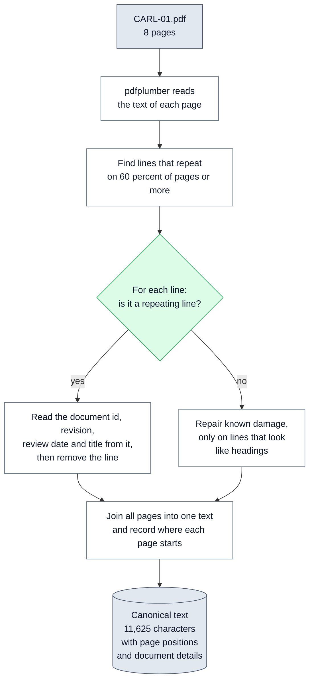
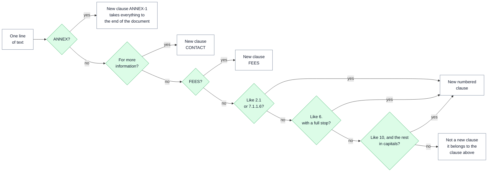
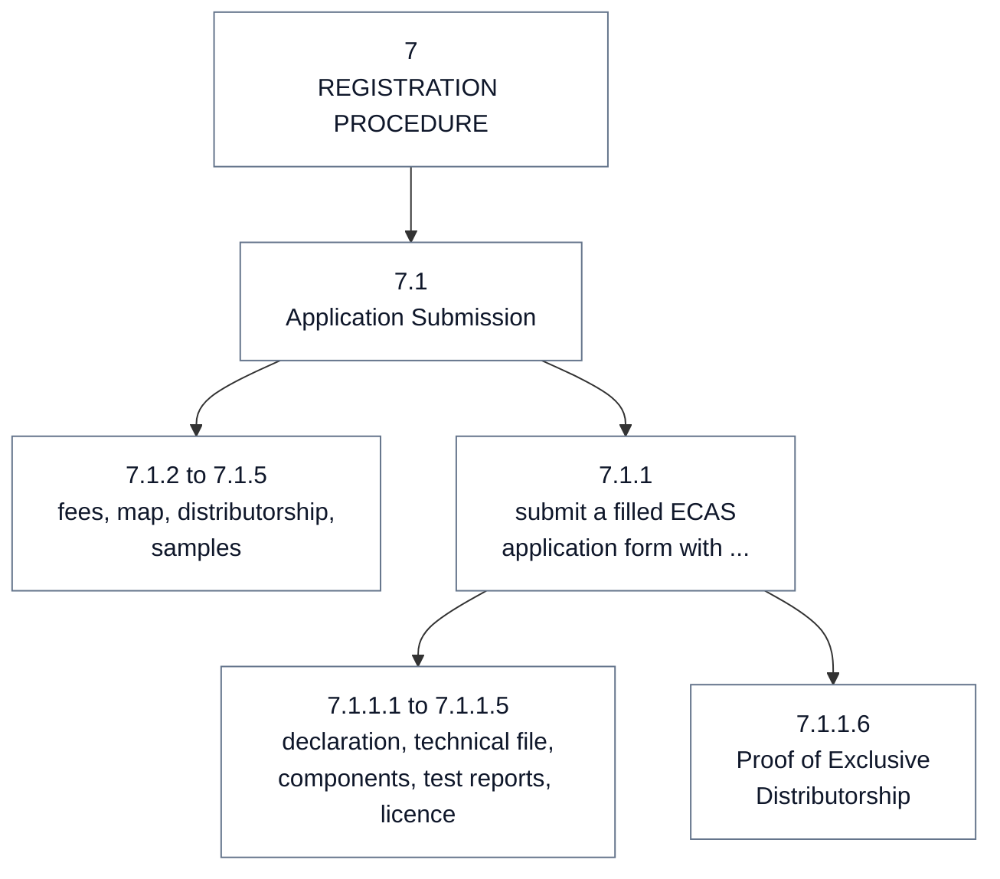

# 📥 04 — Ingest and Structure: from a PDF to a clean clause tree

> **In one line:** before any AI model sees the document, normal code turns the PDF into clean text and cuts it into clauses. It remembers where every character came from.

---

## 🧭 Where this fits

These are **steps 1 and 2** of the ten steps. Step 1 (**ingest**) reads the PDF. Step 2 (**structure**) finds the clauses. No AI model is used in either step. Every later step depends on them: if a clause is cut in the wrong place, every fact from it is wrong.

The code is in `regextract/document/ingest.py` and `regextract/document/segment.py`.

---

## 🤔 The simple picture

Imagine photocopying a book to study it. Each photocopied page has the book title at the top and a page number at the bottom. Before you study, you cut those off, tape the pages into one long strip, and number the paragraphs. You also keep a note: "character 2,211 is where page 3 starts". Now you can say exactly where any sentence came from.

That is steps 1 and 2. The "long strip" is the **canonical text** (one clean text for the whole document). The "note" is the list of **character offsets** (positions counted from the start of the text).

---

## ❓ Why we need it

| Problem | What goes wrong without it |
|---|---|
| The same header and footer appear on every page | They end up inside clauses, and the model extracts "Revision: 4" as a fact eight times |
| A clause runs over a page break | A page-by-page reader cuts clause 3.1.1 in half |
| The PDF text layer has damage (stray letters) | Stray "U" letters from underlined headings end up inside clause text or break clause numbers |
| Table rows start with numbers | "10 Electromechanical Kitchen Appliances" looks like clause 10 |
| No record of positions | We cannot tell anyone which page a fact came from |
| An AI model builds the structure | It is slower, costs money, and can be wrong in ways that are hard to test |

> [!IMPORTANT]
> **Why code and not AI here?** Numbering patterns are cheap to get right in code and expensive to get right with a model. And every later step depends on the tree being correct. So code builds the tree. The design keeps an AI model only as a fallback for documents where the numbering fails completely.

---

## ⚙️ Step 1: Ingest, step by step

This diagram shows how the PDF becomes one clean text.



### 1. Read each page

We use **pdfplumber**, a Python library that reads the text inside a PDF. It works page by page. The code keeps the raw text of every page.

### 2. Find the header and footer

The header and footer repeat on every page, but the page number changes: "Page (1) of (8)", "Page (2) of (8)". So we cannot just look for identical lines.

Instead, each line gets a **signature**: every group of digits becomes `#`, spaces are tidied, and letters become lower case. Now "Page (1) of (8)" and "Page (2) of (8)" have the same signature: `page (#) of (#) revision: # ...`. Any signature seen on at least 60% of the pages (for 8 pages, that is 4 pages or more) is treated as a header or footer.

```python
def _line_signature(line: str) -> str:
    """Collapse a line to a shape, so 'Page (1) of (8)' and 'Page (2) of (8)'
    are recognised as the same repeating furniture."""
    return _DIGITS.sub("#", " ".join(line.split())).lower()
```

In CARL-01 this removes **26 lines**, for example "Form: Requirements for Registration of Low Voltage Equipment Identification no.: CARL-01".

### 3. Read the document details from the footer, before throwing it away

The footer is useless inside clauses, but it holds useful facts about the document. Before removing a footer line, the code reads:

| Field | Found in the footer | Stored as |
|---|---|---|
| Document id | "Identification no.: CARL-01" | `CARL-01` |
| Title | "Form: Requirements for Registration of Low Voltage Equipment" | the title |
| Revision | "Revision: 4" | `4` |
| Review date | "Date of Review : March 1, 2014" | `2014-03-01` |
| Page count | "Page (1) of (8)" | `8` |

The **effective date** (the date the rules start to apply) is left **empty on purpose**. CARL-01 has no effective date. The only date is a **review** date, and a review date is not an effective date. Filling it in would be inventing a value (failure class E).

The code also stores a **source hash**: a fingerprint of the PDF file's bytes (`d1be194cb28cbeed` for CARL-01). If the file ever changes, the fingerprint changes. This matters later for spotting forged documents ([08](08_GUARDRAILS.md)) and new revisions ([11](11_CHANGE_DETECTION.md)).

### 4. Repair text-layer damage, carefully

CARL-01's headings are underlined. In the PDF, the underline leaks into the text as a stray letter **"U"**. Depending on the PDF reader and its version, it shows up in two ways:

- **On its own line.** With the pdfplumber version we pin (0.11.10), most "U"s sit alone on a line. A lone "U" line repeats on most pages, so step 2 above removes it with the footer.
- **Glued to the heading**, for example "1. UINTRODUCTIONU:" or "U12. LIABILITY". The code has four small repair rules for this form.

**Why the repair is so careful.** A simple rule would be "remove a U at the start of a word in capitals". But section 4 has a table heading "UAE STANDARD". That rule would turn it into "AE STANDARD" and damage the document. So the repair only runs on lines that **look like headings** (short, mostly capital letters, starting with a number or a capital word). And the rule that removes a trailing "U" only runs if another rule already fired on the same line. Failure class A checks that "UAE" appears untouched (39 times in the clean text).

The code also unwraps email and web links that the PDF stores as `0TU...U0T`. In CARL-01 the code makes **2 repairs** like this.

### 5. Join the pages and remember positions

All clean pages are joined into one text, with a new line between pages. For each page, the code records where it starts and ends:

| Page | Starts at character | Ends at character |
|---|---|---|
| 1 (cover) | 0 | 93 |
| 2 | 93 | 2,211 |
| 3 | 2,211 | 3,779 |
| ... | ... | ... |
| 8 | 10,251 | 11,625 |

Later, when our code finds a quote at character 277, it asks `page_for_offset(277)` and gets page 2. This is how every fact gets a real page number without asking the model.

> [!NOTE]
> Everything after step 1 sees only the canonical text. It never needs to know if the source was a PDF, a web page or a scan. That is what lets HTML and scanned pages be added later without changing steps 2 to 10.

---

## ⚙️ Step 2: Structure, step by step

Step 2 goes through the canonical text line by line and decides: **does this line start a new clause?**

This diagram shows the decision for one line.



"In capitals" means more than 80% of the letters in the rest of the line are capital letters.

### The three numbering rules

Here is the real code that decides if a line starts a numbered clause:

```python
def _classify(line: str) -> tuple[str, str] | None:
    """Return (clause_id, heading_text) if this line starts a clause."""
    stripped = line.strip()
    if not stripped:
        return None

    match = _DOTTED.match(stripped)
    if match:
        return match.group(1), match.group(2)

    match = _TOP_WITH_PERIOD.match(stripped)
    if match:
        return match.group(1), match.group(2)

    match = _TOP_NO_PERIOD.match(stripped)
    if match and _upper_ratio(match.group(2)) > 0.8:
        # "10 INSPECTION AND MARKET MONITORING" -- yes.
        # "10 Electromechanical Kitchen Appliances" -- no, that is a table row.
        return match.group(1), match.group(2)

    return None
```

| Line in CARL-01 | Rule | Result |
|---|---|---|
| `7.1.1.6 Proof of Exclusive Distributorship ...` | Dotted number | Clause `7.1.1.6` |
| `6. REQUIREMENTS FOR CERTIFICATION` | Number with a full stop | Clause `6` |
| `10 INSPECTION AND MARKET MONITORING` | No full stop, but the rest is in capitals | Clause `10` |
| `1 UAE / IEC 60335-1: 2007 IEC 60335-1 : 2006 Household and similar` (section 4 table) | No full stop, and the rest is mostly lower case | **Not** a clause: part of clause `4` |
| `10 Electromechanical Kitchen Appliances` (Annex table) | Inside the Annex | **Not** a clause: part of `ANNEX-1` |

Table rows are protected twice. Rows in the section 4 table fail the capital-letters rule. Rows in Annex 1 never reach the numbering rules at all, because the Annex takes everything after its heading.

### Sections with no number get made-up ids

Three parts of CARL-01 have no clause number. The code gives them **synthetic ids** (made-up but fixed names):

| Part | Synthetic id | Why it needs special handling |
|---|---|---|
| The fees section | `FEES` | A heading with no number |
| The contact block | `CONTACT` | Starts with "For more information" |
| Annex 1 | `ANNEX-1` | A table. It is kept as **one clause** on purpose: this project has no table engine. |

### Building the tree

A clause's parent comes from its number. `7.1.1.6` has the parent `7.1.1`, which has the parent `7.1`, and so on. The **path** is the list of parts: `["7", "1", "1", "6"]`, so its depth is 4. The text of a clause runs from its own line to the line where the next clause starts. That is why clause 3.1.1 stays whole even though a page break falls inside it. In the canonical text, the page break is just a new line.

This diagram shows one branch of the real tree.



### The structure report: checking the tree itself

After building the tree, the code writes a short **structure report**. For CARL-01:

| Check | CARL-01 result | What happens if it fails |
|---|---|---|
| Number of clauses | 73 | — |
| Top-level sections | 1 to 12 | — |
| **Numbering gaps** (for example, sections 1, 2, 4 with no 3) | none | The **whole document** goes to review (`numbering_gaps`) |
| **Duplicate ids** (two clauses called 5.2) | none | The **whole document** goes to review (`duplicate_clause_ids`) |
| Deepest level | 4 | — |
| Synthetic ids | `FEES`, `CONTACT`, `ANNEX-1` | — |

A gap or a duplicate means the tree is probably wrong. If the tree is wrong, every score on the document is suspect. So instead of trusting item-level scores, the whole document goes to a person. [07 — Scoring and Routing](07_SCORING_AND_ROUTING.md) explains these document-level flags.

---

## 📊 What the results show

| Result on CARL-01 | Value |
|---|---|
| Pages read | 8 |
| Clean text length | 11,625 characters |
| Header and footer lines removed | 26 |
| Text repairs made | 2 |
| Clauses found | 73 |
| Deepest numbering level | 4 (for example `7.1.1.6`) |
| Clause 3.1.1 | one clause, pages 2 to 3 |
| Gaps or duplicates | none |
| Time taken | about 1.5 seconds for ingest, under 2 milliseconds for structure |

Three failure classes test these steps, and all three pass ([12](12_EVALUATION_AND_TESTING.md)):

- **Class A (layout artefacts):** no stray-"U" headings left, the footer is gone, and "UAE" is untouched.
- **Class B (clause split across pages):** 3.1.1 is one clause, pages 2 to 3, with both halves of its text.
- **Class C (irregular structure):** `10`, `12`, `7.1.1.1`, `7.1.1.6`, `6.4.3`, `FEES`, `CONTACT` and `ANNEX-1` are all present, with no gaps, no duplicates and depth 4.

You can check the tree yourself with step 2 of `RUNBOOK.md`.

---

## 🗣️ Say it like this

> "Before any AI model sees the document, normal code cleans it and cuts it into clauses. It removes the header and footer by spotting lines that repeat on most pages, and it reads the document id, revision and review date from them first. It joins the pages into one text, so a clause that crosses a page break stays whole, and it remembers where every page starts. Then simple numbering rules build the clause tree. If the tree has gaps or duplicates, we do not trust anything on that document and send it all to a person."

---

## ⚠️ Limits and honest notes

- **Text PDFs only.** Scanned pages need OCR (optical character recognition: turning an image of text into text). OCR also changes how strict the quote matching can be. That is phase 3 ([14](14_PATH_TO_PRODUCTION.md)).
- **The rules were tuned on one document.** Other issuers use other numbering styles (for example "Article 5", "(a)", "Section 2(1)(b)"). Each new style needs a rule and a test.
- **The AI fallback for broken numbering is in the design, not in the code.** The proof of concept has no model fallback in step 2.
- **No table engine.** Annex 1 is one clause. That works for one small table. Many large tables would need a proper table reader.
- **Text cleaning is never perfect.** With our pinned PDF reader, one line holding only "U U" stays inside clause 1. It does no harm, because quotes are still found.
- **Text before clause 1 is not in any clause.** The cover page title is in the clean text but belongs to no clause, so no facts are extracted from it.

---

## 📚 See also

- [02 — The Task and the Sample Document](02_THE_TASK_AND_THE_SAMPLE_DOCUMENT.md): the traps in CARL-01
- [03 — Output Contract](03_OUTPUT_CONTRACT.md): the Document and Clause objects
- [05 — Extraction and Model Gateway](05_EXTRACTION_AND_MODEL_GATEWAY.md): what happens to each clause next
- [06 — Grounding Gate and Verify](06_GROUNDING_GATE_AND_VERIFY.md): how page positions are used as evidence
- [12 — Evaluation and Testing](12_EVALUATION_AND_TESTING.md): failure classes A, B and C
- [17 — Glossary](17_GLOSSARY.md): every technical word in plain English
