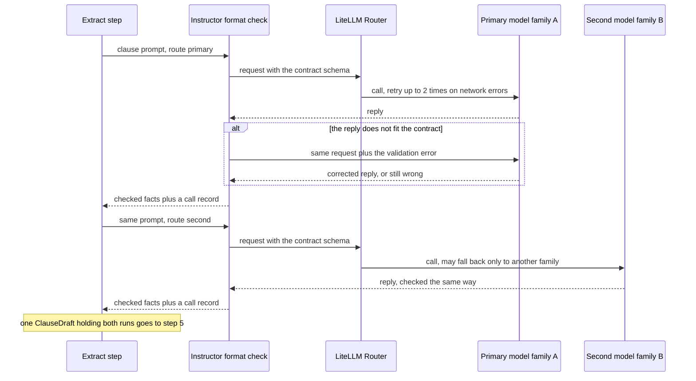
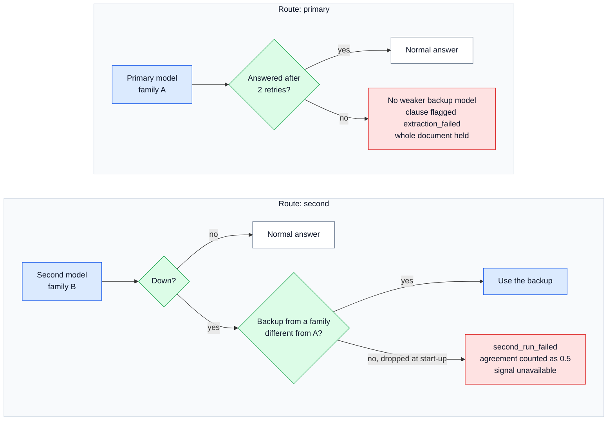
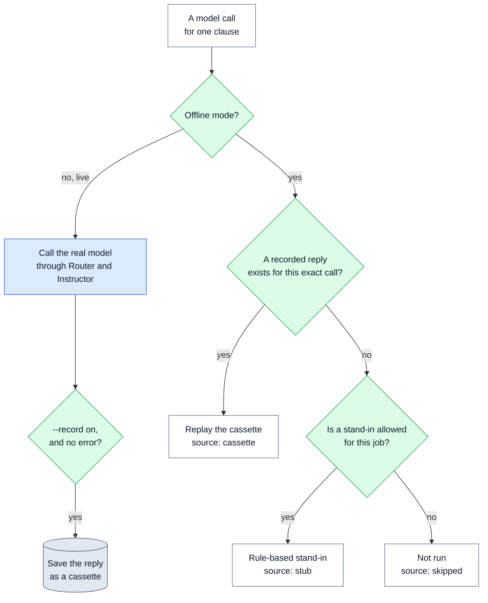

# 🧠 05 — Extraction and Model Gateway: how the AI models read each clause

> **In one line:** each clause goes to two AI models from different companies. A reply that does not fit our form is sent back, and a failure is never treated as "no facts".

---

## 🧭 Where this fits

This is **step 4** (extract), the only step where an AI model reads the document to find facts. It takes the clauses from step 2 ([04](04_INGEST_AND_STRUCTURE.md)) and hands **draft facts** to step 5, where our code checks every quote ([06](06_GROUNDING_GATE_AND_VERIFY.md)).

The code is in `regextract/extraction/` (what to ask) and `regextract/llm/` (how to call the models). The settings are in `regextract/config.py`.

---

## 🤔 The simple picture

Imagine a company that needs an important letter translated. It does not trust one translator. It sends the letter, one paragraph at a time, to **two translators from different schools**. Each translator must fill in the same form. If a form is filled in wrongly, it goes back with a note: "box 3 is missing". If a translator is ill and sends nothing, the company writes "NOT DONE" on that paragraph. It never assumes "nothing to translate here".

And the company never calls the translators directly. It calls **one front desk** and says "I need the main translator" or "I need the second opinion". The front desk knows who is on duty, retries if the phone line drops, and writes down who actually did the work.

In our system, the translators are **AI models**, the form is the **contract** ([03](03_OUTPUT_CONTRACT.md)), and the front desk is the **model gateway**.

---

## ❓ Why we need it

| Problem | What goes wrong without it |
|---|---|
| One model checks itself | It repeats its own blind spots. Asking the same model twice mostly measures how much it varies, not if it is right. |
| A reply in the wrong shape | Downstream code crashes, or reads the wrong field without noticing |
| A failed call returns nothing | "Nothing" looks exactly like "this clause has no facts" (a silent failure) |
| A reply is cut off at the length limit | Half the facts are missing, and no error is raised |
| The provider quietly answers with a different model | Quality changes and nobody can tell which model produced a fact |
| Model names are written all over the code | Changing provider means changing code in many places |
| Every test calls a paid model | Tests cost money, are slow, and give different answers each time |

---

## ⚙️ How it works, step by step

### 1. One call per clause, with a little context

For each of the 73 clauses, the code builds one prompt. The prompt holds:

- the document's id, title, issuer and jurisdiction,
- the **headings above this clause** (for 7.1.1.6: "7 REGISTRATION PROCEDURE > 7.1 Application Submission > 7.1.1 ..."),
- a short **definitions digest**: the text of the document's definitions section (section 5 in CARL-01), cut to at most 1,800 characters. For CARL-01 it is 1,590 characters. The prompt says it is "for context only": no facts may be taken from it.
- the clause itself.

Regulatory text defines a term once and then relies on it. Without the definitions, the model would have to guess what "Approved Supplier" or "Specific Requirement" means.

Here is the real end of the prompt for clause 11.4:

```text
CLAUSE 11.4 -- ECAS Registration Certificate shall be valid for one year. Renewal of
"""
11.4 ECAS Registration Certificate shall be valid for one year. Renewal of
registration shall be required a month before the expiration of the
Registration Certificate.
"""
```

**Why one clause at a time, and not the whole document?**

| | One clause per call (our choice) | Whole document in one call |
|---|---|---|
| Build time | Days | Hours |
| 300+ page documents | Works, and clauses run in parallel | Breaks: the reply becomes too long |
| Cost of retrying one failure | One clause | The whole document |
| Testing | Per clause | Per document only |
| Two-model agreement | Cheap | The whole document, twice, every time |

For short documents (under about 30 pages) the whole-document call is fine, and it could be added later as an extra document-level check. The brief describes documents of 300+ pages, so the design uses one clause per call.

### 2. The system prompt and its seven rules

The **system prompt** is the fixed instruction sent with every call (in `regextract/extraction/prompts.py`, version `extract-v1`). It lists the taxonomy with a CARL-01 example for each clause type, then seven rules. Each rule exists because of a specific failure:

| Rule in the prompt | The failure it prevents | Failure class |
|---|---|---|
| 1. Quote word for word. Copy it, do not retype it. | A quote that is not in the source fails the grounding gate | Evidence |
| 2. Never correct the source ("low voltage equipments" stays as written) | A "fixed" quote no longer matches the source | G |
| 3. An empty list is a correct answer. No money amount in the text: no money entity. No date: no date entity. | The model invents a value to fill a space | E |
| 4. A year attached to a standard is not a date ("IEC 60335-1: 2007") | Years in standard codes become fake dates | D |
| 5. "clause 4 of this document" is internal; "clause no. 6 of ECAS General Requirements" is external | Internal and external references get mixed up | F |
| 6. Subjects can be implicit ("collected by ESMA": the subject is ESMA). If there is no subject, return an empty string. | The model guesses who must act | H |
| 7. Give an honest confidence. It is only used to break ties. | Over-trusting the model's own confidence | Scoring |

**Prompt caching.** The system prompt is exactly the same for every clause. That is on purpose. Providers can **cache** (store and reuse) a repeated prompt start, and charge less for it. On a large backfill, the long taxonomy part is then paid for once per cache window, not once per clause.

### 3. Two model families

When agreement is on (the default), every clause is extracted **twice**: once by the **primary** model and once by a **second** model from a different family. A **model family** means the company that trained the model (Anthropic, OpenAI, Mistral, Google, Meta ...), not the company that hosts it. For example, `groq/openai/gpt-oss-120b` is hosted by Groq but trained by OpenAI, so its family is OpenAI.

Why two families? Two samples from the same model mostly show how much that one model varies. This is called **self-consistency**. Two different families agreeing is real evidence. Two families disagreeing is a useful warning. Facts found only by the second model are not thrown away: they go to a person as possible misses by the primary.

This diagram shows one clause going through both families.



### 4. The gateway: routes, not model names

The code never names a model. It asks the **gateway** (`regextract/llm/gateway.py`) for a **route**, a named job:

| Route | Job | Default model (in `config.py`) | Fallback |
|---|---|---|---|
| `primary` | Extracts every clause | `anthropic/claude-opus-5` | **None, by design** |
| `second` | The agreement run | `openai/gpt-4.1` | `groq/openai/gpt-oss-120b`, only because it is a different family from the primary |
| `guardrail` | Screens clause text for hidden instructions (optional, [08](08_GUARDRAILS.md)) | `groq/openai/gpt-oss-safeguard-20b` | — |
| `judge` | Orders the review queue (optional, [07](07_SCORING_AND_ROUTING.md)) | `groq/openai/gpt-oss-120b` | — |

So changing a provider is a **settings change**, not a code change.

Two libraries sit behind the gateway, and each has one clear job:

- **LiteLLM Router** sends the call to the right provider and retries **transport errors**: rate limits, timeouts, server errors. Default: 2 retries, 120-second timeout.
- **Instructor** checks every reply against the contract. A reply that does not fit is sent back to the model **with the validation error**. For example, the error may say that a `modality` is not one of shall, must, may, should or reserves_right. Default: 1 validation retry. A reply that still does not fit becomes an **error**, never an answer.

Other settings: temperature 0.0 (as repeatable as possible), maximum 4,000 output tokens, 4 clauses in parallel on live runs.

### 5. The fallback rules

A **fallback** is a backup model used when the first choice is down. The rules are strict on purpose. This diagram shows them.



**Why the primary never falls back.** If the strongest model is down and a weaker one quietly answers, quality drops and nothing in the output shows it. It is safer to flag the clause, hold the document, and run that one clause again later. That is cheap, because only one clause is re-sent.

**Why the second run may only fall back to another family.** If the backup for the second run came from the primary's family, "two families agree" would silently become "one family agrees with itself". So any same-family backup is dropped when the program starts, and a note says so. This is the real code in `regextract/llm/routes.py`:

```python
    for model in settings.second_fallbacks:
        if model_family(model) == primary_family:
            notes.append(
                f"dropped second-run fallback {model}: same family as the primary "
                f"({primary_family}), so agreement would silently become self-consistency"
            )
            continue
```

If the second run fails completely, agreement is recorded as **0.5**, meaning "signal unavailable". That is different from **0.0**, "the models disagree". Mixing the two up would send every fact in the clause to review for the wrong reason.

### 6. Every call is recorded, including what went wrong

Every call returns the facts **plus a call record**. The record holds the model asked for and the model that **actually answered** (the "served model"). It also holds whether a fallback was used, where the answer came from (live, cassette, stub or skipped), tokens, cost and time. This record feeds the **provenance** on every fact and the run manifest ([12](12_EVALUATION_AND_TESTING.md)).

Three failure cases are handled on purpose:

| What happens | How the code handles it |
|---|---|
| **The call fails** (network, provider error, reply never fits) | The gateway returns an **empty result in the right shape** plus an error message. The run does not crash. But the clause is marked `primary_error`, the document gets the flag `extraction_failed`, the whole document goes to review, and the clause is the first row of the review queue. This is **failing closed**. |
| **The reply is cut off** (the model hit the length limit, `finish_reason=length`) | Recorded as an error: "truncated: finish_reason=length (raise max_tokens)". The clause fails closed. On current models the token limit covers thinking **and** output together, so a small limit cuts answers off. |
| **The provider answers with a different model** | The served model is written into the fact's provenance, and the manifest counts it. A dated version of the same model (`gpt-4.1-2025-04-14` for `openai/gpt-4.1`) is not counted as a different model. |

The live run shows why this matters: Mistral was asked for `open-mistral-nemo` but answered with `ministral-8b-2512`, and provenance caught it ([13](13_LIVE_RUN_RESULTS.md)).

### 7. Offline mode: run everything for free

Offline is the **default**. It lets the whole pipeline, the evaluation and all 109 tests run with no API key and no cost. This diagram shows where an answer comes from.



**Cassettes (recorded replies).** Like recording a TV show to watch again later. Run once against a real model with `--live --record`, and every reply is saved as a file in `cassettes/`. Later runs replay the recording: free, fast and the same every time. Each recording's name is a fingerprint of everything that could change the answer. That means the model, the prompt version, the taxonomy version, the clause, the system prompt and the user prompt. So if someone edits the prompt, the old recording no longer matches and is not replayed by mistake. The submission includes 144 recorded replies from the live run (146 calls, minus the 2 that failed and were not saved). On replay, the stand-in answers those 2 clauses.

**The stub (rule-based stand-in).** When nothing is recorded, a small rule-based program (`regextract/llm/stub.py`) plays the part of the model. It is **not a model** and does not pretend to be one:

- It finds obligations by modal words ("shall", "must", "may" ...) and entities by word lists and patterns.
- Every quote it gives is a real sentence from the clause, so it passes the grounding gate.
- It **never** gives a money amount or a date inside a clause. Those are the "say nothing" tests (failure class E).
- Its second run drops one obligation, so the agreement signal has something to catch.
- Everything it produces is labelled `source: stub` in the run manifest, and the evaluation report refuses to present stub numbers as model quality.

**Fault injection.** With `--inject-faults`, the stub adds an invented phrase to some quotes: "and additionally a penalty of AED 50,000 applies". A fixed rule on the clause id chooses which quotes. This plants 18 fake facts among 153, so the grounding gate has something real to stop. It stops all 18 ([06](06_GROUNDING_GATE_AND_VERIFY.md)).

**Testing the live path without a network.** The tests plug a fake provider into the gateway. It speaks the same format as a real one. So routes, validation retries, truncation, fallbacks and provenance are all tested with no key and no cost.

---

## 📊 What the results show

| Result | Value |
|---|---|
| Model calls for CARL-01 | 146 (73 clauses × 2 families) |
| Offline source of answers | 146 from the stub, cost $0 |
| Live run (free-tier models) | 146 calls, 2 failed (one cut off on ANNEX-1, one provider JSON failure), about 477,000 tokens, about $0.02 |
| Fixes that came from the live run | the judge's reply budget, replies wrapped in a one-item list, loading keys from `.env` |
| Gateway tests | routes, fallback policy, validation retry, truncation, provenance, and a live-mode run through a fake provider: all pass |

Full live results: [13 — Live Run Results](13_LIVE_RUN_RESULTS.md).

---

## 🗣️ Say it like this

> "Each clause goes to two AI models from different companies, because one model checking itself only shows how much it varies. The code never names a model: it asks for a job, like 'primary' or 'second', so a provider change is a settings change. Every reply is checked against our fixed form and sent back once with the error if it does not fit. The primary model never falls back to a weaker one, and a failed call is reported as a failure, never as 'no facts'. Offline, recorded replies and a clearly labelled stand-in let everything run for free."

---

## ⚠️ Limits and honest notes

- **The default models were not the ones used live.** The code is set up for Claude Opus 5 and GPT-4.1. The only live run used free-tier Mistral and Groq models, which are much smaller.
- **Agreement compares wording, and that is strict.** In the live run the two models agreed on only 23% of facts (9 of 90 obligations), mostly because they phrased the same action differently. A better comparison would look at meaning or at overlapping quotes.
- **Offline numbers are stub numbers.** They prove the checks and the plumbing work. They say nothing about how good a real model is.
- **Two runs double the cost.** The design lowers this later with a single run for low-impact types ([14](14_PATH_TO_PRODUCTION.md)).
- **No automatic re-run.** A failed clause is flagged and the document is held. Re-running that clause is described in the design but is a manual step in the proof of concept.
- **The definitions digest is cut at 1,800 characters.** For a document with a long definitions section, some definitions would be missing from the context.

---

## 📚 See also

- [03 — Output Contract](03_OUTPUT_CONTRACT.md): the form every reply must fit
- [06 — Grounding Gate and Verify](06_GROUNDING_GATE_AND_VERIFY.md): what happens to the draft facts next
- [07 — Scoring and Routing](07_SCORING_AND_ROUTING.md): how agreement and failures change the decision
- [08 — Guardrails](08_GUARDRAILS.md): checking clause text before it goes into a prompt
- [13 — Live Run Results](13_LIVE_RUN_RESULTS.md): what happened with real models
- [16 — Tech Stack, Config and Commands](16_TECH_STACK_CONFIG_AND_COMMANDS.md): every setting and command
- [17 — Glossary](17_GLOSSARY.md): every technical word in plain English
