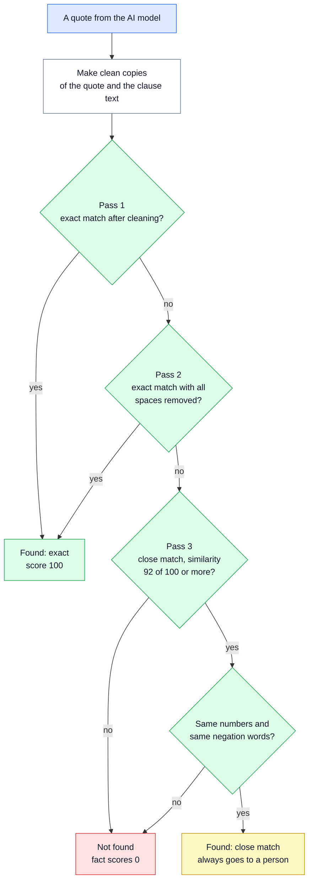
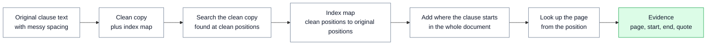
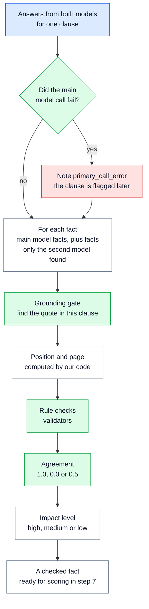
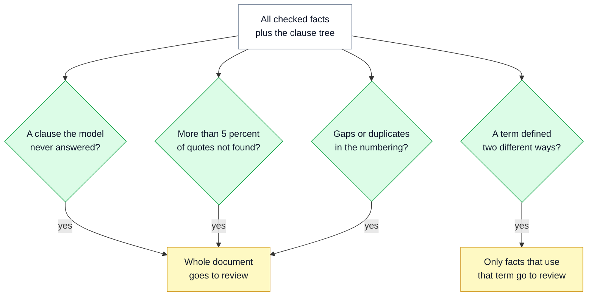

# 🔎 06 — Grounding Gate and Verify: we check the evidence ourselves

> **In one line:** Before a fact can be published, our code must find its quote in the document and work out the position itself. The AI model's word is never enough.

---

## 🧭 Where this fits

This is **step 5 of 10** (Verify). It runs straight after step 4, where two AI models read each clause and return facts. It is the heart of the whole design. It is where rule 1 from [01 — System Overview](01_SYSTEM_OVERVIEW.md) happens: **we check the evidence; we do not ask the model for it.**

Step 5 does four jobs:

1. **The grounding gate.** Find every quote in the source text.
2. **Rule checks** (we call them "validators"). Small, fixed checks for each type of fact.
3. **Agreement.** Compare the answers of the two AI model families.
4. **Document-level checks.** Look for problems with the whole document, not just one fact.

---

## 🤔 The simple picture

A student writes an essay and uses quotes from a book. Next to each quote, the student writes a page number. A careful teacher does not trust those page numbers. The teacher opens the book and looks for each quote.

The teacher is patient in three ways, from strict to less strict:

1. **Exact words.** The quote is in the book, word for word. Good.
2. **Same letters, broken spacing.** The book was printed badly, so a word was split across two lines. The letters are the same. Good.
3. **Almost the same.** One letter is smudged. The teacher accepts it only if **no number and no "not" has changed**, and then asks a colleague to confirm it.

If the quote is not in the book at all, the point does not count. It does not matter how confident the student sounds.

In regextract, **the AI model is the student** and **our code is the teacher.** The "colleague" in level 3 is a human reviewer.

---

## ❓ Why we need it

| Problem | What goes wrong without it |
|---|---|
| The model invents a fact that is not in the document (this is called a **hallucination**) | An invented fact looks real and flows into a compliance system. Nobody notices. This is the **silent failure** the design exists to stop. |
| The model changes a number ("one year" becomes "two years") | A customer plans for the wrong deadline. |
| The model drops the word "not" | A rule is turned upside down: "shall not apply" becomes "shall apply". |
| The model gives a wrong page or position | An auditor cannot find the evidence later. |
| The model quotes a different clause | The fact is linked to the wrong part of the document. |
| The PDF breaks words across lines ("60335-" then "2-13" on the next line) | A strict word-for-word check rejects real quotes. Too many false alarms make people stop trusting the checks. |

---

## ⚙️ How it works, step by step

### Part A: finding one quote (the three passes)

First, our code makes a **clean copy** of both texts. This is called **normalisation**. It removes differences that do not change the meaning:

| In the PDF text | In the clean copy | Why |
|---|---|---|
| Curly quotes `“ ” ‘ ’` | Straight quotes `" '` | PDFs love curly quotes; models often type straight ones |
| Long dashes `– — −` | A normal hyphen `-` | Same reason |
| Special spaces (non-breaking, thin) | A normal space | Invisible, but they break a text search |
| Zero-width characters, soft hyphens | Removed | Printing marks, never content |
| `…` | `...` | Same meaning |
| Several spaces or line breaks in a row | One space | Line breaks come from page layout, not meaning |
| Capital letters | Small letters | "ESMA" and "esma" should match |

Then the search runs in three passes. It starts with the cheapest and strictest check. It moves to the next pass only if the previous one fails.



| Pass | What it checks | What it catches |
|---|---|---|
| **1. Exact** | The clean quote appears inside the clean clause text | Normal quotes with different spacing, quote marks or capital letters |
| **2. Exact, no spaces** | Same, but with **every** space and line break removed | Words or codes broken across lines, such as `60335-` and `2-13` |
| **3. Close (fuzzy)** | The quote is at least 92% similar to some part of the clause (using the **rapidfuzz** library), **and** the numbers and negation words are exactly the same | Small typing or text-layer noise, such as one wrong letter |

**Negation words** are words that turn a meaning around: `not`, `no`, `never`, `none`, `nor`, `neither`, `without`, `except`, `unless`, `cannot`, and any word ending in `n't`. **Numbers** include digits (`50`, `1,000`, `3.1`) and number words (`one`, `twelve`, `first`, `half`, `twice` ...).

> [!IMPORTANT]
> A close match (pass 3) is **evidence, not proof**. The fact is kept, but it is **always** sent to a person. It can never be published automatically.

Two more rules:

- **The quote is searched only inside its own clause.** A quote from clause 11.4 must be in clause 11.4. A true sentence copied from another clause does not count.
- **Before comparing numbers, the matched part is stretched to whole words.** So a number cut in half (for example `50` out of `500`) is compared as the whole number.

### Part B: getting the real position back (the index map)

We search in the **clean** copy, but we must publish positions in the **original** text. An auditor must be able to open the original and find the exact characters.

So while making the clean copy, the code keeps an **index map**. It is a list that says where each character of the clean copy came from in the original.

A tiny example. The original text is `shall··be⏎held` (two spaces and a line break). The clean copy is `shall be held`.

| Clean copy position | 0-4 | 5 | 6 | 7 | 8 | 9-12 |
|---|---|---|---|---|---|---|
| Clean character | `shall` | space | `b` | `e` | space | `held` |
| Original position | 0-4 | 5 | **7** | 8 | 9 | 10-13 |

The quote `be held` is found in the clean copy at positions 6 to 12. The map sends this back to **original positions 7 to 13**. Those are the characters we publish.



The last two steps work like this:

- **Position in the whole document** = where the clause starts + where the quote starts inside the clause.
- **Page** = the page whose character range contains that position. Step 1 (Ingest) recorded where every page starts and ends. See [04 — Ingest and Structure](04_INGEST_AND_STRUCTURE.md).

This is why the model **never** gives us a position. It only gives a quote. Our code finds the position.

### Part C: the rule checks (validators)

A **validator** is a small, fixed rule. It needs no AI. Each fact type has its own validators.

| Validator | Applies to | What it checks |
|---|---|---|
| `evidence_grounded` | every fact | The grounding gate found the quote |
| `entity_text_in_quote` | entities | The entity's text is inside its own quote (the model did not quote one sentence and name something else) |
| `standard_pattern` | standard references | It looks like a standard code: `IEC`, `BS`, `EN`, `ISO`, `GSO` or `UAE.S` plus numbers |
| `monetary_has_currency` | money amounts | A currency (AED, USD, EUR, $, € ...) appears in the quote. A number with no currency is usually a misread |
| `numeric_value_in_quote` | number limits | Every number in the value appears in the quote |
| `time_period_normalised` | time periods | The standard form looks like "1 year" (a number and a unit) |
| `date_parses` | dates | The date can be read as a real calendar date |
| `internal_target_exists` | internal cross-references | The clause it points to (for example clause 4) really exists in the clause tree |
| `external_has_document` | external cross-references | It names the other document |
| `has_action`, `modality_known` | obligations | It says what must be done, and its strength is one of shall, must, may, should, reserves_right |

A failed validator does not stop a fact by itself. It lowers the score and adds a reason, such as `validator_failed:has_action`. For high-impact facts, **every** validator must pass. See [07 — Scoring and Routing](07_SCORING_AND_ROUTING.md).

### Part D: do the two models agree?

Two AI models from **different companies** read each clause (see [05 — Extraction and Model Gateway](05_EXTRACTION_AND_MODEL_GATEWAY.md)). For each fact from the main model, our code looks for the same fact in the second model's answer.

"The same fact" is decided by a **signature**: a short text made from the parts that matter, after cleaning.

| Fact kind | Signature is made from |
|---|---|
| Obligation | who must act + how strong (shall, may ...) + the first 80 characters of the action |
| Entity | type + text |
| Cross-reference | internal or external + target clause + target document |

The agreement value can be:

| Value | Meaning |
|---|---|
| **1.0** | The second model gave the same fact |
| **0.0** | The second model did not give this fact. The models **disagree** |
| **0.5** | There was no second run, or the second run failed. The signal is **missing**, which is not the same as disagreeing |

Two more cases:

- **A fact only the second model found** is a possible miss by the main model. It is added with the note `second_model_only` and always goes to a person. So a miss becomes visible instead of disappearing.
- **A call that failed** leaves a note on the facts: `second_run_failed` or `primary_call_error`. Step 7 reads these notes.

### Part E: one clause from start to finish

This diagram shows what step 5 does with the answers for one clause.



### Part F: checks on the whole document

Some problems are bigger than one fact. If the document itself looks wrong, we should not trust any single fact's score. So after all facts are checked, step 5 looks at the whole document and raises **document flags**.



| Flag | When it fires | Effect (applied in step 7) |
|---|---|---|
| `extraction_failed` | The main model returned nothing usable for a clause | **Whole document** to review. The failed clause goes to the top of the review queue. |
| `high_grounding_failure_rate` | More than 5% of all quotes were not found | **Whole document** to review. Many missing quotes means something is wrong with the model or the text. |
| `numbering_gaps` | A top-level section number is missing (for example 1, 2, 4) | **Whole document** to review. The clause tree may be wrong. |
| `duplicate_clause_ids` | The same clause number appears twice | **Whole document** to review. |
| `conflicting_definition` | An abbreviation is written out in two different ways | **Only the facts that use that term** go to review. |

**The real example in CARL-01.** Section 1 writes ECAS as "Emirates Conformity Assessment **Scheme**". Clause 5.6 writes it as "Emirates Conformity Assessment **Systems**". Our code finds both and raises:

```text
conflicting_definition: ECAS expanded 2 ways: ['emirates conformity assessment scheme', 'emirates conformity assessment systems']
```

This is a general rule, not a special case for ECAS. The code looks for any abbreviation of 3 to 6 capital letters written as "Long Name (ABBR)" or "ABBR – Long Name". If one abbreviation has two different long names, it raises the flag.

---

## 🔍 How we built it in this project

| File | What is in it |
|---|---|
| `regextract/normalize.py` | The clean copy (`Normalized`, with its `index_map`), the three-pass search (`locate`), the number and negation check (`meaning_tokens`) |
| `regextract/verification/verify.py` | One checked fact per model fact (`_make_items_for_clause`), the validators (`run_validators`), agreement (`signature`, `_agreement`, `facts_missed_by_primary`), and the document flags (`document_flags`, `find_conflicting_definitions`) |
| `regextract/config.py` | `fuzzy_threshold` = 92.0 and `max_grounding_failure_rate` = 0.05 (5%) |

This is pass 3, copied from `regextract/normalize.py`. Notice the last check: the numbers and negation words must be exactly the same.

```python
    # Pass 3 -- fuzzy, high threshold. Deliberately last and deliberately strict.
    # A close match may absorb noise in a word, never a change of meaning: the
    # quote must fit inside the source, and its numbers and negations must be
    # exactly those of the source text it matched.
    if loose_quote and loose_source.text and len(loose_quote) <= len(loose_source.text):
        alignment = fuzz.partial_ratio_alignment(
            loose_quote, loose_source.text, score_cutoff=fuzzy_threshold
        )
        if alignment is not None:
            s, e = _widen_to_words(loose_source.text, alignment.dest_start, alignment.dest_end)
            if meaning_tokens(loose_source.text[s:e]) == meaning_tokens(loose_quote):
                start, end = loose_source.to_original_span(
                    alignment.dest_start, alignment.dest_end
                )
                return Location(True, start, end, MatchKind.FUZZY, float(alignment.score))

    return NOT_FOUND
```

**The gate is checked in three places, on purpose:**

1. In **scoring** (step 7): a fact whose quote was not found gets a score of 0. See [07](07_SCORING_AND_ROUTING.md).
2. In **review** (step 8): a person cannot "accept" such a fact. They can only correct it with a real quote, or reject it. See [10](10_HUMAN_REVIEW_AND_PUBLISH_LOG.md).
3. At **publishing** (step 9): `published_items()` only lets out facts that are accepted **and** grounded. This is a deliberate second check at the exit door.

---

## 🧪 Worked examples

We ran the real `locate()` function on these examples. The similarity numbers are the real output.

**(a) A word broken across lines: found by pass 2.**
In Annex 1 of CARL-01, the PDF text layer splits a standard code across two lines: `UAE.S 60335-` and then `2-13`. The model writes the quote `UAE.S 60335-2-13`.
- Pass 1 fails: the line break became a space, so the clean text says `60335- 2-13`.
- Pass 2 succeeds: with all spaces removed, both say `uae.s60335-2-13`.
- Result: **found, exact, score 100**. Without pass 2, a correct fact would be rejected.

**(b) A dropped "not" or a changed number: refused by pass 3.**
- Clause 3.1.2 says "This document shall **not** apply to the products excluded by UAE / IEC 60335-1." A quote without "not" is **94.4% similar**, which is above 92. But the word "not" is missing, so it is **refused**.
- Clause 11.4 says "valid for **one** year". A quote saying "valid for **two** years" is **94.9% similar**. But the number word changed, so it is **refused**.

This is the key point: **high similarity is not enough.** One small word can reverse a legal meaning.

**(c) A planted fake fact: not found.**
The `--inject-faults` option adds this invented phrase to some quotes: "and additionally a penalty of AED 50,000 applies". CARL-01 has no money amounts at all. The changed quote is only about **75% similar**, far below 92, so it is **not found** and scores 0. In the fault-injection run, **18 of 153** facts (11.8%) were planted like this. The gate stopped **all 18**. Because 11.8% is more than 5%, the whole document was also held for review. Nothing was published automatically.

**(d) One wrong letter: found as a close match, then sent to a person.**
A quote that says "Registraton" instead of "Registration" is **98.2% similar**, and its numbers and negation words are the same. It is **found as a close match**. The fact is kept, but it goes to a person.

---

## 📊 What the results show

| Run | Facts | Quotes found exactly | Close matches (sent to a person) | Not found (stopped) |
|---|---|---|---|---|
| Offline (rule-based stand-in) | 153 | 153 | 0 | 0 |
| Offline with 18 planted fakes | 153 | 135 | 0 | **18 of 18 stopped** |
| Live, real free-tier models | 353 | 320 | 15 | 18 (5.1%) |

- **Offline**, the stand-in quotes real sentences, so 100% found is expected. The planted-fakes run is what proves the gate works.
- **Live**, 18 of 353 quotes (5.1%) were not in the source. 5.1% is above the 5% limit, so the whole document was held. The main model also failed on one clause (ANNEX-1), which raised `extraction_failed`. **0 facts were published automatically.** That is the safe result. See [13 — Live Run Results](13_LIVE_RUN_RESULTS.md).

---

## 🗣️ Say it like this

> "The model gives us a fact and a quote. It never gives us a position. Our code searches for the quote in that clause: first exactly, then with spaces removed, then as a close match. A close match must keep every number and every 'not', and even then a person checks it. If we cannot find the quote, the fact scores zero and is never published. When we planted 18 fake facts, the gate stopped all 18."

---

## ⚠️ Limits and honest notes

- **Grounding proves the words exist. It does not prove the model understood them.** The quote can be real while the model picks the wrong subject, or the wrong fact type. Agreement between two models, the validators and human review cover this part.
- **The quote can be real but too wide.** A model could quote a whole long sentence. `entity_text_in_quote` checks the entity is inside its quote, but not that the quote is as short as possible.
- **Agreement compares wording, and that is strict.** In the live run the two models agreed on only 23% of facts, and on 9 of 90 obligations. Many were the same meaning in different words. A better comparison (for example, overlapping quote positions, or a looser match on the action text) is a clear next step.
- **The close-match check is strict on purpose, and sometimes too strict.** Sometimes the matched window touches a nearby clause number (for example the "4" of "11.4"), and the number check then refuses a quote that was almost exact. This fails on the safe side: the fact goes to a person.
- **92 is a starting value.** Scanned pages (OCR, text read from images) will have more noise. The threshold will need new tuning for scans. It is not a drop-in change.
- **The conflicting-definition check knows two writing patterns** ("Long Name (ABBR)" and "ABBR – Long Name"). Other patterns are not caught yet.
- **Low OCR confidence** is a planned document flag, but the proof of concept only reads text PDFs, so it never fires.

---

## 📚 See also

- [01 — System Overview](01_SYSTEM_OVERVIEW.md): the one idea behind the grounding gate
- [04 — Ingest and Structure](04_INGEST_AND_STRUCTURE.md): where the clean text, clause positions and page ranges come from
- [05 — Extraction and Model Gateway](05_EXTRACTION_AND_MODEL_GATEWAY.md): how the two models produce the facts and quotes
- [07 — Scoring and Routing](07_SCORING_AND_ROUTING.md): what happens to a fact after it is checked
- [10 — Human Review and Publish Log](10_HUMAN_REVIEW_AND_PUBLISH_LOG.md): why a reviewer's correction passes the same gate
- [12 — Evaluation and Testing](12_EVALUATION_AND_TESTING.md): the planted-fakes test and the failure classes
- [17 — Glossary](17_GLOSSARY.md): plain meanings of grounding, normalisation, fuzzy match and more
