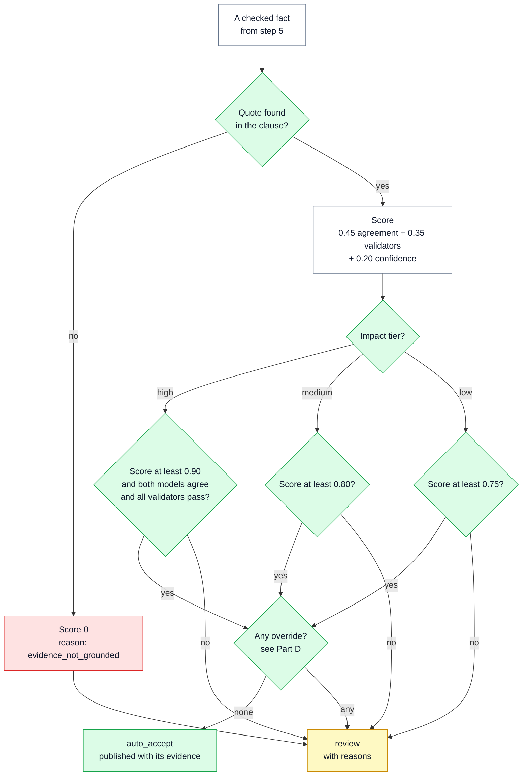
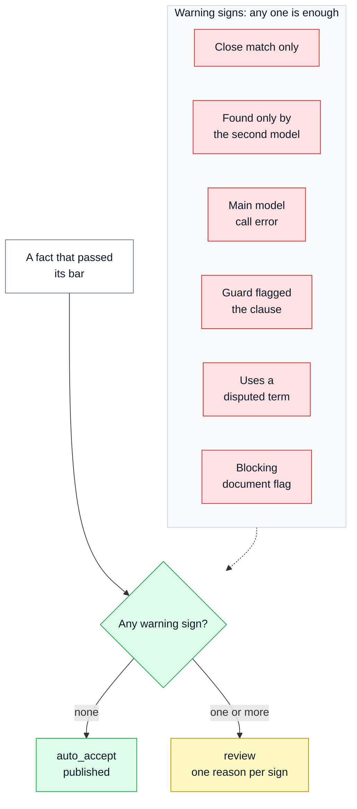
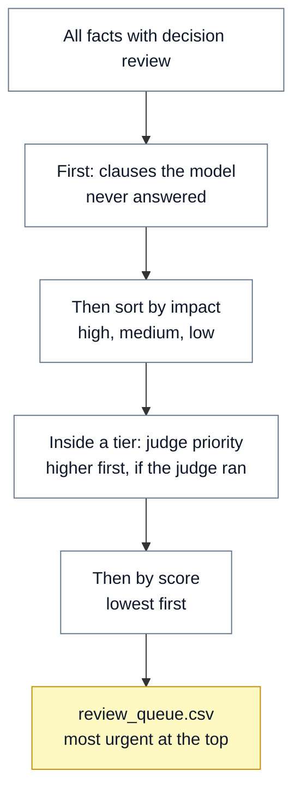

# ⚖️ 07 — Scoring and Routing: publish now, or ask a person?

> **In one line:** Each checked fact gets a score from our own checks. The more harm a wrong fact could cause, the higher the bar for publishing it without a person.

---

## 🧭 Where this fits

This is **step 7 of 10** (Score and route). It takes the checked facts from step 5 ([06 — Grounding Gate and Verify](06_GROUNDING_GATE_AND_VERIFY.md)) and gives each one:

- a **score** between 0 and 1,
- a **decision**: `auto_accept` (publish without a person) or `review` (a person must look),
- a list of **reasons**, so a reviewer knows why it was sent to them.

After routing, an optional **judge** (another AI model) can change the **order** of the review queue. It can never change a decision.

This step is rule 4 from [01 — System Overview](01_SYSTEM_OVERVIEW.md): **spend review time where the risk is.**

---

## 🤔 The simple picture

Think of a bank that approves payments.

- **A small payment** goes through by itself if the normal checks pass.
- **A large payment** needs more: every check must pass, and a second person must agree, even when everything looks fine.
- **Some warning signs** always send a payment to a manager, whatever its size: a smudged signature, a new account, an unusual country.
- **A forged signature** is never approved. No other good sign can make up for it.

regextract works the same way. "Size" is the **impact** of a fact (how much harm it can do if it is wrong). The "forged signature" is a quote our code could not find in the document.

---

## ❓ Why we need it

| Problem | What goes wrong without it |
|---|---|
| Treat every fact the same | Either people review everything (too slow and too costly for thousands of documents), or risky facts are published with no check. |
| Trust the model's own confidence | AI models are often sure and wrong. A model can say "0.99 confident" about an invented fact. |
| A single score for everything | A high score could hide a missing quote. That is why grounding is a **gate**, not part of the score. |
| No reasons on review items | Reviewers waste time guessing what is wrong with each fact. |
| Missing signals treated as good news | If the second model failed, "no disagreement" could look like "agreement". The score must treat a missing signal as missing. |

---

## ⚙️ How it works, step by step

### Part A: four signals, ranked by how much we trust them

| Rank | Signal | How it is used |
|---|---|---|
| 1 | **Grounding**: did our code find the quote? | A **gate**. If not found, the score is 0 and the fact can never be published automatically. |
| 2 | **Agreement**: did the second model family give the same fact? | Weight **0.45**. Value 1.0 (same), 0.0 (different) or 0.5 (no second answer). |
| 3 | **Validators**: what share of the rule checks passed? | Weight **0.35**. |
| 4 | **The model's own confidence** (0 to 1) | Weight **0.20**. The weakest signal. It mostly breaks ties. |

For a fact that passed the gate:

```text
score = 0.45 × agreement  +  0.35 × share of validators passed  +  0.20 × model confidence
```

> [!NOTE]
> The **order** of the signals matters more than the exact weights. The weights and the thresholds below are **starting values**. They are not measured yet. Part H explains how real ones would be set.

### Part B: the arithmetic, with real rows from the review queue

These are real facts from `samples/review_queue.csv` (the offline run on CARL-01).

| Clause | Fact | Agreement | Validators passed | Confidence | Score |
|---|---|---|---|---|---|
| 11.4 | time period "one year" | 1.0 | all | 0.70 | 0.45 + 0.35 + 0.14 = **0.94** |
| 10.2 | obligation "Consignment ... shall be held" | 1.0 | all | 0.72 | 0.45 + 0.35 + 0.144 = **0.944** |
| 10.2 | obligation "Appropriate action shall then be taken" | 0.0 | all | 0.72 | 0 + 0.35 + 0.144 = **0.494** |
| 9.2 | obligation "the client needs to rectify ..." | 1.0 | 1 of 2 | 0.72 | 0.45 + 0.175 + 0.144 = **0.769** |

Three facts from the arithmetic are worth remembering:

- **If the models disagree** (agreement 0.0), the best possible score is 0.35 + 0.20 = **0.55**. That is below every threshold. **A fact the models disagree on is never published automatically.**
- **If there is no second answer** (agreement 0.5), the best possible score is 0.225 + 0.35 + 0.20 = **0.775**. That is below the medium bar (0.80) and the high bar (0.90). So **medium and high facts always go to a person** when the second model is missing. A low fact can still pass, but only with confidence of 0.875 or more.
- **If the quote was not found**, the score is **0**, whatever the other signals say.

> [!IMPORTANT]
> Offline, there is no real second model. The rule-based stand-in **pretends** to disagree: its second run leaves out one obligation per clause (the last one). So the `models_disagree` rows in the offline queue are simulated. They exist to test the routing, not to measure models.

### Part C: impact tiers and thresholds

**Impact** means how much harm a wrong fact could cause downstream.

| Impact | Which facts | Published automatically only if |
|---|---|---|
| **High** | dates, time periods, money amounts, number limits; **obligations inside a clause about validity, enforcement, exemption or scope** | score ≥ **0.90** **and** agreement = 1.0 **and** every validator passes |
| **Medium** | all other obligations; cross-references; references to standards and laws; product categories | score ≥ **0.80** |
| **Low** | organisations, individuals, roles, locations | score ≥ **0.75** |

**The rule for obligations.** Downstream systems act on obligations, so an obligation is **never** low impact. It is medium by default. It becomes high when the clause it sits in is about validity and dates, enforcement, exemption or scope. The clause type comes from the main model's answer.

This diagram shows the full decision for one fact.



### Part D: overrides (warning signs that always mean "ask a person")

Even when a fact passes its bar, any one of these sends it to review. Each adds a reason code.

| Warning sign | Reason code on the fact | Why |
|---|---|---|
| The quote matched only closely, not exactly | `evidence_matched_fuzzily (98)` | A close match is evidence, not proof |
| Only the second model found this fact | `found_only_by_second_model` | A possible miss by the main model |
| The main model call had an error | `primary_call_error` | A cut-off reply may still contain something, but it is not trustworthy |
| The guard flagged this clause | `guardrail_flagged_clause:<rule>` | The text may contain hidden instructions. See [08](08_GUARDRAILS.md) |
| The fact uses a term defined two ways | `uses_disputed_term:ECAS` | Downstream could pick the wrong meaning |
| A blocking document flag fired | `document_flagged:<codes>` | Something is wrong with the whole document |

Two more reasons explain decisions on high-impact facts: `high_impact_requires_full_agreement` (the models did not both give it) and `high_impact_type` (added to every high-impact fact that goes to review).

> [!IMPORTANT]
> Overrides only work in **one direction**. They can send a fact **to** a person. Nothing in step 7 can publish a fact that failed its checks.

This diagram shows the same rule as a picture: one warning sign is enough.



### Part E: whole-document flags: blocking or targeted?

Step 5 raises document flags (see [06](06_GROUNDING_GATE_AND_VERIFY.md)). Step 7 decides what they do.

| Flag | Type | Effect |
|---|---|---|
| `high_grounding_failure_rate` (more than 5% of quotes not found) | **Blocking** | Every fact in the document goes to review |
| `extraction_failed` (a clause the model never answered) | **Blocking** | Every fact goes to review; the missing clause is the first row of the queue |
| `numbering_gaps`, `duplicate_clause_ids` | **Blocking** | Every fact goes to review |
| `low_ocr_confidence` | **Blocking** | Planned for scanned pages; not produced in the proof of concept |
| `conflicting_definition` | **Targeted** | Only facts that mention the term go to review |
| `prompt_injection_suspected` | Recorded | Raised for a high-severity guard finding; that clause's facts are already forced to review |

**Why is the ECAS conflict only targeted?** A **structural** problem (a broken clause tree, many missing quotes, a missing clause) means we cannot trust **any** score in the document. A **terminology** problem only affects the facts that use the unclear term. Sending the whole document to review for one unclear word would waste reviewer time and teach people to ignore flags. In the offline CARL-01 run, the ECAS flag sent **12 facts** to review with the reason `uses_disputed_term:ECAS`.

### Part F: the order of the review queue

The queue is sorted so the most important work comes first:

1. **Clauses with no answer at all** (`extraction_failed`). These come first as their own rows. There is no fact to review, only a hole, and a reviewer must know where it is.
2. Then facts by **impact**: high, then medium, then low.
3. Inside each tier, by the **judge's priority** (higher first), if the judge ran.
4. Then by **score**, lowest first. The fact we are least sure about comes first.



These are real rows from the top of `samples/review_queue.csv`, with their reasons explained in plain words:

| Impact | Clause | Fact | Score | Reasons | In plain words |
|---|---|---|---|---|---|
| high | 10.2 | obligation | 0.494 | `models_disagree; high_impact_requires_full_agreement; high_impact_type` | The second model did not give this obligation. It is high impact, so both models must agree. |
| high | 11.4 | obligation | 0.494 | same as above | "Renewal ... a month before the expiration": high impact, and the models did not agree. |
| high | 11.4 | time period "one year" | 0.940 | `uses_disputed_term:ECAS` | It passed every check, but its sentence uses ECAS, which is defined two ways. |
| medium | 9.2 | obligation | 0.769 | `validator_failed:has_action` | The fact does not say clearly what must be done. |
| low | 7.1.1 | role | 0.940 | `uses_disputed_term:ECAS` | A role such as "Manufacturers", in a sentence that mentions ECAS. |

### Part G: the judge (it orders the queue; it never decides)

The judge is an optional AI model. It reads a fact that is already going to review and replies with **one number from 0 to 10**: how urgently an analyst should look at it.

- **Triage only.** It changes the **order** of the queue. It cannot publish a fact, reject a fact, or override the grounding gate.
- **Only the top 40** waiting facts are judged. Judging the whole queue costs money to reorder work nobody will reach today.
- **Skipped when a blocking flag fires.** If the whole document will be reviewed anyway, ordering it is wasted money.
- **A different model family** from the main model. A model shares its own blind spots, so it may rank its own mistakes as unimportant. The code adds a warning note if the judge is from the same family.
- **A reply budget of 512 tokens.** The live run showed that 8 tokens is too small: a "reasoning" model uses tokens to think before it answers, and returned nothing. See [13](13_LIVE_RUN_RESULTS.md).
- **Off by default.** Without it, the queue is ordered by impact and score, which is already a sensible order.

**Why an AI judge must never be a gate.** The thing being tested cannot also be the test. A judge model has the same weaknesses as the extractor. It can be confidently wrong, it is not calibrated, and it can change when the provider updates it. If it could publish facts, one model's mistake could be approved by another model's mistake. So we use code checks and people for decisions, and the judge only for ordering.

### Part H: how the real thresholds would be set (calibration)

The numbers 0.90, 0.80 and 0.75 are guesses. In production they would be **measured**:

1. **Build a gold set.** Analysts label a few hundred documents by hand. Two analysts label a shared sample, to check that people agree with each other.
2. **Run the pipeline** on the gold set.
3. **Group the facts by type and by score band** (for example, all time periods scoring between 0.90 and 0.95).
4. **Measure precision in each band.** Precision means: of the facts we would publish, how many are correct?
5. **Set the bar per type** at the lowest band where precision is still **0.95 or more**.
6. **Check review capacity.** Count how many facts would go to review each day. The team must be able to clear that queue. If it cannot, the trade-off is made openly.
7. **Switch on auto-publish one type at a time**, only when that type reaches 0.95 precision. Repeat as reviewer corrections grow the gold set.

See [14 — Path to Production](14_PATH_TO_PRODUCTION.md) for how this fits the release phases.

---

## 🔍 How we built it in this project

| File | What is in it |
|---|---|
| `regextract/routing/route.py` | `score_item` (the gate and the weights), `route_item` (thresholds and overrides), `apply_document_flags` (blocking and targeted flags), `review_queue` (the order), `routing_summary` (the counts) |
| `regextract/routing/judge.py` | `score_priority`: the optional judge, top 40 only |
| `regextract/contract.py` | `impact_tier`: which facts are high, medium or low |
| `regextract/pipeline/graph.py` | `node_route` forces review for guard-flagged clauses; `_should_judge` skips the judge when a blocking flag fired |
| `regextract/config.py` | `threshold_high` 0.90, `threshold_medium` 0.80, `threshold_low` 0.75 (settings `REGEXTRACT_THRESHOLD_HIGH`, `..._MEDIUM`, `..._LOW`) |

This is the start of `score_item`, copied from `regextract/routing/route.py`. The first check is the gate.

```python
def score_item(item: Item) -> tuple[float, list[str]]:
    reasons: list[str] = []

    if not item.evidence.grounded:
        # The gate. No score can rescue this.
        return 0.0, ["evidence_not_grounded"]

    if item.evidence.match_kind.value == "fuzzy":
        reasons.append(f"evidence_matched_fuzzily ({item.evidence.match_score:.0f})")

    validators = item.review.validators or {}
    checked = {k: v for k, v in validators.items() if k != "evidence_grounded"}
    validator_score = (sum(1 for v in checked.values() if v) / len(checked)) if checked else 1.0
    for name, passed in checked.items():
        if not passed:
            reasons.append(f"validator_failed:{name}")
```

The runbook has a small test you can run. It builds a fake money fact with a claimed confidence of 0.99 and full agreement, but with a quote that is not in the document. It scores **0.0** and goes to review. See RUNBOOK.md, step 5.

---

## 📊 What the results show

**Offline run of CARL-01** (rule-based stand-in):

| Tier | Facts | Published automatically | Sent to review |
|---|---|---|---|
| High | 19 | 11 | 8 |
| Medium | 67 | 58 | 9 |
| Low | 67 | 64 | 3 |
| **Total** | **153** | **133** | **20 (13.1%)** |

Notice the pattern: the higher the impact, the larger the share sent to a person. That is the design working as intended.

**With 18 planted fake facts:** 0 of 153 published automatically. The planted facts scored 0, and 11.8% not found (more than 5%) sent the whole document to review.

**Live run with real free-tier models:** 0 of 353 published automatically. A clause the model never answered and 5.1% of quotes not found both held the whole document. See [13](13_LIVE_RUN_RESULTS.md).

---

## 🗣️ Say it like this

> "Grounding is a gate, not a weight: no quote, no publishing. After the gate, the score comes from our own checks: two-model agreement counts most, rule checks next, and the model's own confidence least. The bar rises with impact. A high-impact fact needs 0.90, both models agreeing and every rule passing. If the models disagree, the maths means it can never publish by itself. And the AI judge only orders the queue. It never decides."

---

## ⚠️ Limits and honest notes

- **The thresholds and weights are placeholders.** They are not measured. Part H describes the calibration that would replace them. The code and the evaluation report both say this.
- **An obligation's tier depends on the main model's clause type.** If the model labels an enforcement clause as a plain requirement, the obligation drops from high to medium. A safer version would take the stricter tier from both models, or set clause types by code rules and an analyst mapping.
- **The model's confidence comes from the model.** It carries only 20% of the score, but it is still not calibrated.
- **The disputed-term check is a plain text search.** Any fact whose text or quote contains "ECAS" goes to review, even when the meaning is clear.
- **The judge's number is not checked** against anything. That is acceptable only because it changes the order, never the decision.
- **Offline disagreement is simulated.** Real disagreement rates come only from live runs. In the live run, the models agreed on 23% of facts, because the wording comparison is strict (see [06](06_GROUNDING_GATE_AND_VERIFY.md)).
- **The proof of concept does not model review capacity.** It reports the review rate, but it does not yet tune thresholds to a team's daily capacity.

---

## 📚 See also

- [06 — Grounding Gate and Verify](06_GROUNDING_GATE_AND_VERIFY.md): where grounding, validators, agreement and document flags come from
- [08 — Guardrails](08_GUARDRAILS.md): why a guard-flagged clause always goes to review
- [10 — Human Review and Publish Log](10_HUMAN_REVIEW_AND_PUBLISH_LOG.md): what happens to facts in the review queue
- [12 — Evaluation and Testing](12_EVALUATION_AND_TESTING.md): the tests that prove no ungrounded fact is ever auto-accepted
- [13 — Live Run Results](13_LIVE_RUN_RESULTS.md): routing with real models
- [14 — Path to Production](14_PATH_TO_PRODUCTION.md): calibration, gated auto-publish and the circuit breaker
- [17 — Glossary](17_GLOSSARY.md): plain meanings of precision, calibration, threshold and more
