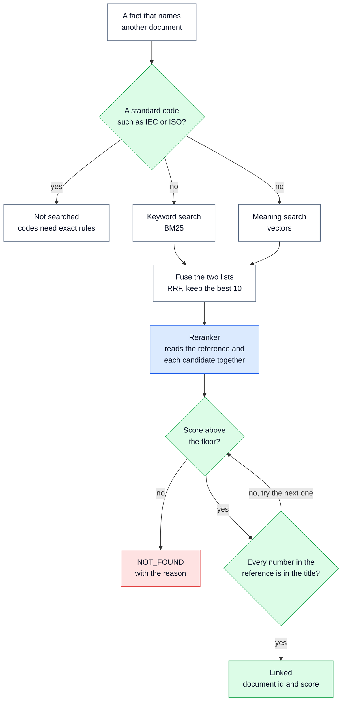
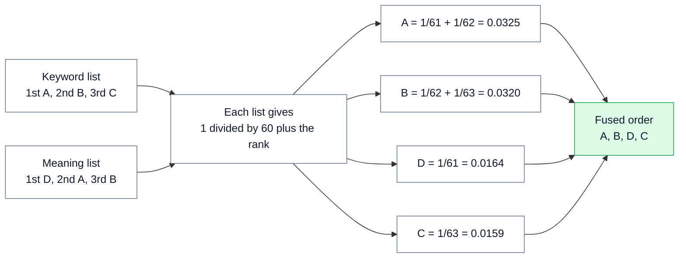
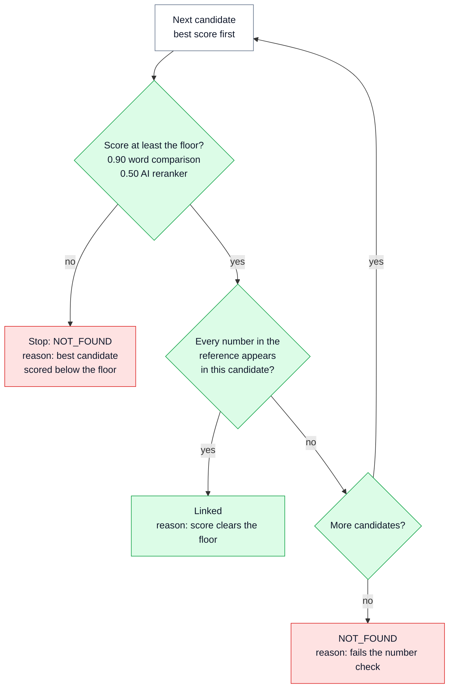

# 🔗 09 — Reference Linking: point to the right document, or say NOT_FOUND

> **In one line:** When a regulation mentions another document, we link it to a document we already hold only if we are sure; otherwise we honestly say NOT_FOUND.

---

## 🧭 Where this fits

This is **step 6 of 10** (Resolve). It runs after step 5 has checked every fact ([06 — Grounding Gate and Verify](06_GROUNDING_GATE_AND_VERIFY.md)). It looks only at facts that **name another document**, and tries to link each one to a document in our collection (the **corpus**).

This is one of only **two places** where search is used in the whole system. The other is matching clauses between two revisions ([11 — Change Detection](11_CHANGE_DETECTION.md)). Search is **not** used to extract facts.

---

## 🤔 The simple picture

A visitor asks a librarian for "the ECAS General Requirements book". A good librarian:

1. Looks in the catalogue for the **exact words** ("ECAS", "General", "Requirements").
2. Also thinks of books with the **same meaning** in other words ("Emirates Conformity Assessment Scheme General Requirements").
3. Puts both lists together, and picks the books that **both** lists like.
4. Takes the top few books and **reads each title carefully** next to the request.
5. Checks the **numbers**: "Law No. 28" is not "Law No. 24", however similar they look.
6. Hands over a book **only if sure**. Otherwise says: "We do not have that book."

Handing over the wrong book is worse than saying "we do not have it". The visitor would trust the wrong book.

---

## ❓ Why we need it

**What is a reference?** It is text in one document that points to another document. CARL-01 has two clear examples:

- Clause 8.1: "... according to a relevant conformity assessment scheme which is written in **clause no. 6 of ECAS General Requirements**."
- Clause 5.1: "ESMA ... The UAE's Standards body as mandated by **Federal Law No. 28**."

Compliance customers follow these chains: a regulation points to a law, a law points to a standard, a standard covers a product. If we already hold the other document, the customer should get a **link** (its document id), not just the words.

| Problem | What goes wrong without it |
|---|---|
| We only keep the words "ECAS General Requirements" | A customer cannot follow the chain to the other document, even though we hold it. |
| We always link to the closest-looking title | "Federal Law No. 24" gets linked when the text says "No. 28". A compliance team reads the wrong law and trusts it. |
| Meaning-based search alone | Numbers blur. To a meaning model, "No. 24" and "No. 28" are almost the same. |
| Keyword search alone | It misses the same name written in other words, such as the full name instead of the abbreviation. |
| No clear "not found" answer | Most references point to documents we do not hold. Without a clear NOT_FOUND, people cannot tell "not linked yet" from "not found". |

> [!IMPORTANT]
> **A wrong link is worse than no link.** So NOT_FOUND is a valid, normal answer. It always comes with a reason.

---

## ⚙️ How it works, step by step

### Part A: which facts are linked

Only two kinds of facts name another document:

| Fact | What is searched for |
|---|---|
| An **external cross-reference** (for example 8.1) | The name of the other document (`target_document`) |
| A **legal reference** entity (for example "Federal Law No. 28") | The entity's text |

**Internal** references ("clause 4 of this document") are not searched. Step 5 checks them directly: does clause 4 exist in the clause tree?

**Standard codes are not searched either.** "IEC 60335-1" and "IEC 60335-2-13" are different standards. But a meaning-based search puts them right next to each other, because the text is almost the same. A code is an **identifier**, like a passport number. Identifiers need **exact** rules, not similarity. In the proof of concept, standard codes are simply not sent to search. The exact matching rules for them are part of the design, not yet built.

### Part B: the whole flow



### Part C: keyword search (BM25)

**BM25** is a standard way to score documents by **keywords**. In simple words:

- A title scores higher when it contains the words of the reference.
- **Rare words count more.** "ECAS" or "28" tells us much more than "the" or "requirements".
- A long title does not win just because it has more words.

BM25 is good at **exact tokens**, such as "No. 28". The code uses the usual settings (k1 = 1.5, b = 0.75). It is written out in about 25 lines in `retrieval.py`, so it is easy to read.

### Part D: meaning search (vectors, also called embeddings)

An **embedding** is a list of numbers that stands for the **meaning** of a text. Texts with a similar meaning get similar lists. We compare two lists with **cosine similarity**: a number that is high when the lists point the same way.

- **Strength:** it finds the same name written in different words.
- **Weakness:** numbers blur. "Federal Law No. 24" and "Federal Law No. 28" look almost the same.

That is why we use **both** kinds of search. This mix is called **hybrid search**.

**Live mode** uses a real embedding model through LiteLLM (the default setting is `text-embedding-3-small`; the live run used Jina). **Offline mode** has no embedding model, so the code uses a simple stand-in: a **hashed bag of words**. Each word is turned into one of 256 slots, and the list counts the words. It is free and gives the same result every time. But it is **not** about meaning: "car" and "automobile" look unrelated. The code says so plainly. If the live embedding call fails, the code falls back to the stand-in, and the searches use the same stand-in so that the numbers stay comparable.

### Part E: putting the two lists together (RRF)

The two searches give scores on **different scales**. You cannot add a BM25 score to a cosine score. So we only use the **rank** (1st, 2nd, 3rd ...). This is **reciprocal rank fusion (RRF)**:

- Each list gives each document **1 ÷ (60 + its rank)**.
- Add up the points from both lists.
- A document that **both** lists like comes out on top.

The number 60 is a standard value. It stops one first place from winning on its own.

**A small worked example.** The keyword list ranks A, B, C. The meaning list ranks D, A, B.



D was first in the meaning list, but only one list liked it. A was liked by both lists, so A wins. In the code, each list gives its top 30, and the fused list keeps the **best 10**.

### Part F: the reranker, the floor and the number check

The **reranker** reads the reference and each of the 10 candidates **together**, and gives each a new score from 0 to 1.

- **By default** it is a simple word comparison (rapidfuzz `token_sort_ratio`). It sorts the words first, so word order does not matter. It checks the title and every alias, and keeps the best.
- **Optionally** it is an AI reranker model, such as `jina-reranker-v2-base-multilingual`, called through LiteLLM. If that call fails, the code falls back to the word comparison, and the result says which method was used.

Then the code walks down the reranked list:



- **The floor** is the minimum score for a link. It is 0.90 for the word comparison and 0.50 for an AI reranker, because the two give scores on different scales.
- **The number check** is a rule no score can override: every number in the reference must appear in the candidate's title or alias, as a whole number. "2" does not match "28".

This is the number check, copied from `regextract/resolution/retrieval.py`:

```python
def numbers_agree(query: str, entry: CatalogEntry) -> bool:
    wanted = set(_NUMBER.findall(query))
    if not wanted:
        return True
    return any(wanted <= set(_NUMBER.findall(name)) for name in entry.names)
```

**Real results from the code** (offline, word-comparison reranker, noisy catalogue):

| Reference | Result | Reason given by the code |
|---|---|---|
| ECAS General Requirement | **Linked** to ECAS-GR, score 0.98 | "score 0.98 clears the floor of 0.90" |
| Federal Law No. 2 | NOT_FOUND | "best candidate 'Federal Law No. 28' fails the number check" (the words were 0.97 similar) |
| Federal Law No. 99 | NOT_FOUND | "best candidate 'Federal Law No. 28' scored 0.89, below the floor of 0.90" |
| General Requirements | NOT_FOUND | "best candidate 'ECAS General Requirements' scored 0.89, below the floor of 0.90" |

"Federal Law No. 2" is the key case. Its words are **97% similar** to "Federal Law No. 28", so it passes the floor. **Only the number check stops a wrong link.**

### Part G: Qdrant (an optional search database)

**Qdrant** is a database built for vector search. It is optional. With `--qdrant`, each catalogue entry is stored with **two named vectors**: a dense one (meaning) and a sparse one (keywords, BM25-style, with Qdrant adding the word weights itself). Qdrant runs both searches and the RRF fusion **inside the database**. It runs in memory by default; set `QDRANT_URL` to use a real server. If Qdrant is not available, the code uses the same method in plain Python. The `resolve` step reports which one it used (`backend: qdrant` or `in-process`).

---

## 🔍 How we built it in this project

| File | What is in it |
|---|---|
| `regextract/resolution/retrieval.py` | The catalogue loader, `BM25`, `reciprocal_rank_fusion`, `HybridIndex` (in-process or Qdrant), `rerank`, `numbers_agree`, `resolve`, and `evaluate_resolution` (clean versus noisy test) |
| `regextract/resolution/vectors.py` | `embed` (live model, or the offline hashed stand-in), `local_embedding` (256 slots), `cosine` |
| `data/corpus_catalog.json` | The pretend corpus: 6 documents |
| `data/distractor_titles.txt` | About 200 unrelated titles, added as noise |
| `gold/resolution.json` | The 8 hand-written test cases |
| `regextract/config.py` | `use_resolution` on; `resolution_min_score` 0.90; `resolution_min_score_model` 0.50; `resolution_candidates` 10; `rerank_model` empty (word comparison); `use_qdrant` off |

**The pretend corpus.** We do not have a real corpus, so `data/corpus_catalog.json` stands in for "documents we already hold":

| Id | Title | Why it is there |
|---|---|---|
| ECAS-GR | ECAS General Requirements (alias: Emirates Conformity Assessment Scheme General Requirements) | Cited by CARL-01 clause 8.1 |
| AE-FL-28 | Federal Law No. 28 | Cited by CARL-01 clause 5.1 |
| SYN-FL-24 | Federal Law No. 24 | **Invented near-miss**: one number away |
| SYN-ECAS-REG | ECAS Registration Guidelines | Invented near-miss |
| SYN-TOY | General Requirements for Toy Safety | Invented near-miss |
| SYN-LVD | Low Voltage Equipment Directive | Invented near-miss |

The four invented entries exist only to prove that the code **refuses** a document that merely looks similar. Then about 200 unrelated titles (computer-science and systems papers) are mixed in as noise, for **211** entries in total.

The link is **information for downstream**, not a reason to send a fact to review. Most references point to documents we do not hold, so NOT_FOUND is normal, not suspicious.

---

## 📊 What the results show

The 8 test cases run twice: against the 6-document catalogue (**clean**) and against all 211 entries (**noisy**). If accuracy drops when the noise is added, the floor is too low.

| Reference | Expected | Offline, word comparison (clean / noisy) | Live, Jina AI reranker (clean / noisy) |
|---|---|---|---|
| ECAS General Requirements | ECAS-GR | ECAS-GR / ECAS-GR | ECAS-GR / ECAS-GR |
| Federal Law No. 28 | AE-FL-28 | AE-FL-28 / AE-FL-28 | AE-FL-28 / AE-FL-28 |
| ECAS General Requirement | ECAS-GR | ECAS-GR / ECAS-GR | ECAS-GR / ECAS-GR |
| Emirates Conformity Assessment Scheme General Requirements | ECAS-GR | ECAS-GR / ECAS-GR | ECAS-GR / ECAS-GR |
| Federal Law No. 2 | NOT_FOUND | NOT_FOUND / NOT_FOUND | NOT_FOUND / NOT_FOUND |
| Federal Law No. 99 | NOT_FOUND | NOT_FOUND / NOT_FOUND | NOT_FOUND / NOT_FOUND |
| GSO Technical Regulation for Low Voltage Electrical Equipment | NOT_FOUND | NOT_FOUND / NOT_FOUND | **SYN-LVD / SYN-LVD (wrong)** |
| General Requirements | NOT_FOUND | NOT_FOUND / NOT_FOUND | **ECAS-GR / ECAS-GR (wrong)** |
| **Accuracy** | | **1.0 / 1.0, 0 wrong links** | **0.75 / 0.75, 4 wrong links** |

- **Offline:** 8 of 8 correct (4 linked, 4 NOT_FOUND), with and without the noise. **0 wrong links.**
- **Live:** the Jina reranker got 6 of 8. It linked two vague references it should have refused. Its scores use a different scale, and the floor of 0.50 is too low for it. **The floor for an AI reranker must be calibrated** on labelled cases, just like the routing thresholds in [07](07_SCORING_AND_ROUTING.md).
- **In the offline CARL-01 run**, three facts were linked: clause 5.1 (legal reference) to AE-FL-28, and clause 8.1 (legal reference and cross-reference) to ECAS-GR.

---

## 🗣️ Say it like this

> "Search is used in only two places, and this is one: linking a reference to a document we already hold. We use keyword search and meaning search together, because keywords catch exact numbers and meaning catches other wordings. A reranker reads each candidate, then a minimum score and a number check decide. 'Federal Law No. 2' is 97% similar to 'No. 28' and only the number check stops it. A wrong link is worse than no link, so NOT_FOUND with a reason is a normal answer. Standard codes like IEC 60335-1 are identifiers, so they need exact rules, not similarity."

---

## ⚠️ Limits and honest notes

- **The corpus is a fixture.** Six documents, four of them invented, plus about 200 noise titles. It shows the method, not real-world recall.
- **Eight test cases is small.** They show the floor and the number check doing their job under noise. They are not a recall measurement, and the report says so.
- **The AI reranker's floor is not calibrated.** Live, Jina got 6 of 8 and made wrong links. In the live CARL-01 run it also linked three facts in clauses 10.1 to 10.3 to "ECAS Registration Guidelines", one of the invented near-miss entries. The floor must be set from labelled data before an AI reranker is used in production.
- **The word-comparison floor is close to the edge for vague names.** "General Requirements" scored 0.89 against a floor of 0.90. A slightly different vague reference could pass. The number check does not help when there are no numbers.
- **A wrong link would travel with its fact.** The link does not affect routing. So if the fact itself is published automatically, a wrong link goes with it. This is another reason to calibrate before switching on an AI reranker.
- **Standard codes are not linked yet.** The exact matching rules for identifiers such as IEC 60335-2-13 are design only.
- **The offline vectors are not about meaning.** They are a free, repeatable stand-in, and they are labelled as such.

---

## 📚 See also

- [06 — Grounding Gate and Verify](06_GROUNDING_GATE_AND_VERIFY.md): internal references are checked there (`internal_target_exists`)
- [07 — Scoring and Routing](07_SCORING_AND_ROUTING.md): calibration of thresholds, which the reranker floor needs too
- [11 — Change Detection](11_CHANGE_DETECTION.md): the other place where vectors are used
- [12 — Evaluation and Testing](12_EVALUATION_AND_TESTING.md): the clean-versus-noisy test in the evaluation report
- [13 — Live Run Results](13_LIVE_RUN_RESULTS.md): the Jina reranker in the live run
- [15 — Decisions, Trade-offs and Limits](15_DECISIONS_TRADEOFFS_AND_LIMITS.md): why search is not used inside extraction
- [17 — Glossary](17_GLOSSARY.md): plain meanings of BM25, embedding, cosine similarity, RRF and reranker
