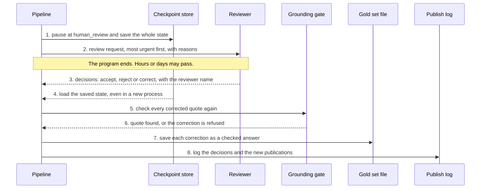
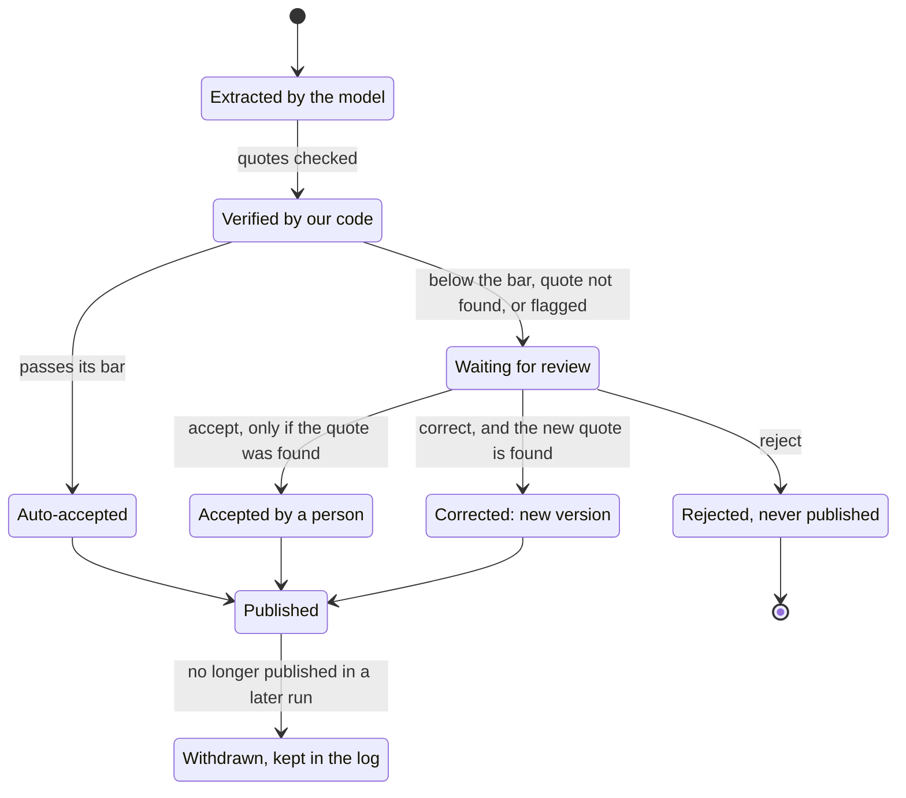
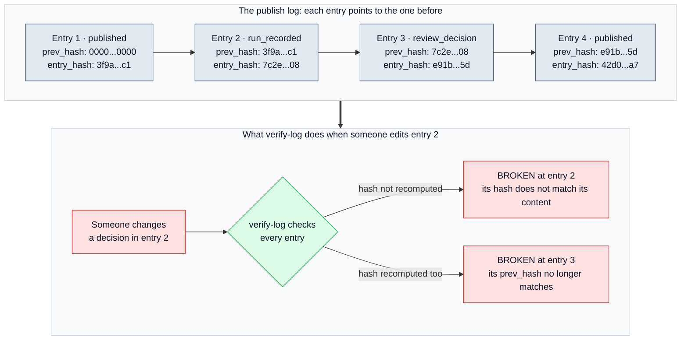

# 🧑‍⚖️ 10 — Human Review and the Publish Log: people decide, and nothing changes quietly

> **In one line:** When a fact needs a person, the run waits for their decision. That decision is checked like the model's answer, and every publication goes into a log that shows any later change.

---

## 🧭 Where this fits

This doc covers **step 8 (Review)** and **step 9 (Publish)** of the ten steps in [01 — System Overview](01_SYSTEM_OVERVIEW.md).

Step 7 has already given every fact a decision: publish automatically, or send to a person. This doc explains what happens next:

- how the run **pauses** for a person and **resumes** later,
- what a reviewer **can and cannot** do,
- what is **published**, and
- how the **publish log** proves that nothing changed quietly afterwards.

---

## 🤔 The simple picture

**The pause.** Think of an office form that needs a manager's signature. The clerk puts the form in the manager's tray and goes home. The next day the manager signs it, and the clerk continues from exactly where they stopped. Nobody starts the form again from the beginning.

regextract does the same. When facts need a person, the run saves everything it has done so far and stops. Later, a reviewer sends in decisions, and the run continues from the saved point. This works even if the computer was restarted in between.

**The log.** Think of a notebook where every page carries a fingerprint of the page before it. If someone later changes one word on page 5, the fingerprint on page 6 no longer matches. You cannot hide the change. That is the publish log. The "fingerprint" is a **hash**: a short code that is computed from the content. Change one letter of the content and the hash changes completely.

---

## ❓ Why we need it

| Problem | What goes wrong without it |
|---|---|
| Some facts are too risky to publish without a person | Wrong facts reach compliance systems, or everything must be checked by hand |
| A person may take hours or days to review | Without a saved pause, the run is lost and must start again from the PDF |
| A reviewer can make mistakes too | A reviewer could "accept" a fact whose quote is not in the document, or type a wrong quote |
| Downstream systems act on published facts | If a published fact is changed or deleted later with no trace, nobody can prove what was true on a given day |
| Reviewer corrections are valuable | If corrections are not saved, the system never learns and the test set (the "gold set") never grows |

---

## ⚙️ Part 1: Pause and resume (step 8)

### The words you need

- **Checkpoint:** a saved copy of the run's data at a point in time. Like a "save game" in a video game.
- **Interrupt:** the moment the run stops and asks a question. Here, the question is "what do you decide for these facts?".
- **Run id** (also called the **thread id**): a short name for one run, for example `6ba6d6e403d4`. You need it to resume the right run.
- **LangGraph:** the library that joins the pipeline steps into one run. It provides the checkpoint and the interrupt.

### What happens, step by step

1. Step 7 finishes. The code checks: is **review mode** on, and is at least one fact waiting for a person?
2. If yes, the run goes to the `human_review` step and calls `interrupt()`. The whole state of the run is saved in the checkpoint store.
3. The run hands out a **review request**: the waiting facts, most urgent first, each with its reasons and quote.
4. The program ends. Nothing is published while the run waits.
5. Later (hours or days), a reviewer sends a decisions file.
6. The run loads its saved state and continues from `human_review`. It applies the decisions and then publishes.

This diagram shows the pause and the resume. Time goes from top to bottom.



If review mode is **off** (the default), the run does not pause. It writes the waiting facts to `review_queue.csv` and finishes.

### Why the saved state holds data only

A checkpoint must be written to disk and read back later. Plain data (text, numbers, lists of facts) can be saved. A **live connection** cannot. The model gateway holds open connections to AI providers. Saving it is like trying to put a phone call in a box: when you open the box, the call is gone.

So the design splits the run into two parts:

| Part | What it holds | Saved in the checkpoint? |
|---|---|---|
| **State** | The data: the clean text, the clauses, the facts, the flags | Yes |
| **Runtime context** (`Services`) | The live objects: the settings, the model gateway, the run recorder | No. It is rebuilt fresh in every process |

This is the real code, from `regextract/pipeline/graph.py`:

```python
@dataclass
class Services:
    """Runtime context: what every node needs and no checkpoint may hold."""

    settings: Settings
    gateway: Gateway
    recorder: RunRecorder
```

And the review step itself. Note the comment: when the run resumes, LangGraph runs this function again **from the top**. So nothing before `interrupt()` may change anything outside the run.

```python
def node_human_review(state: PipelineState, runtime: Runtime[Services]) -> dict:
    """Wait for a person. LangGraph re-runs this node from the top when the
    run resumes, so nothing before interrupt() may have a side effect."""
    answer = interrupt(review_request(state["items"], state["run_id"]))
```

The choice between review and publish is one small function:

```python
def review_or_publish(state: PipelineState) -> str:
    waiting = any(i.review.decision is Decision.REVIEW for i in state.get("items", []))
    return "human_review" if state.get("review_mode") and waiting else "publish"
```

### Loading a checkpoint safely

Reading a saved file back into program objects is called **deserialisation**. It has a known risk. If someone changes the saved file, a careless loader might build any object the file asks for, including a harmful one.

So `regextract/pipeline/checkpointing.py` lists **every allowed type by name** (Document, Clause, Item, Evidence, and so on). The loader builds only those types. If a developer adds a new type to the state and forgets to list it, a test fails and names the missing type.

The proof of concept saves checkpoints in **SQLite** (a small database in one file, `outputs/checkpoints.sqlite`). In production this would be **Postgres** (a full database server).

---

## ⚙️ Part 2: The three decisions

A reviewer can do one of three things with each waiting fact. Every decision must carry the reviewer's name.

| Decision | What happens |
|---|---|
| **accept** | The fact is published as it is. It is marked `accepted`, with the reviewer's name and the time. |
| **reject** | The fact is never published. It is marked `reject`. |
| **correct** | The reviewer sends only the fields that change. A **new version** of the fact is created. The old version is kept and marked `superseded`. The new version points to the old one (`supersedes`). |

### One rule for people too

> [!IMPORTANT]
> A reviewer cannot publish unsupported evidence either. The same grounding gate that checks the model also checks the reviewer.

This means two things:

1. **A fact whose quote was not found cannot be accepted.** The reviewer must correct it with a real quote from the clause, or reject it. This is the real code, from `regextract/review/review.py`:

   ```python
   if decision.action == "accept" and not item.evidence.grounded:
       # A person cannot publish unsupported evidence either: correct the
       # quote from the clause text, or reject the fact.
       problem = ("accept_refused_not_grounded: the quote is not in the clause text; "
                  "correct it with a quote from the clause, or reject it")
   ```

2. **A correction is checked again.** If the corrected quote cannot be found in the clause, the correction is **refused**. The fact is not rejected. It stays waiting, and the reason is added to it for the next reviewer.

Other checks: a correction that changes nothing is refused ("use accept"). A decision for a fact that is not waiting is refused. A decision for a fact that does not exist is reported.

### Corrections grow the gold set

Every accepted correction is added as one line to `gold/reviewer_corrections.jsonl`, with the fact before, the fact after, the reviewer, the note and the time. This file is how the **gold set** (the collection of answers checked by experts) grows over time. See [12 — Evaluation and Testing](12_EVALUATION_AND_TESTING.md).

### The life of a fact

This diagram shows every state a fact can be in, from the moment the model returns it.



When a fact is corrected, the old version does not disappear. It is marked `superseded` and kept, so anyone can see what the model said and what the person changed.

Sometimes a correction is refused (its new quote is not in the clause), or an "accept" is refused (the original quote was not found). Then the fact simply **stays in "Waiting for review"**, with the reason added.

---

## ⚙️ Part 3: Review from the command line

**1. Run with review mode on.**

```bash
python run.py extract --pdf data/CARL-01.pdf --review
```

The run pauses and prints something like `paused for review: 20 item(s) need a person`, the run id, and two files:

- `outputs/pending_review.json`: the queue, most urgent first.
- `outputs/decisions.template.json`: one empty line per waiting fact.

**2. Fill in the template.** For each fact you decide, write `accept`, `reject` or `correct`, and your name. A correction carries only the fields that change:

```json
{"item_id": "...", "action": "correct", "reviewer": "analyst-a", "payload": {"subject": "supplier"}}
```

The `action` in the template is left empty **on purpose**. If someone submits the template without editing it, it is refused. So nobody can accept a whole queue by accident.

**3. Resume the run.**

```bash
python run.py review --thread <run id> --decisions my_decisions.json
```

It prints how many facts were accepted, rejected and corrected, any problems, how many are still waiting, and how many were published. If the run id does not belong to a paused run, it is refused with a clear message.

> [!NOTE]
> Review has no screen yet. Decisions are a JSON file. That is enough to show the loop works. It is not what an analyst should use every day. A review screen is on the "later" list.

---

## ⚙️ Part 4: Publishing (step 9)

### What the run writes

| File | What it holds |
|---|---|
| `clauses.json` | The clause tree: ids, headings, text, pages, character positions |
| `extractions.json` | Every fact with its evidence, rule checks, score, decision and provenance (which model answered) |
| `review_queue.csv` | What a person still has to look at, most urgent first, with reasons |
| `publish_log.jsonl` | The hash-chained log of every publication and decision |
| `run_manifest.json` | Every stage: timing, counters, cost, models that answered, settings, flags |

### The review queue

`review_queue.csv` is the reviewer's to-do list. Its columns are: item id, impact, clause id, kind, type, score, agreement, grounded, match, judge priority, reasons, and the quote.

**Holes come first.** If the model never answered a clause (`extraction_failed`), there is no fact to review, only a gap. The code writes one row for each such clause at the **top** of the file, so a reviewer cannot miss it. A gap that nobody sees looks exactly like "this clause has no facts".

A real row from `samples/review_queue.csv` (clause 11.4, the renewal rule with no stated subject):

```text
CARL-01:11.4:9dc7920e40e0, high, 11.4, obligation, score 0.494, agreement 0.0,
grounded True, exact, reasons: models_disagree; high_impact_requires_full_agreement; high_impact_type
```

### What actually leaves the system

A fact is published only if **both** are true:

1. it was accepted, by the router (`auto_accept`) or by a person (`accepted`), **and**
2. its quote was found in the source (`grounded`).

```python
return [
    i for i in run.items
    if i.review.decision in (Decision.AUTO_ACCEPT, Decision.ACCEPTED) and i.evidence.grounded
]
```

The second condition is **redundant today**, because routing and review already enforce it. It is there on purpose. This is the last gate before other systems receive the data. A double check at the exit is cheap insurance if someone changes the code later.

---

## ⚙️ Part 5: The hash-chained publish log

### What is in each entry

The log `publish_log.jsonl` is a text file with one entry per line. Entries are only ever **added at the end** (append-only). Each entry holds:

| Field | Meaning |
|---|---|
| `seq` | The entry number: 0, 1, 2 ... |
| `event` | One of four types: `published`, `withdrawn`, `review_decision`, `run_recorded` |
| `at` | The time, in UTC |
| `body` | The details, for example the fact id, the document, the revision, the decision, the reviewer, and a content hash of the fact |
| `prev_hash` | The hash of the entry before this one. The first entry uses 64 zeros |
| `entry_hash` | The hash of this entry's own content (everything except this field) |

The hashes use **SHA-256**, a standard method that turns any content into a 64-character code.

### The four events

- **published:** a fact was published, or a published fact changed (a new content hash).
- **withdrawn:** a fact that was published before is not published any more (for example, its clause was removed in a new revision). The entry says so. Nothing is deleted silently.
- **review_decision:** a person accepted, rejected or corrected a fact.
- **run_recorded:** a run finished, with counts: new, unchanged, withdrawn, decisions.

**Re-running an unchanged document adds no new publications.** The log remembers the content hash of every live fact. If a fact is the same as before, it is counted as "unchanged" and not logged again. Only a `run_recorded` entry is added.

### How the chain works

The diagram shows four entries. Each one carries the hash of the one before. Hashes are shortened here.



### The two checks in `verify-log`

`python run.py verify-log` reads the log line by line and runs two checks on every entry:

1. **Does the entry's hash match its content?** If not, the entry was edited after it was written.
2. **Does its `prev_hash` match the entry before?** If not, an entry was inserted, deleted or moved.

| What someone did | What `verify-log` reports |
|---|---|
| Nothing | `chain intact` |
| Changed a line, did not fix its hash | `BROKEN` at that line: "this entry was edited after it was written" |
| Changed a line **and** recomputed its hash | `BROKEN` at the **next** line: its `prev_hash` no longer matches |
| Deleted a line | `BROKEN` at the line after the gap |

Try it: run `verify-log`, change a decision in any line of `outputs/publish_log.jsonl`, and run it again.

### Tamper-evident, not tamper-proof

> [!WARNING]
> A file can **show** tampering. It cannot **stop** it. Someone with access could rewrite the whole file and recompute every hash from the changed line to the end.

This is the difference between two words:

- **Tamper-evident:** a change can be detected. This is what the proof of concept gives.
- **Tamper-proof:** a change is impossible. This needs storage that refuses changes, such as **object-lock storage** in a compliance mode. There, nobody (not even an administrator) can change or delete an entry before its retention date.

In production, each entry would be stored under such a lock.

---

## 🔍 How we built it in this project

| File | What it does |
|---|---|
| `regextract/pipeline/graph.py` | `node_human_review` (the pause), `review_or_publish` (the branch), `node_publish`, `resume_pipeline` (continue a paused run; refuses a run that is not waiting) |
| `regextract/pipeline/checkpointing.py` | The allow-list of saved types; `memory_checkpointer` (tests) and `sqlite_checkpointer` (on disk) |
| `regextract/review/review.py` | `review_request`, `ReviewDecision`, `parse_decisions`, `apply_decisions`, `append_gold_corrections` |
| `regextract/publishing/publish.py` | `write_outputs`, the review queue CSV, `published_items` |
| `regextract/publishing/publog.py` | `PublishLog` (append, record) and `verify_log` |
| `run.py` | `extract --review`, `review --thread ... --decisions ...`, `verify-log` |

One more detail: a paused run and its resumed half happen in two different processes. The run manifest joins them, so `run_manifest.json` shows the stages from **before** the pause and **after** it, as one run.

---

## 📊 What the tests show

These tests in `tests/test_review.py` and `tests/test_trust_fixes.py` all pass:

- the run pauses and hands out the queue as its question, and publishes nothing while it waits
- accept and reject are applied and stamped with the reviewer and time
- a correction is a new version, and the original is kept
- a correction whose quote is not in the source is refused
- a fact whose quote was not found cannot be accepted
- the pause survives the process ending (resume in a new process)
- resuming a run that is not waiting is refused
- the resumed run has its whole history, and reviewer decisions are in the publish log
- re-running an unchanged document publishes nothing new
- an edited entry is detected, and a deleted entry breaks the chain

`tests/test_checkpointing.py` also checks that the state survives a save and load with every type registered, and that no live object is saved in the checkpoint.

---

## 🗣️ Say it like this

> "When a fact needs a person, the run saves its state and stops. A reviewer can accept, reject or correct, and must give their name. The reviewer is held to the same rule as the model. A correction must quote words we can find in the document, and a fact with no real quote cannot be accepted. A correction never overwrites anything. It creates a new version and keeps the old one. Every publication and decision goes into a log where each entry carries the fingerprint of the one before, so any later edit is detected."

---

## ⚠️ Limits and honest notes

- **No review screen.** Decisions are a JSON file. Fine for a proof of concept, not for daily work.
- **Tamper-evident only.** The log is a local file. Tamper-proof needs object-lock storage underneath it.
- **SQLite checkpoints.** Good for one machine. Production needs Postgres.
- **No reviewer levels yet.** In production, high-impact facts could need a senior analyst. That is a design idea, not built.
- **The gold file only grows.** Corrections are saved, but turning them into calibrated thresholds is not built yet. See [07 — Scoring and Routing](07_SCORING_AND_ROUTING.md).

---

## 📚 See also

- [07 — Scoring and Routing](07_SCORING_AND_ROUTING.md): how a fact ends up waiting for review
- [06 — Grounding Gate and Verify](06_GROUNDING_GATE_AND_VERIFY.md): the quote check that reviewers must pass too
- [11 — Change Detection](11_CHANGE_DETECTION.md): what happens when a new revision arrives, and why facts get withdrawn
- [12 — Evaluation and Testing](12_EVALUATION_AND_TESTING.md): the gold set that reviewer corrections grow
- [14 — Path to Production](14_PATH_TO_PRODUCTION.md): Postgres, object-lock storage and the review screen in production
- [17 — Glossary](17_GLOSSARY.md): checkpoint, interrupt, hash, SHA-256, tamper-evident
