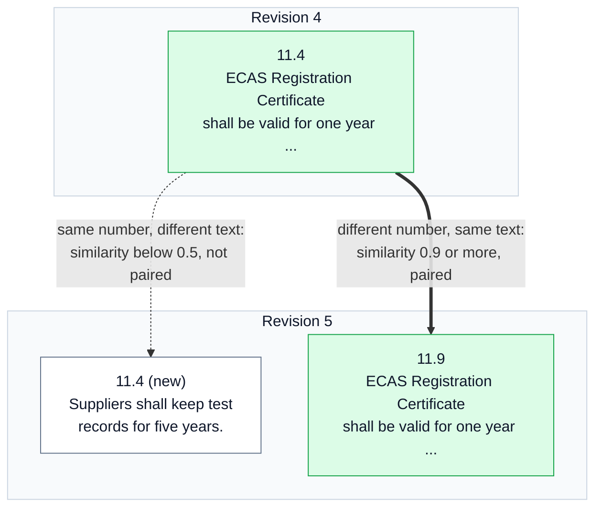
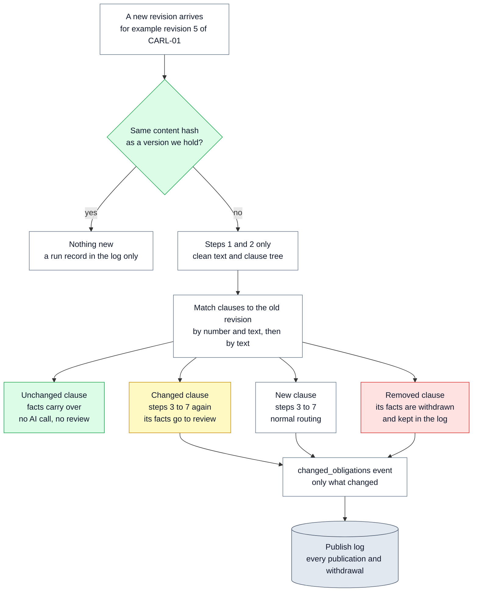

# 🔄 11 — Change Detection: find what changed between two revisions

> **In one line:** When a new version of a regulation arrives, we match its clauses to the old version. Only the facts that were added or removed go to people and other systems.

---

## 🧭 Where this fits

This is **step 10 (Diff)**, the last of the ten steps in [01 — System Overview](01_SYSTEM_OVERVIEW.md).

Steps 1 to 9 turn **one** document into checked facts. Step 10 compares **two revisions** of the same document, for example revision 4 and revision 5 of CARL-01. It is the start of the second loop: a new revision goes through the pipeline, and step 10 finds what is different.

---

## 🤔 The simple picture

Imagine you signed a rental contract last year. This year the landlord sends a new 40-page contract. You do not want to read all 40 pages again. You want someone to tell you: "Three things changed. The rent went up, the notice period is now two months, and the pet rule was removed."

Compliance teams have the same need, for thousands of regulations. They already know the old version. What they need is **the difference**, and they need it to be exact.

One thing makes this harder than it sounds. Regulations get **renumbered**. If a new clause is inserted as 11.2, the old 11.2 becomes 11.3, the old 11.3 becomes 11.4, and so on. A simple "compare clause 11.3 with clause 11.3" would report that everything changed, when really only one clause was added.

---

## ❓ Why we need it

| Problem | What goes wrong without it |
|---|---|
| Customers care about **what changed**, not the whole document again | They must re-read everything, and a real change is easy to miss |
| Clauses get renumbered | Matching by number alone reports false changes in every clause after the insert |
| A new clause can take an old clause's number | Matching by number alone mixes up two different clauses |
| Review time is limited | Without a diff, every fact of every new revision goes back to review |
| Model calls cost money | Without a diff, every clause of every revision is sent to the AI model again |

> [!IMPORTANT]
> For a compliance customer, tracking change **is** the product. Extraction is how we get there. That is why the design says step 10 is what turns extraction into something customers pay for.

---

## ⚙️ How it works, step by step

### Part 1: Match the clauses

The code must decide which old clause is "the same clause" as which new clause. It uses two rules, in order. This is the function `match_clauses` in `regextract/publishing/publish.py`.

1. **Same number, and similar text.** If a clause id exists in both revisions (for example `11.4`), the two are paired only if their texts are also similar. The similarity must be at least **0.5** out of 1.0.
2. **Leftovers, by text only.** Every old clause that is still unpaired is compared with every new clause that is still unpaired. The most similar pairs are matched first, but only if their similarity is at least **0.9** (very close).

A clause that finds no partner is **removed** (if it was old) or **new** (if it is new).

**How "similar" is measured.** Each clause's heading and text is turned into a list of 256 numbers (a **vector**) by counting its words. Two clauses with nearly the same words get nearly the same vector. The code compares vectors with **cosine similarity**, a standard score from 0 (nothing in common) to 1 (the same). These are simple word-count vectors, not an AI model. That is on purpose: a renumbered clause has almost exactly the same words, so word counting finds it, for free and with the same answer every time.

### Why the number alone is not enough

This diagram shows a real test case from `tests/test_resolution.py`. In revision 5, the old clause 11.4 moves to 11.9 without any change, and a **new** clause takes the number 11.4.



| Method | What it reports | Correct? |
|---|---|---|
| Match by number only | "11.4 changed completely" and "11.9 is new". Churn in two places | No |
| Match by number **and** text (our method) | "11.4 was renumbered to 11.9, no facts changed" and "a new 11.4 was added" | Yes |

The test `test_renumbering_alone_produces_no_fact_deltas` checks both rows: our method reports **zero** fact changes for the move, and a number-only match **does** report false changes.

### Part 2: Compare the facts

Once clauses are matched, the code compares **facts**, not text. This is `diff_runs`.

1. Every fact gets a **key**: (the clause it maps to in the new revision, its kind, its signature).
   The **signature** is a short, normalised summary of the fact. For an obligation, it is the subject, the strength (shall, may ...) and the first 80 characters of the action. For an entity, it is the type and the text.
2. A fact whose key is only in the new revision is **added**.
3. A fact whose key is only in the old revision is **removed**.
4. An old clause with no partner gets a special key starting with `unmatched:`. That key can never match anything new. So its facts are reported as removed, and they never collide with a new clause that happens to reuse the same number.

> [!NOTE]
> A clause whose wording moved around but whose facts stayed the same produces **no** change. Only facts count. A reviewer's time is not spent on a comma.

A fact whose value changed (for example "one year" became "two years") has a new signature. So it shows as **one removed and one added**. Both appear in the event, side by side.

### Part 3: Tell other systems

The result is a small **event** (a message other systems can listen for) called `changed_obligations`. It is kept small on purpose: identifiers, counts and the changed facts only. A system that needs the full context fetches it by id.

This is real output. We ran the runbook example (revision 5 = revision 4 with three obligations removed) on 19 September 2026. It is shortened here to one of the three changes:

```json
{
  "event": "changed_obligations",
  "document_id": "CARL-01",
  "from_revision": "4",
  "to_revision": "5",
  "counts": {
    "total_deltas": 3,
    "obligation_deltas": 3,
    "added": 0,
    "removed": 3,
    "renumbered_clauses": 0
  },
  "obligation_deltas": [
    {
      "change": "removed",
      "clause_id": "2",
      "type": "obligation",
      "before": {
        "modality": "must",
        "action": "meet these requirements",
        "quote": "electrical equipment must meet these requirements."
      },
      "after": null
    }
  ],
  "renumbered_clauses": []
}
```

---

## ⚙️ How it would work in production

In the proof of concept, the diff compares **two complete runs**: both revisions go through all the steps, then step 10 compares the results. In production, the same matching would decide **what to run at all**, so unchanged clauses never go to the AI model again.

This diagram shows the production flow for a new revision.



Four ideas make this work:

1. **Content hash.** Step 1 already records a hash (a fingerprint) of the PDF file. If the fingerprint is the same as a version we hold, nothing has changed and nothing runs.
2. **Carry over unchanged facts.** Fact ids are built from the document id, the clause number and the content of the fact. An unchanged clause with the same number gives the same facts with the same ids, so they keep their published status. (A renumbered clause gets new ids, because the clause number is part of the id. The clause match above is what tells us they are the same facts.)
3. **Withdraw, never delete.** Facts of a removed clause are marked `withdrawn` in the publish log. The history stays. See [10 — Human Review and the Publish Log](10_HUMAN_REVIEW_AND_PUBLISH_LOG.md).
4. **Integrity alert.** If the file's hash changes but the **revision number does not**, that is not a normal new revision. Someone may have changed the document without saying so. The system raises an alert and holds the document. See [08 — Guardrails](08_GUARDRAILS.md).

**Why this matters for cost.** The design estimates about 200 new or changed documents a month per jurisdiction. That is about $2,400 a month at full price if every clause were re-extracted. Re-extracting only the changed clauses costs much less. See [14 — Path to Production](14_PATH_TO_PRODUCTION.md).

---

## 🔍 How we built it in this project

| Piece | Where | What it does |
|---|---|---|
| `match_clauses` | `regextract/publishing/publish.py` | Pairs old and new clauses: same id with similarity ≥ 0.5, then leftovers with similarity ≥ 0.9 |
| `local_embedding`, `cosine` | `regextract/resolution/vectors.py` | 256-number word-count vectors, and the similarity score |
| `diff_runs` | `regextract/publishing/publish.py` | Compares facts by (mapped clause, kind, signature); reports added and removed |
| `renumbered_clauses` | `regextract/publishing/publish.py` | Lists clauses whose number changed, for example 11.4 to 11.9 |
| `changed_obligations_event` | `regextract/publishing/publish.py` | Builds the small event for other systems |
| `signature` | `regextract/verification/verify.py` | The normalised summary of a fact (also used for two-model agreement) |

This is the heart of `match_clauses`, copied from the code:

```python
mapping: dict[str, str] = {}
for clause_id in old.keys() & new.keys():
    if cosine(old[clause_id], new[clause_id]) >= same_id_floor or not any(old[clause_id]):
        mapping[clause_id] = clause_id

left_old = [cid for cid in old if cid not in mapping]
left_new = {cid for cid in new if cid not in mapping.values()}
pairs = sorted(((cosine(old[o], new[n]), o, n) for o in left_old for n in left_new), reverse=True)
for score, old_id, new_id in pairs:
    if score < threshold:
        break
    if old_id not in mapping and new_id in left_new:
        mapping[old_id] = new_id
        left_new.discard(new_id)
```

**Run it yourself.** Save two runs, then compare them:

```bash
python run.py extract --pdf data/CARL-01.pdf --out outputs/rev4
# ... later, for the new revision:
python run.py extract --pdf data/CARL-01-rev5.pdf --out outputs/rev5
python run.py diff --previous outputs/rev4/extractions.json --current outputs/rev5/extractions.json
```

`RUNBOOK.md` step 19 shows how to make a "revision 5" in a few lines of Python, by removing three obligations from revision 4. (`CARL-01-rev5.pdf` above is an example name. Only one real revision of CARL-01 was available.)

---

## 📊 What the tests show

| Test | What it proves |
|---|---|
| `test_diff_detects_added_and_removed_facts` | Remove three obligations: exactly three deltas, all "removed", and the event counts three obligation deltas |
| `test_identical_runs_produce_no_deltas` | The same run compared with itself gives no changes (no false alarms) |
| `test_a_renumbered_clause_is_matched_by_text_not_by_its_old_id` | 11.4 moved to 11.9 is matched to 11.9, and listed as renumbered |
| `test_renumbering_alone_produces_no_fact_deltas` | A pure renumbering gives zero fact changes, and a number-only match would have reported false changes |
| `test_item_ids_are_stable_across_runs` | The same document gives the same fact ids twice. Without this, every run would look like a change |

---

## 🗣️ Say it like this

> "Customers do not want the whole regulation again. They want to know what changed. So we match each clause of the new revision to the old one, first by its number and text, then by text alone, because clauses get renumbered. Then we compare facts, not wording, and send out a small event with only the facts that were added or removed. In production, unchanged clauses would not even go back to the AI model, which keeps the monthly cost low."

---

## ⚠️ Limits and honest notes

- **Only one real revision.** CARL-01 revision 4 is the only version we had. Change detection was tested on **made-up** revisions: removed facts, and a renumbered clause whose old number is reused.
- **The proof of concept runs everything twice.** It compares two complete runs. Skipping unchanged clauses (to save cost) is a production design, not built yet.
- **"Changed" shows as removed plus added.** The code has no separate "changed" label yet. A changed value appears as one removed fact and one added fact.
- **Word-count similarity is simple.** It works well for renumbered clauses, which keep their words. A clause that was heavily reworded may not be matched, and then shows as removed plus new. That is the safe direction: a person reviews it.
- **The thresholds (0.5 and 0.9) are starting values.** They should be checked on real revision pairs.
- **Clause splits and merges** (one old clause becomes two new ones) are not handled specially. They show as removed plus new.

---

## 📚 See also

- [10 — Human Review and the Publish Log](10_HUMAN_REVIEW_AND_PUBLISH_LOG.md): how removed facts are withdrawn and logged
- [03 — Output Contract](03_OUTPUT_CONTRACT.md): why fact ids come from the content
- [06 — Grounding Gate and Verify](06_GROUNDING_GATE_AND_VERIFY.md): the fact signature, also used for two-model agreement
- [08 — Guardrails](08_GUARDRAILS.md): source integrity and the hash-changed-without-a-new-revision alert
- [14 — Path to Production](14_PATH_TO_PRODUCTION.md): cost of changed documents per month
- [17 — Glossary](17_GLOSSARY.md): vector, cosine similarity, content hash, event
