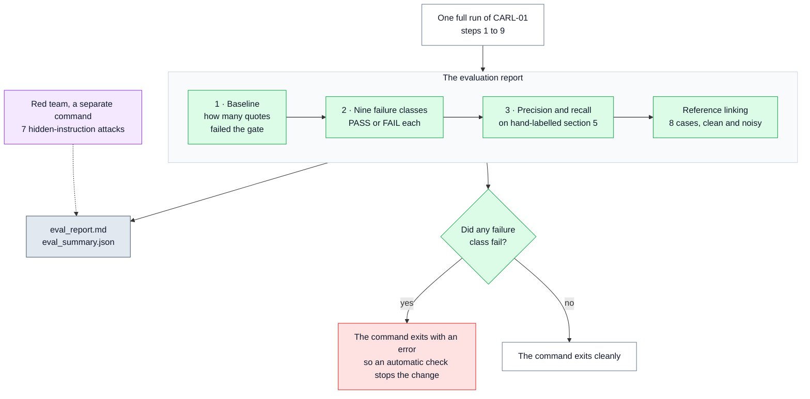
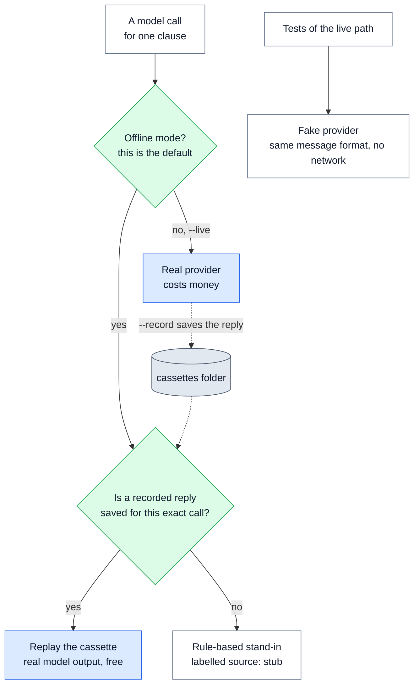
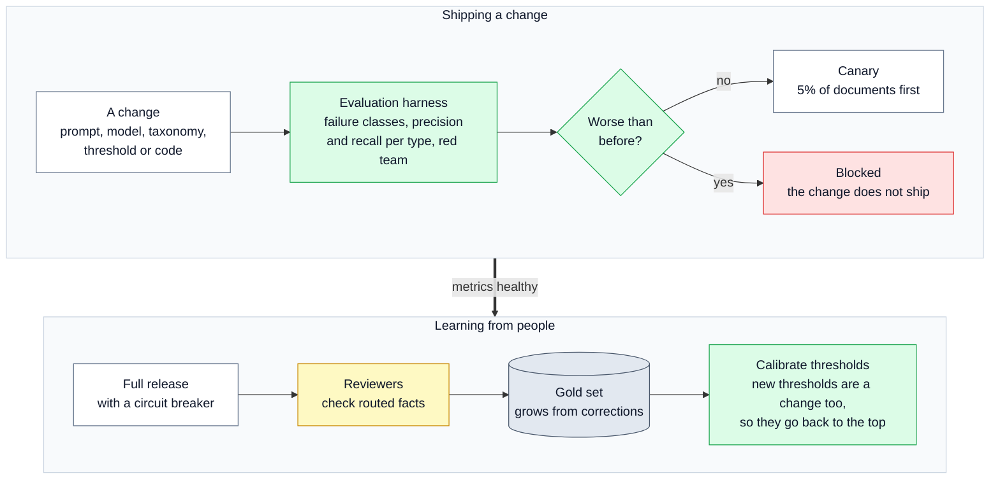

# 🧪 12 — Evaluation and Testing: how we know the checks work

> **In one line:** We test for nine known problems, plant fake facts, attack the system with hidden instructions, and run 109 automated tests. None of it needs an API key.

---

## 🧭 Where this fits

Evaluation is not one of the ten steps. It sits **around** all of them. It answers the brief's question: *"What evidence and evaluations would make you comfortable that the system is working as intended?"*

There are two parts:

- **The evaluation report** (`python run.py evaluate`): runs the whole pipeline on CARL-01 and measures the result.
- **The automated tests** (`python -m pytest -q`): 109 small checks on every part of the code.

---

## 🤔 The simple picture

Think of a **driving test**. The examiner does not only drive on an empty straight road. They take the learner through the hard situations they already know about: a roundabout, a hill start, a school zone. Each one has a clear pass or fail.

Our **failure classes** are those hard situations. CARL-01 contains nine kinds of known trouble (a clause split across pages, a money section with no amounts, a table, and so on). For each one, the report checks the output and says PASS or FAIL.

Think also of a **fire drill**. You do not wait for a real fire to find out whether the alarm works. You make smoke on purpose and watch. **Fault injection** is our fire drill: we plant fake facts on purpose and check that the grounding gate stops every one.

---

## ❓ Why we need it

| Problem | What goes wrong without it |
|---|---|
| "It looks right" is not evidence | Nobody can say whether a change made the system better or worse |
| The worst failure is silent (an invented fact) | Without a planted-fault test, we never see the gate actually stop anything |
| Calling AI models costs money and gives slightly different answers each time | Tests become slow, expensive and flaky, so people stop running them |
| A score can look good for the wrong reason | Without knowing *which* problem failed, a number cannot be fixed |
| Small test sets can mislead | A number from 11 examples can be presented as "quality", which it is not |

---

## ⚙️ How it works, step by step

### The evaluation report

One command runs the pipeline and writes `eval_report.md` (for people) and `eval_summary.json` (for machines):

```bash
python run.py evaluate --pdf data/CARL-01.pdf
```

This diagram shows what one evaluation run measures.



The report is meant to be read in order. Each layer is explained below.

### Layer 1: the baseline number

**The question:** how many facts from the model failed the grounding gate? A simple pipeline that trusts the model would have published all of them.

This number is free: both sides of the comparison already exist in one run. It is the number that justifies the whole design.

- On a **normal offline run**, it is **0 of 153**. The offline stand-in (see below) always quotes real sentences, so nothing fails. The report says this plainly and points to `--inject-faults`.
- With **fault injection**, it is **18 of 153 (11.8%)**. See the next section.
- In the **live run** with real models, it was **18 of 353 (5.1%)**. See [13 — Live Run Results](13_LIVE_RUN_RESULTS.md).

### Fault injection: the fire drill

```bash
python run.py evaluate --pdf data/CARL-01.pdf --inject-faults
```

A fixed rule picks about one clause in five, so the choice is the same every time. For those clauses, the offline stand-in adds invented words to the end of a real quote:

```text
"... and additionally a penalty of AED 50,000 applies"
```

This is exactly the kind of error that matters most: a money penalty that does not exist in CARL-01.

| Result (re-run on 19 September 2026) | Value |
|---|---|
| Facts with a planted fault | 18 of 153 (11.8%) |
| Planted faults stopped by the grounding gate | **18 of 18** |
| Planted faults published automatically | **0** |
| Document-level result | 11.8% is more than the 5% limit, so `high_grounding_failure_rate` sends the **whole document** to review |
| Facts published automatically in that run | 0 of 153 |

> [!WARNING]
> `RUNBOOK.md` step 4 still says "14 of 153 (9.2%)". That line is out of date. The real number is **18 of 153 (11.8%)**, as in `samples/eval_report_injected_faults.md` and the Solution Highlights.

### Layer 2: the nine failure classes

Each class is a **general problem** that happens in many regulatory documents. CARL-01 has a real example of each. The check is an automatic assertion on the output. These are the real offline results from `samples/eval_report.md`:

| # | The general problem | The example in CARL-01 | What the check asserts | Actual (offline) | Result |
|---|---|---|---|---|---|
| **A** | Layout errors from the PDF | Stray "U" letters from underlined headings, a footer on every page | No damaged headings left, footer removed, and "UAE" left untouched (the check tests the result; on CARL-01 the stray "U" lines are removed with the footer) | 0 damaged headings, footer gone, "UAE" appears 39 times | PASS |
| **B** | A clause split across pages | 3.1.1 runs over pages 2 and 3 | One clause, pages 2-3, both halves joined | pages 2-3, both halves present | PASS |
| **C** | Irregular numbering | "10" with no full stop, unnumbered FEES, 4 levels (7.1.1.6) | All odd ids present, no gaps, no duplicates, depth 4 | nothing missing, no gaps, no duplicates, depth 4 | PASS |
| **D** | The wrong entity type | "IEC 60335-1: 2007": the year is part of a code, not a date | 0 dates in section 4 and Annex 1; all 4 voltage and current limits found exactly | 0 dates; 4 of 4 limits found | PASS |
| **E** | Inventing a value | FEES lists fee types but no amounts; no effective date; no named person | 0 money amounts, 0 people, 0 dates in clauses 1-12; effective date empty; review date 2014-03-01 | all zero; effective date None; review date 2014-03-01 | PASS |
| **F** | References to other documents | "clause no. 6 of ECAS General Requirements" (external), "clause 4 of this document" (internal) | 8.1 external and named; 8.3 points to 4; 5.2 points to 3.1; "Annex I" points to ANNEX-1 | all four true | PASS |
| **G** | Conflicting terms, and copying the source exactly | ECAS written out two ways; 3 typos in the source | ECAS conflict flagged; all 3 typos kept word for word | flagged; 3 of 3 kept | PASS |
| **H** | Who must act, and how strongly | "Samples shall be collected by ESMA" (passive), "should", "may", "reserves the right" | At least 5 of 6 subject and strength checks | 6 of 6 | PASS |
| **I** | Tables | Annex 1 maps 15 products to their standards | Annex 1 is one clause; 15 products; standards linked; all quotes found | 15 products, 12 standards, all found | PASS |

**Result: 9 of 9 pass offline.**

Why this layer is useful: when a class fails, the report prints what was **expected**, what was **actually** found, and the clause. So a failure points at its cause. For example, class D or E failing means the model started inventing or mislabelling values. Class B or C failing means the clause tree broke.

### Layer 3: precision and recall on section 5

**The words, with a picture.** Imagine a lake with 10 fish. You throw a net and pull out 11 things: 10 fish and 1 old boot.

- **Precision** asks: of everything you caught, how much was fish? 10 of 11 = **0.909**. High precision means few wrong answers.
- **Recall** asks: of all the fish in the lake, how many did you catch? 10 of 10 = **1.0**. High recall means few missed answers.
- **F1** is one number that balances the two (their "harmonic mean"). Here it is **0.952**.

These happen to be the real offline numbers for entities in section 5.

A person labelled section 5 of CARL-01 (the definitions, clauses 5.1 to 5.10) by reading the PDF, not by copying the pipeline's output. This hand-checked answer list is called the **gold set** (`gold/section_5.json`). It holds 10 entities and 1 cross-reference, plus three things that **must stay empty**: money amounts, dates and named people.

| Group | Correct (TP) | Extra (FP) | Missed (FN) | Precision | Recall | F1 |
|---|---|---|---|---|---|---|
| entities | 10 | 1 | 0 | 0.909 | 1.0 | 0.952 |
| cross-references | 1 | 0 | 0 | 1.0 | 1.0 | 1.0 |

- **TP** = true positive: a correct find.
- **FP** = false positive: something found that is not in the gold list.
- **FN** = false negative: something in the gold list that was not found.

The one "extra" was `5.3: role: supplier`. That may be a correct find that the gold list simply does not include. The report says so: *"Not in gold (may still be correct: gold is not exhaustive)."*

> [!IMPORTANT]
> About 11 labelled items is **far too few to claim quality**. These numbers prove that the harness **calculates** precision and recall correctly. They do not prove that any AI model is good. The report prints this warning itself: *"n is about a dozen. These numbers show the harness computes precision and recall correctly. They are not a quality claim."*

### Reference linking evaluation

Eight hand-written cases (`gold/resolution.json`) are run twice: against a clean catalogue of 6 documents, and against 211 entries where about 200 unrelated titles are mixed in as noise. If accuracy drops when noise is added, the minimum score is too low.

| Reference | Expected | Clean | With noise |
|---|---|---|---|
| ECAS General Requirements | ECAS-GR | ECAS-GR | ECAS-GR |
| Federal Law No. 28 | AE-FL-28 | AE-FL-28 | AE-FL-28 |
| ECAS General Requirement | ECAS-GR | ECAS-GR | ECAS-GR |
| Emirates Conformity Assessment Scheme General Requirements | ECAS-GR | ECAS-GR | ECAS-GR |
| Federal Law No. 2 | NOT_FOUND | NOT_FOUND | NOT_FOUND |
| Federal Law No. 99 | NOT_FOUND | NOT_FOUND | NOT_FOUND |
| GSO Technical Regulation for Low Voltage Electrical Equipment | NOT_FOUND | NOT_FOUND | NOT_FOUND |
| General Requirements | NOT_FOUND | NOT_FOUND | NOT_FOUND |

**Offline: 8 of 8 correct, clean and noisy, 0 wrong links.** "Federal Law No. 2" is refused only by the number check. Details in [09 — Reference Linking](09_REFERENCE_LINKING.md).

### The red team

```bash
python run.py redteam --pdf data/CARL-01.pdf
```

Seven attacks (hidden instructions such as "Ignore all previous instructions") are added to real CARL-01 clauses. Each attacked clause goes through the pipeline twice: with the guard step and without it.

| Mode | Attacks caught | Facts from attacked clauses published automatically |
|---|---|---|
| Offline, pattern scanner only | 5 of 7 | 17 without the guard, **5** with it |
| Live, with the safety model | 6 of 7 | 7 without the guard, **3** with it |

The report names the misses and why. Details in [08 — Guardrails](08_GUARDRAILS.md).

---

## ⚙️ Testing an AI system without calling an AI model

Real model calls cost money, need keys, and can give slightly different answers each time. So the project has three ways to answer a model call. The gateway picks one:



### 1. The offline stand-in (the "stub")

`regextract/llm/stub.py` is **not** an AI model, and it does not pretend to be one. It uses fixed rules (word lists and patterns) to produce facts in the correct format, with quotes that really are in the clause. It lets the whole pipeline, the report and the tests run for free.

Three things to know:

- Everything it produces is labelled `source: stub` in the run manifest, and the report starts with a warning that offline numbers are not model quality.
- It **never** produces a money amount or a date inside a clause. Those are the "do not invent" checks (class E), and the stand-in must get them right for the harness to mean anything.
- There is no real second model family offline. So for the second run, the stand-in **drops one obligation** on purpose. This gives the agreement check something to measure. It is why some obligations show `models_disagree` in the offline review queue.

### 2. Cassettes (recorded replies)

With `--live --record`, every real model reply is saved as a file in `cassettes/`. A later offline run replays it exactly, for free. The name of each file is a **hash** (fingerprint) of everything that could change the answer. That means the model, the prompt version, the taxonomy version, the clause, and the full prompt text. So if someone edits a prompt, the old recording is simply not found, and a stale answer is never replayed by mistake.

The live run's 146 calls were recorded this way. See [13 — Live Run Results](13_LIVE_RUN_RESULTS.md).

### 3. The fake provider (for tests)

`tests/fake_llm.py` pretends to be an AI provider. It speaks the same message format (the "tool call" format) that the real libraries send. This lets the tests drive the **live** code path (routing, format checking, retries, truncation, fallbacks, provenance) with no network and no key. One test runs the whole pipeline in live mode through the fake provider and checks that it gives exactly the same fact ids as the offline run.

---

## 🔍 How we built it in this project

### The files

| File | What it does |
|---|---|
| `regextract/evaluation/evaluate.py` | The baseline, the nine failure-class checks, precision and recall, and the report |
| `regextract/evaluation/redteam.py` | The seven attacks, run with and without the guard step |
| `regextract/resolution/retrieval.py` | `evaluate_resolution`: the 8 linking cases, clean and noisy |
| `regextract/llm/stub.py` | The offline stand-in, including fault injection |
| `regextract/llm/cassette.py` | Save and replay recorded replies |
| `gold/section_5.json`, `gold/resolution.json` | The hand-written answers |
| `tests/` | 109 automated tests, `fake_llm.py`, `fakes.py`, `conftest.py` |

Each failure class is a small function with a decorator. This is class E (inventing a value), copied from `evaluate.py`:

```python
@check("E", "Inventing a value that is not there",
       "the model makes something up -- the only failure that reaches downstream silently")
def _class_e(state):
    items = _items(state)
    document = state["document"]
    monetary = [i for i in items if i.type_name == "monetary_threshold"]
    individuals = [i for i in items if i.type_name == "individual"]
    body_dates = [i for i in items if i.type_name == "date"
                  and i.clause_id.split(".")[0].isdigit() and 1 <= int(i.clause_id.split(".")[0]) <= 12]
    ok = (not monetary and not individuals and not body_dates
          and document.effective_date is None and document.review_date == "2014-03-01")
```

### The 109 automated tests, grouped by what they prove

All 109 pass (re-run on 19 September 2026, about 40 seconds). The numbers are tests collected per file (some tests run several times with different inputs).

| File | Tests | What they prove |
|---|---|---|
| `test_pipeline.py` | 11 | **The core promise:** no fact whose quote was not found is ever auto-accepted; every published quote is found in the source again, separately from the pipeline; positions point at the real text; all nine failure classes pass; every fact has provenance; fact ids are the same across runs |
| `test_trust_fixes.py` | 13 | A close match that changes a number or a "not" is refused; a close match always goes to a person; every planted fact is stopped; facts only the second model found go to a person; a fact whose quote was not found cannot be accepted; a reply wrapped in a one-item list is accepted |
| `test_stages.py` | 19 | Annex table rows are not mistaken for clauses; the clause tree is well formed; a fabricated quote fails; money with no currency fails its rule check; high impact needs full agreement; obligations are never low impact; injection is detected but ordinary "shall not" language is not; the diff finds added and removed facts |
| `test_normalize.py` | 11 | The quote search: exact matches, words broken across lines, missing quotes, fuzzy only as a last resort and labelled |
| `test_gateway.py` | 18 | Routes and fallback rules; an invalid reply is sent back and fixed; a reply that never fits is an error, not an answer; truncation is flagged; a different serving model is reported; the live path through the fake provider gives the offline result |
| `test_fail_closed.py` | 4 | A failed clause holds the whole document, heads the review queue, and a failed second run is "missing", not "disagree" |
| `test_guardrails.py` | 9 | The safety model flags what the policy describes and fails closed; the red-team numbers hold (5 caught, 2 named misses) |
| `test_resolution.py` | 11 | BM25, rank fusion, the number check, NOT_FOUND, noise does not create wrong links, Qdrant does the same fusion; renumbered clauses are matched by text |
| `test_review.py` | 11 | Pause and resume (also in a new process), accept, reject, correct, a refused correction; the publish log detects an edited or deleted entry |
| `test_checkpointing.py` | 2 | The state survives saving and loading, and no live object is saved |
| **Total** | **109** | |

> [!NOTE]
> Diagram 13 in `Solution Diagrams.pdf` says "108 automated tests". That label is out of date. The real number is **109**.

### Determinism

The same document gives the same result every time offline: the same clauses, the same facts and the **same fact ids**. The ids are built from the content (see [03 — Output Contract](03_OUTPUT_CONTRACT.md)). A test checks this. Without it, a re-run would look like a change, and the diff in step 10 would be useless.

### The automatic gate for every change

This one line is a complete check that a CI system (**continuous integration**: a server that tests every change automatically) could run:

```bash
python -m pytest -q && python run.py evaluate --pdf data/CARL-01.pdf
```

`evaluate` exits with an error if any failure class fails. So a change that breaks a known case is stopped.

---

## ⚙️ How evaluation grows in production

The proof of concept shows the **machinery**. Production adds real data and real decisions. This diagram shows the quality loop from the design.



What production adds:

1. **A real gold set.** A few hundred documents labelled by compliance analysts against a written guide. Two analysts label the same sample, so we can measure how often **people** agree. That sets a realistic ceiling for the machine.
2. **Precision and recall per type and per confidence band.** For example: "of all standard references that scored between 0.85 and 0.90, what share were correct?" Answers like this, measured on the gold set, are what replace the placeholder thresholds.
3. **Auto-publish is earned per type.** A fact type is published without a person only once its precision on the gold set reaches **0.95**.
4. **Live measures.** Review rate, reviewer override rate (how often people change what the system decided), grounding failures, and how the scores drift week by week.
5. **Monthly regression.** Reviewer corrections grow the gold set, and the whole gold set is re-run every month.
6. **Never an AI judge as the gate.** An AI model may help **order** the review queue. It never decides pass or fail. The thing being tested cannot also be the test.

---

## 🗣️ Say it like this

> "I did not want to say 'it looks right'. So the report checks nine known problems in the sample document, each with a clear pass or fail. Then I plant 18 fake facts on purpose, and the gate stops all 18 and holds the document. The precision and recall numbers are real calculations, but on about 11 labelled items, so I call them a test of the harness, not a quality claim. Everything runs offline for free: a rule-based stand-in, recorded model replies, and a fake provider that lets 109 tests exercise the live code path without a network."

---

## ⚠️ Limits and honest notes

- **The gold set is about a dozen items.** Enough to prove the calculation. Not enough for any quality claim. This is the biggest gap, and it is named in the README.
- **Offline numbers are stand-in numbers.** 9 of 9 and 153 of 153 show that the checks work, not that a model is good. The live run is the only model measurement, and it used small free models. See [13 — Live Run Results](13_LIVE_RUN_RESULTS.md).
- **The failure classes are tied to CARL-01.** Each class is a general problem, but the checks look at CARL-01's clause numbers. A new document needs its own examples in the gold set.
- **One document.** Nothing here measures how the system behaves across many jurisdictions and layouts.
- **Fault injection is one kind of fault.** It adds invented words to the end of a quote. It does not test a model that quotes a real sentence but reads it wrongly (for example, the wrong subject). Agreement between two models, rule checks and review cover that.
- **The live path is tested against a fake provider,** plus one real free-tier live run. Real providers can behave differently, which is exactly what the live run found.

---

## 📚 See also

- [06 — Grounding Gate and Verify](06_GROUNDING_GATE_AND_VERIFY.md): the gate that fault injection tests
- [07 — Scoring and Routing](07_SCORING_AND_ROUTING.md): the placeholder thresholds that the gold set would replace
- [08 — Guardrails](08_GUARDRAILS.md): the red team in full
- [09 — Reference Linking](09_REFERENCE_LINKING.md): the clean versus noisy catalogue test
- [13 — Live Run Results](13_LIVE_RUN_RESULTS.md): the same report with real models
- [14 — Path to Production](14_PATH_TO_PRODUCTION.md): canary, rollback and the circuit breaker
- [17 — Glossary](17_GLOSSARY.md): precision, recall, F1, gold set, stub, cassette, CI
