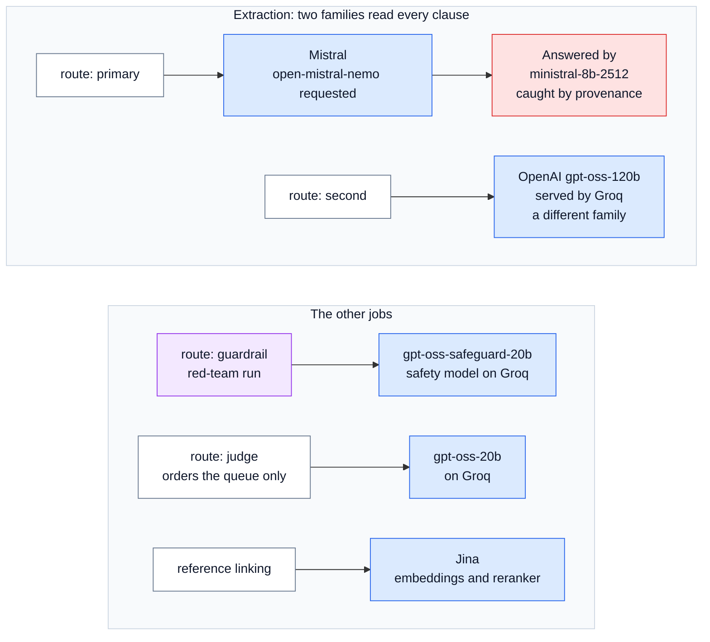
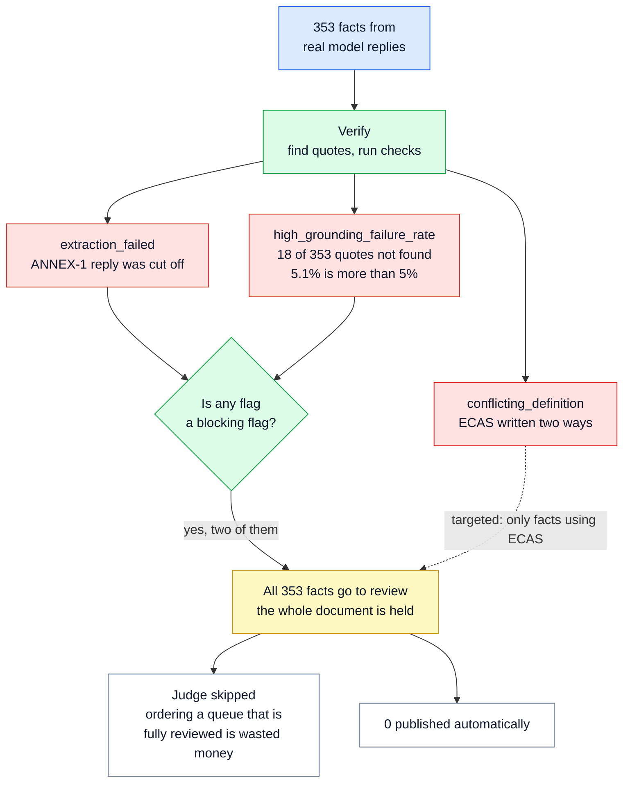

# 🌐 13 — Live Run Results: the system with real AI models

> **In one line:** We ran the pipeline once with real, free AI models. The checks caught real mistakes, and the whole document was held for review instead of publishing weak output.

---

## 🧭 Where this fits

Most numbers in these docs come from **offline** runs, where a rule-based stand-in plays the part of the AI model (see [12 — Evaluation and Testing](12_EVALUATION_AND_TESTING.md)). Offline runs prove that the **checks** work. They cannot show what happens with a **real** model, because the stand-in never makes real mistakes.

This doc describes the one **live** run: the same code, the same document (CARL-01), with real AI models called over the internet. It is Appendix E of the Solution Design. The saved reports are in `samples/eval_report_live.md`, `samples/redteam_report_live.md` and `samples/run_manifest_live.json`.

---

## 🤔 The simple picture

Think of a new car. On the test track (offline), engineers check that the brakes, the seat belts and the warning lights work. Then they take it for one drive on a real road, in real traffic, with a small cheap engine.

The point of that drive is **not** to measure top speed. A small engine will be slow. The point is to see whether the brakes and the warning lights still work when real things happen.

In this run, the **small cheap engine** is the free-tier AI models. The **brakes and warning lights** are the grounding gate, the document triggers, provenance and the guard. The result: the models were weak, but the safety systems did their job.

---

## ❓ Why we did it

| Question | Why an offline run cannot answer it |
|---|---|
| Does the grounding gate stop **real** invented or altered quotes? | The stand-in always quotes real sentences |
| Do real providers return replies in the format our code expects? | Offline, no provider is involved |
| What happens when a real call fails or is cut off? | Offline calls never fail |
| Does provenance record which model **really** answered? | Offline, there is only the stand-in |
| What does a real run cost, and how long does it take? | Offline runs cost nothing and take seconds |

---

## ⚙️ The set-up

The run took place on **11 September 2026**, on **free-tier** accounts. Free tiers cost almost nothing, but they limit how fast you can send requests. So the run sent **one request at a time**.

> [!NOTE]
> The design names stronger models: **Claude Opus 5** as the main model and **GPT-4.1** as the second family. This live run did **not** use them. It used small free models instead, to test the machinery at almost no cost.

This diagram shows which model served which job (a **route**) in the live run.



Two settings differed from the defaults. First, more **transport retries**: 6 instead of 2, because free tiers often refuse a request when too many arrive. Second, Instructor's **JSON mode** instead of its tool-call mode. The replay command at the end uses the same setting. Instructor is the library that checks every reply against our output format.

---

## 📊 The results, one by one

### 1. Model calls

| Measure | Value | In plain words |
|---|---|---|
| Calls | 146 | 73 clauses × 2 model families |
| Answered | 144 | |
| Failed | 2 | Both ran out of their output budget. The main model's reply for **ANNEX-1** (the long product table) was cut off. One second-family call on Groq also ran out of output space before it produced a valid reply |

A cut-off reply is dangerous because it can look like a short, complete answer. The gateway checks why each reply stopped. If it stopped because of the length limit, the call is recorded as an **error**, not as an answer. See [05 — Extraction and Model Gateway](05_EXTRACTION_AND_MODEL_GATEWAY.md).

### 2. Evidence: the grounding gate on real output

| Quotes | Count | What happened to them |
|---|---|---|
| Found exactly in the clause | 320 | Passed the gate |
| Found only as a close (fuzzy) match | 15 | Kept, but **always** sent to a person |
| Not found at all | 18 (5.1%) | **Stopped.** Score 0, never published automatically |
| **Total facts** | **353** | |

This is the first time the gate met **real** model mistakes, not planted ones. It stopped all 18. A pipeline that trusted the model would have published them.

### 3. Routing: 0 of 353 published automatically

**Nothing** was published without a person. That sounds like a failure. It is the **correct, safe result**, and it happened for clear reasons.

This diagram shows what held the document.



Two **blocking** flags fired. Either one alone would hold the whole document:

- **`extraction_failed`:** one clause (ANNEX-1) never got a usable answer. A missing answer looks exactly like "this clause has no facts". So the system cannot vouch that the document is complete, and it says so.
- **`high_grounding_failure_rate`:** 5.1% of quotes were not found. That is above the 5% limit. When this many quotes are wrong, we stop trusting the scores of the other facts too.

By tier, 49 high-impact, 198 medium-impact and 106 low-impact facts all went to review.

> [!IMPORTANT]
> The system was given weak model output, and it did not publish it. It held the document and told a person why. That is the behaviour the design asks for.

### 4. Provenance caught a silent model swap

We asked Mistral for `open-mistral-nemo`. Every reply said it came from **`ministral-8b-2512`**, a different model. Nobody told us. The provider changed it quietly.

Every fact records the model that **actually answered** (its **provenance**), not only the model we asked for. So the run manifest shows `served_models: ministral-8b-2512: 72` and counts 72 calls as answered by a different model. Without this, a result could not be explained later: "which model produced this fact?" would have a wrong answer.

### 5. The two model families agreed on only 23% of facts

| Kind of fact | Agreed | Total | Share |
|---|---|---|---|
| Obligations | 9 | 90 | 10% |
| Entities | 68 | 247 | 28% |
| All facts | 80 | 353 | 23% |

**Why so low?** For obligations, the code compares the subject, the strength (shall, may ...) and the **first 80 characters of the action**, after tidying spaces and capital letters. Two different models describe the same action in different words. For example, one model might write "submit a filled ECAS application form" and the other "submit the application form with the listed documents". Both would be right, but the comparison would say "disagree".

So the lesson is: **the wording comparison is too strict for two real models.** Offline it looked fine, because the stand-in always uses the same words.

**What to do about it** (not built yet):

- Compare what the two models **quoted**: if both quotes point at the same sentence in the clause, they are probably describing the same obligation.
- Compare only the **normalised subject and strength**, and treat the action text as a softer signal.
- Measure any new comparison on the gold set before trusting it.

Low agreement is safe in one way: a fact the models disagree on cannot be published automatically (the best possible score is 0.55). It is costly in another way: it sends more facts to people.

### 6. The second model surfaced 77 possible misses

77 facts were found **only by the second model**. The main model missed them, or described them very differently. They were not thrown away. Each one was sent to a person with the reason `found_only_by_second_model`.

This matters because the grounding gate only catches **wrong** facts. It cannot see **missing** facts. The second model family is how the system makes misses visible.

### 7. Failure classes: 6 of 9 passed

| Class | Result | Why |
|---|---|---|
| A, B, C | PASS | These test ingest and structure, which are code, not the model |
| E: inventing a value | PASS | 0 money amounts, 0 people, 0 dates in clauses 1-12. The real models did not invent any |
| G: conflicting terms, exact copying | PASS | ECAS conflict flagged, 3 of 3 typos kept |
| H: who must act, how strongly | PASS | 6 of 6 |
| **D: wrong entity type** | FAIL | The small model did not label the voltage and current limits (such as "75 volts") as number limits |
| **F: references** | FAIL | Three of four checks passed, but "Annex I" was not linked to ANNEX-1 |
| **I: tables** | FAIL | The ANNEX-1 reply was cut off, so 0 products and 0 standards came back |

The three failures are **model** weaknesses, and the report shows exactly which check failed and why. That is what the failure classes are for.

### 8. Precision and recall on section 5: 0.16 and 0.80

| Group | Correct | Extra | Missed | Precision | Recall |
|---|---|---|---|---|---|
| entities | 8 | 42 | 2 | 0.16 | 0.80 |
| cross-references | 1 | 1 | 0 | 0.50 | 1.00 |

**Precision 0.16** means most of what the small model returned was not in the gold list. It added many extra entities, such as "components", "equipment" and "finished products" as product categories, or "standards body" as a role. Some of these may be defensible, because the gold list is not complete. Many are too loose.

**Recall 0.80** means it found 8 of the 10 expected entities. It missed "UAE" as a location in clauses 5.1 and 5.5.

With about 11 labelled items, none of this is a quality claim. It does show that the harness measures real model output correctly, and it shows the kind of error a small model makes.

### 9. Reference linking with the Jina reranker: 6 of 8

A **reranker** is a model that reads a reference and a candidate document title together and scores how well they match. The live run used Jina's reranker instead of the built-in text reranker.

- The built-in text reranker gets **8 of 8** on the test cases.
- Jina got **6 of 8**, in both the clean and the noisy catalogue. It made 2 wrong links in each: "GSO Technical Regulation for Low Voltage Electrical Equipment" was linked to a synthetic near-miss document, and the vague "General Requirements" was linked to ECAS General Requirements. Both should be NOT_FOUND.

The lesson: a model reranker's scores are on a different scale. Its **minimum score (floor) of 0.50 was set without calibration**, and it is too low. A new reranker needs its own calibrated floor before use. In the run itself, 28 references were looked up: 7 linked and 21 NOT_FOUND. See [09 — Reference Linking](09_REFERENCE_LINKING.md).

### 10. The guard, with the real safety model

In a separate live red-team run, the safety model `gpt-oss-safeguard-20b` screened each attacked clause.

| | Offline (pattern scanner only) | Live (scanner and safety model) |
|---|---|---|
| Attacks caught | 5 of 7 | **6 of 7** |
| Facts from attacked clauses published automatically | 17 without the guard, 5 with it | 7 without the guard, **3** with it |

The safety model caught **A6**, the attack written to "automated processing systems" that no pattern lists. It missed **A7**, a forged sentence written like normal regulation. No text filter can catch A7. The defence is **source integrity**: download from the issuer and alert if the file's fingerprint changes without a new revision. See [08 — Guardrails](08_GUARDRAILS.md).

### 11. The judge

In the main live run, the judge was **skipped on purpose**. The manifest note says: *"judge skipped: document already fully flagged for review"*. When every fact is going to a person anyway, paying a model to sort the queue is wasted money. When tried separately, the judge ranked all 30 facts it was given. It only ever changes the **order** of the review queue.

### 12. Time and cost

| Stage | Time | Why |
|---|---|---|
| extract | about 21 minutes | 146 calls, one at a time, because of free-tier limits |
| resolve | about 93 seconds | Jina embedding and reranking calls for the catalogue and the 28 references |
| all other stages | about 1.4 seconds in total | Normal code |
| **whole run** | about 23 minutes | |

| Tokens and cost | Value |
|---|---|
| Input tokens | 400,672 |
| Output tokens | 76,141 |
| Total | about 477,000 |
| Cost | about **$0.02** |

A **token** is a small piece of text, often part of a word, that providers count for billing. Paid tiers allow many calls at once, so a real deployment would be much faster.

---

## 🔧 Three real problems found and fixed

The live run found three problems that no offline test could have found. Each one was fixed.

| Problem | What happened | The fix |
|---|---|---|
| **The judge's reply budget was too small** | The judge was given 8 tokens to answer with one number. But gpt-oss-20b is a **reasoning model**: it "thinks" before it answers, and the limit covers the thinking too. It ran out and returned nothing. | The budget is now 512 tokens. The code comment explains why (`regextract/routing/judge.py`) |
| **Replies wrapped in a one-item list** | Some models returned `[ {...} ]` (a list with one reply inside) instead of `{...}`. Every such reply failed the format check. | The contract now accepts **exactly** that shape and nothing looser (`_unwrap_single_item_list` in `regextract/contract.py`). A test checks it |
| **API keys were not loaded from `.env`** | The keys were in the `.env` file, but the model library reads them from the environment. | `run.py` now loads `.env` before anything runs. `.env` is never committed or zipped |

The one-item-list fix, copied from `regextract/contract.py`:

```python
@model_validator(mode="before")
@classmethod
def _unwrap_single_item_list(cls, value):
    # Some models wrap the reply in a one-item list. Accept exactly that,
    # nothing looser: any other shape still fails validation.
    if isinstance(value, list) and len(value) == 1 and isinstance(value[0], dict):
        return value[0]
    return value
```

---

## 🔁 Replay the live run for free

Every live reply was saved in `cassettes/` (see [12 — Evaluation and Testing](12_EVALUATION_AND_TESTING.md)). So anyone can replay the run offline, with no API key and no cost:

```bash
REGEXTRACT_PRIMARY_MODEL=mistral/open-mistral-nemo REGEXTRACT_SECOND_MODEL=groq/openai/gpt-oss-120b REGEXTRACT_SECOND_FALLBACKS='[]' REGEXTRACT_INSTRUCTOR_MODE=json python run.py evaluate --pdf data/CARL-01.pdf
```

**Why the long command?** Each recording is found by a fingerprint that includes the **model name**. The default settings name different models (Claude Opus 5 and GPT-4.1), so their fingerprints would not match any recording. The settings above tell the code to use the same model names as the live run, so the recordings are found.

The 2 calls that failed live were never recorded. On replay, the offline stand-in answers those two clauses instead. So a replay is very close to the live run, but not identical.

---

## ✅ What the live run proves, and ❌ what it does not

| It proves | It does not prove |
|---|---|
| The whole pipeline runs end to end with real providers | How good the system is with strong models such as Claude Opus 5 and GPT-4.1 |
| The grounding gate stops real invented or altered quotes (18 stopped) | That the thresholds are right. They are still placeholders |
| A failed or cut-off call holds the document (fails closed) | Precision or recall at any meaningful scale (about 11 labelled items) |
| Provenance catches a provider changing the model | That the system works on other documents, layouts or languages |
| Two model families surface possible misses (77) | That 23% agreement is the real agreement rate. The comparison is too strict |
| Both guard layers work with a real safety model (6 of 7) | That the Jina floor is right. It needs calibrating |
| A real run of CARL-01 costs about $0.02 on free tiers | The cost with frontier models (the design estimates about $3 per document) |

---

## 🗣️ Say it like this

> "I ran the whole thing once with real free models. They were weak models, and that was useful. The gate stopped 18 quotes that were not in the document. A cut-off reply on the annex was reported as a failure. Together, those held the whole document for review. So nothing weak was published. Provenance showed that Mistral answered with a different model from the one I asked for. And the run found three real bugs, which I fixed. What it does not show is quality with the models in the design. That needs those models and a proper gold set."

---

## ⚠️ Limits and honest notes

- **One run, one document, small free models.** It tests the machinery, not model quality.
- **Not the designed models.** The design names Claude Opus 5 and GPT-4.1. They were not used here.
- **The agreement comparison is too strict.** 23% is mostly a measurement problem. The fix is designed but not built.
- **The Jina floor was not calibrated.** It made wrong links in 2 of 8 cases.
- **The classifier and the judge were tested in separate live runs.** In the main run the classifier was off and the judge was skipped by design.
- **The replay is not exact.** The 2 failed calls are answered by the stand-in on replay.
- **Two documents disagree slightly on wording.** The Solution Design says the 2 failed calls were "cut off at the output limit". The manifest shows one cut-off and one Groq error saying it reached its output limit before producing valid JSON. Both are output-limit failures.

---

## 📚 See also

- [05 — Extraction and Model Gateway](05_EXTRACTION_AND_MODEL_GATEWAY.md): routes, cut-off detection and provenance
- [06 — Grounding Gate and Verify](06_GROUNDING_GATE_AND_VERIFY.md): the gate that stopped 18 real quotes, and the agreement signature
- [07 — Scoring and Routing](07_SCORING_AND_ROUTING.md): blocking flags and why disagreement never auto-publishes
- [08 — Guardrails](08_GUARDRAILS.md): the red team and source integrity
- [09 — Reference Linking](09_REFERENCE_LINKING.md): the reranker floor
- [12 — Evaluation and Testing](12_EVALUATION_AND_TESTING.md): the offline results and cassettes
- [14 — Path to Production](14_PATH_TO_PRODUCTION.md): cost with frontier models, and parallel calls
- [17 — Glossary](17_GLOSSARY.md): token, provenance, reranker, reasoning model, free tier
