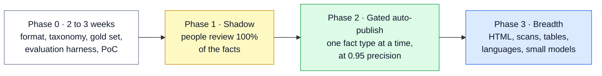
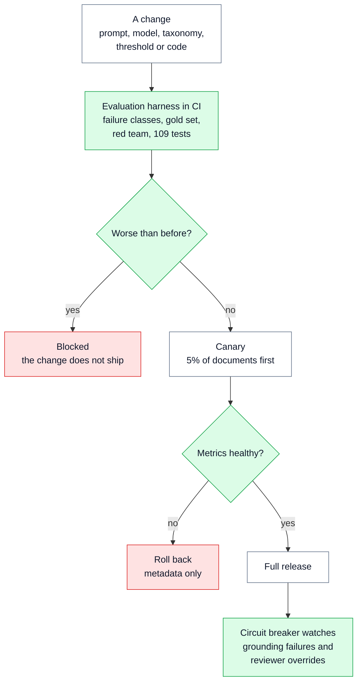
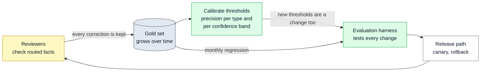
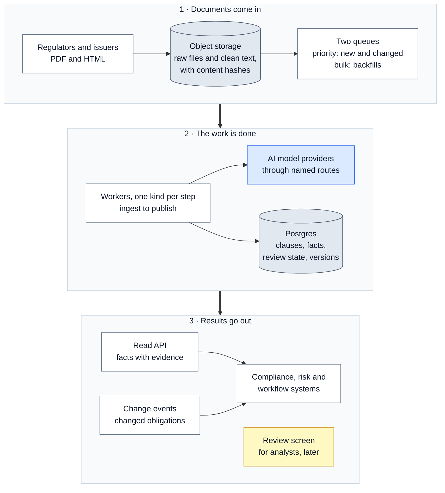

# 🏭 14 — Path to Production: from proof of concept to a real service

> **In one line:** We switch on automatic publishing slowly, one type of fact at a time, and only after real numbers show it is safe.

---

## 🧭 Where this fits

The proof of concept runs all ten steps on one document. This doc explains how the same design becomes a service that handles thousands of documents. It covers four things: **release** (how a change goes live safely), **operate** (how it runs every day), **watch** (how we see problems early), and **cost**.

> [!IMPORTANT]
> Most of this doc is **the design**, not code that exists today. The proof of concept already has the pieces that make it possible: versioned outputs, content-hash ids, a run record per run, and fail-closed behaviour. The queues, the database, the dashboards and the review screen are **not built**.

---

## 🤔 The simple picture

Think of a new employee in a compliance team.

- In the first weeks, a senior person checks **all** of their work.
- After some time, the team knows their error rate for each kind of task. The new person may now sign off **simple tasks alone**, but only the tasks where their error rate is very low.
- Later, they take on **new kinds of work**: new countries, new languages, new document types.

Our system follows the same path. First people check everything. Then the system may publish alone, but only for the fact types where it has proved it is accurate. Then it grows.

---

## 🛣️ The four phases

This diagram shows the four phases in order. Each phase must earn the next one.



| Phase | What we build | Who reviews | When we move on |
|---|---|---|---|
| **0 · 2 to 3 weeks** | The output format, the taxonomy (the list of fact types), the gold set (answers checked by experts), the evaluation harness, and the proof of concept on English text PDFs | No production traffic yet | The evaluation harness runs on every change |
| **1 · Shadow** | The batch pipeline runs on real documents. Nothing publishes by itself. | People review **100%** of the facts. Their decisions grow the gold set. | We have enough gold data to measure precision per fact type |
| **2 · Gated auto-publish** | Automatic publishing is switched on **per fact type**, only when that type reaches **0.95 precision** on the gold set | People review high-impact, low-score and flagged facts | Auto-publish is stable and review load fits the team |
| **3 · Breadth** | HTML and scanned pages, many large tables, other languages, the regulation-standard-product graph, and rules or small models for high-volume types | People review each new language until it has its own gold set | (ongoing) |

**Shadow mode** means the system runs for real, but its output is only checked, not trusted. It is like a trainee who does the work while a senior person does the same work next to them.

**0.95 precision** means: of 100 facts of that type the system would publish, at least 95 are correct. See [17 — Glossary](17_GLOSSARY.md).

---

## 🚀 Releasing a change safely

A "change" is anything that can change the output: a new prompt, a new model, a new taxonomy version, new thresholds, or new code. Every change follows the same path. This diagram shows it.



**The three safety tools, in simple words:**

| Tool | What it is | Why it is safe here |
|---|---|---|
| **Canary (5%)** | A new prompt or model first runs on 5% of documents. We compare its numbers with the old version. | If it is worse, only a small part of the work is affected, and we see it early. |
| **Rollback (metadata only)** | Going back to the old version means changing a pointer, not re-running anything. | Every output is versioned and keyed on **content hash + pipeline version**. The old outputs still exist. We only point "current" back at them. |
| **Circuit breaker** | An automatic switch that turns auto-publish **off**. | It can switch off one fact type, one jurisdiction, or everything, when grounding failures or reviewer overrides spike. Facts then go to people instead. |

The name "canary" comes from miners who took a small bird into the mine. If the air was bad, the bird showed it first. The name "circuit breaker" comes from the electrical switch in a house that cuts the power when something goes wrong.

**Today's CI gate.** CI (continuous integration) means tests that run automatically on every change. The proof of concept already has the gate as one command. `evaluate` exits with an error code if any failure class gets worse:

```bash
python -m pytest -q && python run.py evaluate --pdf data/CARL-01.pdf
```

---

## 🔁 The quality loop

The gold set is the heart of production quality. It grows from reviewers' work, and it sets the thresholds. This diagram shows the loop.



- **The proof of concept already saves corrections.** In review mode, every correction is appended to `gold/reviewer_corrections.jsonl`. See [10 — Human Review and Publish Log](10_HUMAN_REVIEW_AND_PUBLISH_LOG.md).
- **The production gold set** is a few hundred documents labelled by compliance analysts. Two analysts label a shared sample, so we can see where people disagree.
- **Calibration** means setting each threshold from measured precision, per fact type, and matching it to how many facts the review team can actually check. See [07 — Scoring and Routing](07_SCORING_AND_ROUTING.md).

---

## ⚙️ Operating it every day

| Situation | What the system does |
|---|---|
| **A new or changed document arrives** | It goes on a **priority queue**. It is processed first. |
| **A bulk backfill** (loading thousands of old documents) | It goes on a separate **bulk queue**, so it never slows down new documents. It uses the cheaper batch service. |
| **The same document arrives again** | Nothing new happens. Work is **idempotent**: the same content hash and pipeline version give the same result. The publish log records a run and no new publications. |
| **A new revision arrives** | Only changed clauses go to the models and to review. See [11 — Change Detection](11_CHANGE_DETECTION.md). |
| **One clause fails** (the model does not answer) | The clause is flagged `extraction_failed`, the document is held, and we **re-run only that clause**. This is cheap. |
| **The source file changes but the revision number does not** | This is a source-integrity alert, not a new revision. The document is held. See [08 — Guardrails](08_GUARDRAILS.md). |

The code already says why re-running one clause is cheap. This comment is in `regextract/routing/route.py`:

```python
    # A clause the model never answered means the document cannot be vouched
    # for as complete. The operational fix is to re-run that clause, which is
    # cheap because every call is idempotent on content hash.
    "extraction_failed",
```

---

## 👀 Watching it (observability)

**Observability** means we can see what the system is doing, and explain a result months later.

**Today**, every run writes one **run manifest** (`outputs/run_manifest.json`). It records, for every stage: how long it took, its counters, and any error. It also records the settings, the models that actually answered, the number of calls, the tokens and the cost. The code says how this changes in production (`regextract/pipeline/observability.py`):

```python
This is deliberately plain. In production these same events become
OpenTelemetry spans and the counters become metrics -- per-stage latency, cost
per document, grounding-failure rate, reviewer override rate. The shape does
not change, only the sink.
```

A **span** is a record of one piece of work with a start and an end time. A **metric** is a number we track over time. **OpenTelemetry** is an open standard for sending spans and metrics to a monitoring tool.

**What we watch in production:**

| Metric | What it tells us | Alert when |
|---|---|---|
| Time and failures per step | Which step is slow or broken | A step's failures rise |
| Cost per document | Whether spending is under control | Cost per document jumps |
| **Grounding failures** | How often the model gives quotes that are not in the source | It spikes (this also trips the circuit breaker) |
| Review rate | How much work goes to people | It is more than the team can clear |
| **Reviewer override rate** | How often people change or reject what the system proposed | It spikes (this also trips the circuit breaker) |
| Confidence drift | Whether the model's confidence pattern changes week to week | It moves a lot (often a sign the provider changed the model) |
| Queue age | How long documents wait | Documents wait too long |

---

## 🏗️ A reference deployment (the design, not built)

This is one simple way to run the design as a service. It is **not built** in the proof of concept. The diagram shows the parts in three rows: where documents come from, how the work is done, and who uses the results.



| Part | Its job | What the PoC uses today |
|---|---|---|
| **Object storage** | Keeps the raw file and the clean text for every version, with its content hash | Files on disk |
| **Queues and workers** | Run each step, in parallel, with retries | One process; one LangGraph run per document |
| **Postgres** | The system of record: clause tree, facts, review state, versions, checkpoints | JSON files; a SQLite checkpoint file for review pauses |
| **Read API** | Serves facts with their evidence to other systems | `extractions.json` |
| **Change events** | Tell downstream systems exactly what changed | The `changed_obligations` event from `run.py diff` |
| **Publish log store** | Keeps the hash-chained log under an object lock, so nobody can delete entries | `publish_log.jsonl` (tamper-evident only) |
| **Review screen** | Lets analysts accept, correct or reject | A JSON decisions file |

The planning notes put it simply: branching, retries and review loops belong in a workflow engine in production. The proof of concept shows the same shape with LangGraph in one process.

---

## 📈 Handling thousands of documents and 300+ pages

Four features make the design scale:

1. **One call per clause.** A 300-page document is simply more clauses. Each clause is small, so the model's output limit is never a problem, and a failure costs one clause, not the whole document.
2. **Calls run in parallel.** In live mode, clauses run on a thread pool. The number of parallel calls is the setting `REGEXTRACT_CONCURRENCY` (default 4). From `regextract/extraction/extract.py`:

   ```python
       # Offline work is pure CPU, so threads would only add overhead.
       if settings.offline or settings.llm_concurrency <= 1:
           return [work(clause) for clause in clauses]

       with ThreadPoolExecutor(max_workers=settings.llm_concurrency) as pool:
           return list(pool.map(work, clauses))
   ```
3. **Batch processing for backfills.** Precision matters more than speed. So bulk work can use a provider's batch service, which costs about half.
4. **Prompt caching.** The system prompt (the fixed instructions and the taxonomy) is the same for every clause. Providers can cache that fixed part, so we do not pay full price for it again and again. From `regextract/extraction/prompts.py`:

   ```python
   The system prompt is identical for every clause in a document. That is
   deliberate: it is the stable prefix that prompt caching keys on, so on a
   5,000-document backfill the taxonomy is billed once per cache window rather
   than 300 times per document.
   ```

---

## 💰 Cost, step by step

The design uses simple arithmetic. These are the design's **assumptions**, not a quote from a provider.

**Assumptions:** each call sends about **2,000 input tokens** (the clause, its headings, the definitions and the instructions) and gets back about **400 output tokens**. A **token** is a small piece of text, about three quarters of a word. The price assumed for a frontier (top) model is **$5 per million input tokens** and **$25 per million output tokens**. Both model runs are priced at the main model's rate, so every number below is an **upper limit**.

**Step 1: the cost of one call.**

| Part | Maths | Cost |
|---|---|---|
| Input | 2,000 ÷ 1,000,000 × $5 | $0.010 |
| Output | 400 ÷ 1,000,000 × $25 | $0.010 |
| **One call** | $0.010 + $0.010 | **$0.02** |

**Step 2: multiply by the number of calls.** Every clause is read twice (two model families).

| Scenario | Calls | Maths | Cost |
|---|---|---|---|
| **CARL-01** (73 clauses) | 73 × 2 = **146** | 146 × $0.02 = $2.92 | **about $3** |
| **A 40-page document** (about 300 clauses) | 300 × 2 = **about 600** | 600 × $0.02 | **about $12** |
| **Backfill: 5,000 documents of about 40 pages** | 5,000 × 600 = **about 3 million** | 3,000,000 × $0.02 | **about $60,000** |
| The same backfill with **batch processing** (half price) | about 3 million | $60,000 ÷ 2 | **about $30,000** |
| **Monthly running:** about 200 new or changed documents per jurisdiction | about 200 × 600 | 200 × $12 | **about $2,400** at full price |

**What the numbers tell us:** the **backfill** is the expensive part, not the monthly running. And the monthly number is an upper limit, because in practice only changed clauses are sent again.

**For comparison, the real live run** used cheap free-tier models and cost **about $0.02** for all 146 calls. See [13 — Live Run Results](13_LIVE_RUN_RESULTS.md).

**Cost levers, in order** (biggest and easiest first):

1. **Batch processing** for backfills: about half price.
2. **Cache the fixed prompt prefix** (the instructions and taxonomy).
3. **A cheaper model and a single run for low-impact types** (for example, organisations and roles), where a second opinion adds little.
4. **Re-process only changed clauses** when a new revision arrives.
5. **Later, small models or rules for high-volume types**, such as standard references and definitions, once the gold set is large enough to train and test them.

---

## 🌱 Evolving it

| Change | How we handle it |
|---|---|
| **The gold set grows** | Reviewer corrections are added. The full gold set runs as a **monthly regression test**. |
| **A new language** (for example German) | Add a language field, a list of obligation words for that language ("muss", "soll", "darf"...), and **its own gold set before auto-publish**. Character positions work the same way. |
| **A new clause or entity type** | Bump the taxonomy version, with examples. Run the regression on the gold set. Re-process affected documents and show the differences. |
| **The provider updates a model** | Pinned model versions. Provenance records the model that **actually** answered. Regression tests, then canary, then rollback if needed. |
| **Reviewer capacity falls** | Re-set thresholds from the calibration data, and order the queue by impact and uncertainty. Report what that costs in precision. |

---

## 🔒 Data and security

- **The sources are public regulatory texts.** So a hosted AI service is acceptable for them.
- **Client documents are different.** They would need a private setup (for example, a model hosted in the client's own environment) and confidential handling.
- **API keys** live only in a local `.env` file. It is listed in `.gitignore`, is never committed, and was left out of the submitted zip. `.env.example` lists the setting names with no values.
- **Document text is untrusted input.** The guard step and source-integrity checks protect the pipeline. See [08 — Guardrails](08_GUARDRAILS.md).
- **The publish log** proves what was published and when. In production it sits in storage with an object lock, so nobody can change or delete an entry, not even an administrator.

---

## 🗣️ Say it like this

> "We do not switch on automatic publishing on day one. First the system runs in shadow mode and people check everything. That builds the gold set. Then we switch on auto-publish one fact type at a time, only when that type is 95% precise. Every change goes through the evaluation harness, then a 5% canary, and a circuit breaker can switch auto-publish off in seconds. The expensive part is the first backfill, about $30,000 with batch processing at frontier-model prices, not the monthly running."

---

## ⚠️ Limits and honest notes

- **None of the production parts are built:** no queues, no database, no read API, no dashboards, no review screen, no circuit breaker. The PoC shows the shape they plug into.
- **The cost numbers are estimates.** They rest on assumed token counts and an assumed price. They are upper limits, because both runs are priced at the main model's rate.
- **The thresholds are placeholders.** Phase 1 exists to replace them with measured values.
- **"0.95 precision per type" needs enough gold data per type** to be a reliable number. A type with few examples cannot earn auto-publish quickly.
- **The PoC log is tamper-evident, not tamper-proof.** Tamper-proof needs object-lock storage underneath it.

---

## 📚 See also

- [07 — Scoring and Routing](07_SCORING_AND_ROUTING.md): the thresholds that calibration replaces
- [10 — Human Review and Publish Log](10_HUMAN_REVIEW_AND_PUBLISH_LOG.md): corrections and the hash-chained log
- [11 — Change Detection](11_CHANGE_DETECTION.md): why only changes are re-processed
- [12 — Evaluation and Testing](12_EVALUATION_AND_TESTING.md): the harness behind the CI gate
- [15 — Decisions, Trade-offs and Limits](15_DECISIONS_TRADEOFFS_AND_LIMITS.md): what we chose not to build, and why
- [18 — Presentation Guide](18_PRESENTATION_GUIDE.md): how to present this part in one minute
