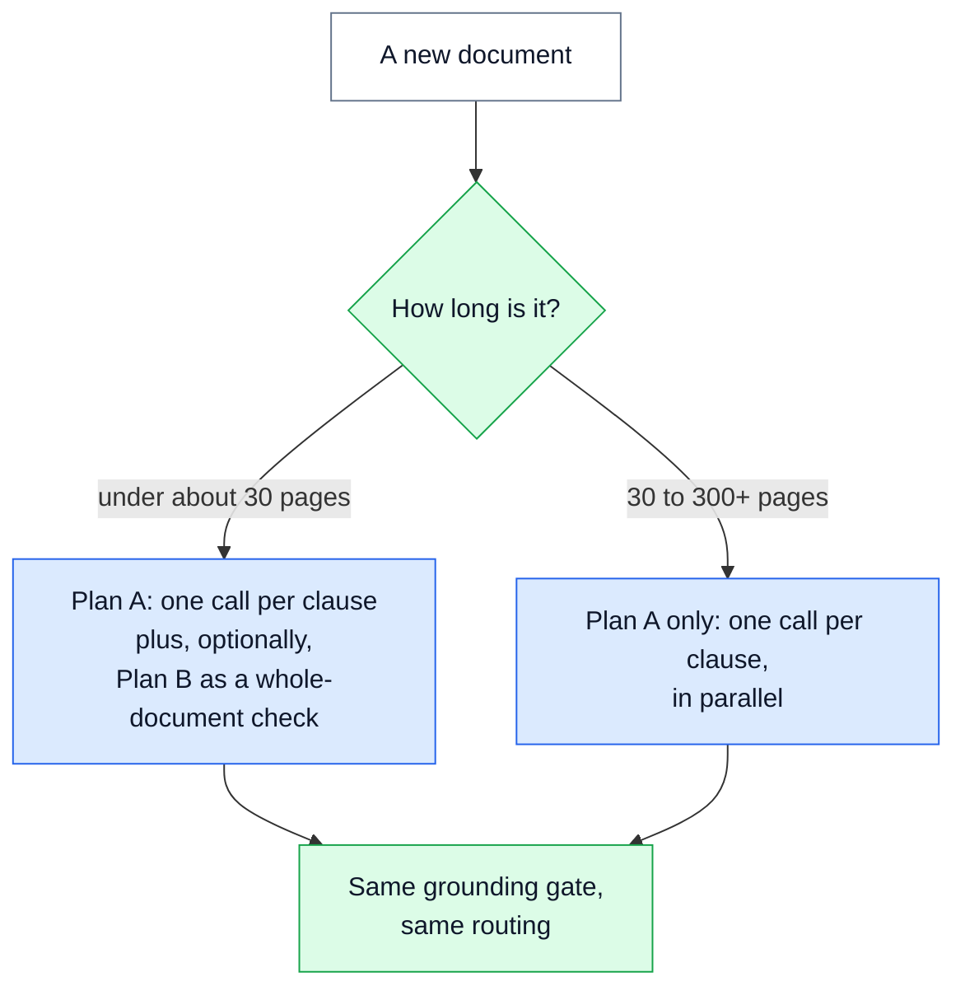
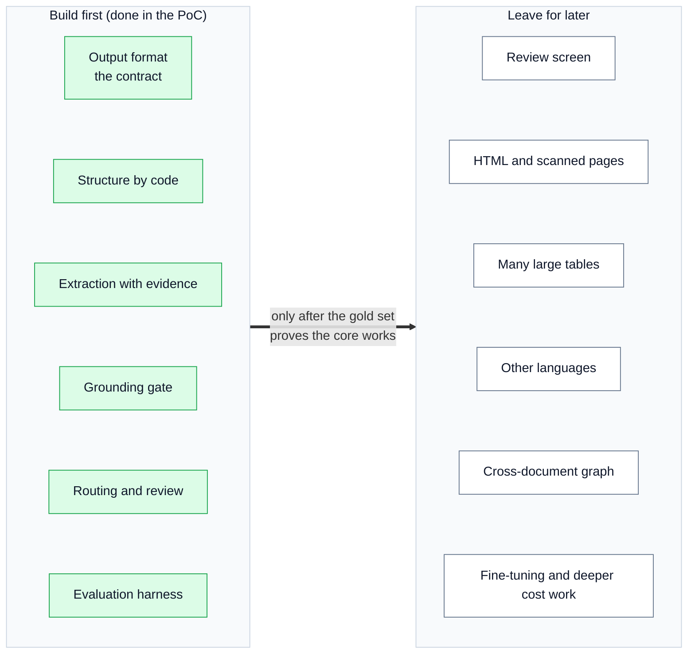

# ⚖️ 15 — Decisions, Trade-offs and Limits: what we chose, what we did not, and why

> **In one line:** Every option has a cost; we chose the options that keep wrong facts out and keep failures visible, and we say plainly what is not done yet.

---

## 🧭 Where this fits

The brief says the interview will cover "the decisions and alternatives you considered, failure modes" and "limitations". This doc collects all of them in one place. Each decision links to the doc that explains the part in detail.

---

## 🤔 The simple picture

Choosing a design is like choosing how to travel to another city. A plane is fast but expensive. A bus is cheap but slow. A car is flexible but tiring. No choice is "best" in every way. You pick based on what matters most **for this trip**.

For this system, the brief tells us what matters most: **"High precision matters more than latency."** Precision means: when we publish a fact, it is correct. So our rule for every decision is:

1. First, pick the option that makes a **wrong fact less likely** to reach downstream systems.
2. Second, pick the option that keeps a **failure visible** (never silent).
3. Only then think about cost and speed.

---

## 1️⃣ The biggest decision: one clause at a time, or the whole document at once?

There are two ways to ask an AI model for facts:

- **Plan A (chosen): one clause per call.** Each call sends one clause, its parent headings and the document's definitions.
- **Plan B: the whole document in one call.** One long call returns all facts for the whole document.

| | Plan A: per clause (chosen) | Plan B: whole document |
|---|---|---|
| Time to build | Days | Hours |
| What the model sees | The clause, its parent headings, the definitions | The entire document |
| 300+ page documents | Works, and runs in parallel | **Breaks.** The model's output size is the limit |
| Cost of retrying one failure | One clause | The whole document |
| Evaluation | Per clause | Per document only |
| Exact character positions | Easy: we search inside one clause | Harder: we search a long text |
| Two-model agreement runs | Cheap | The whole document, every time |

**Decision:** Plan A. The brief describes documents of **5 to 300+ pages** and **thousands** of them. Plan B is fine for short documents (under about 30 pages), for a first pilot, or for a very small team. It breaks at the sizes the brief describes.

**The two can work together.** For a short document, Plan B can run as an extra **document-level check** on top of Plan A.

This diagram shows the choice by document size.

> [!NOTE]
> CARL-01 is only 8 pages, so Plan B would have worked for it. The proof of concept **deliberately** runs the production design (Plan A) on a small document. That was a choice, not an accident of the sample being short.

More detail: [05 — Extraction and Model Gateway](05_EXTRACTION_AND_MODEL_GATEWAY.md).

---

## 2️⃣ The other design options

### The overall approach

| Option | Good | Bad | Decision |
|---|---|---|---|
| **A classical pipeline first:** a layout model, rules, trained classifiers; AI only for hard cases | Cheapest when running at large volume. Can run on-premises (on the company's own machines). | Needs a couple of thousand **labelled** clauses, which do not exist yet. Brittle across jurisdictions. | **Not now.** It is the phase-3 cost path, once reviewer corrections have built the labelled data. |
| **An AI agent loop:** an extractor, a verifier and a critic that talk in a loop until they are satisfied | Can fix some mistakes by itself | More cost, and **less predictable** behaviour, exactly where precision and auditability matter most. Extraction is a fixed transformation, not an open task. | **Rejected.** Two model families already give an independent second opinion. |
| **Search (a vector store) inside extraction** | Popular pattern (often called RAG) | Extraction reads a document we **already have**. Adding search would create a search-quality problem that does not exist today. | **Rejected.** Search is used only for linking references and matching clauses across revisions. See [09](09_REFERENCE_LINKING.md). |

### Trust and checking

| Option | Good | Bad | Decision |
|---|---|---|---|
| **Ask the model for the page and character position** | Simple | The model can invent a position. We would be trusting the thing we are trying to check. | **Rejected.** The model gives only a quote. **Our code finds it** and computes the position. See [06](06_GROUNDING_GATE_AND_VERIFY.md). |
| **The model's own confidence as the main signal** | Free: the model gives it with every answer | Self-reported confidence does not match real accuracy well. A model can be confidently wrong. | **Weakest signal.** It has the smallest weight (0.20) and mostly breaks ties. Grounding is a gate; agreement and rule checks count more. See [07](07_SCORING_AND_ROUTING.md). |
| **One model, asked twice** | Cheaper, simpler | Two answers from one model measure **how much that model varies**, not whether it is right. Both answers share the same blind spots. | **Rejected.** The second run uses a **different model family** (a model trained by a different company). |
| **Two different model families (chosen)** | Their agreement is real evidence. Facts only the second model finds show possible **misses**. | Twice the calls. Agreement needs a good way to compare answers. | **Chosen.** Low-impact types could later use a single run to save cost. |
| **An AI judge as the release gate** (an AI decides if output is good enough) | Fast, cheap to run | **The thing being tested cannot also be the test.** A model shares its own blind spots. | **Rejected.** The optional judge only **orders** the review queue. It cannot publish, reject or override anything. |

### Model calls and failures

| Option | Good | Bad | Decision |
|---|---|---|---|
| **A fallback model for the primary** (if the main model fails, a weaker one answers) | The run always "finishes" | Quality drops **silently**. Nobody sees that a weaker model answered. | **Rejected.** The primary only retries. If it still fails, the clause is flagged `extraction_failed`, the document is held, and we re-run that clause. |
| **A fallback for the second model** | The agreement run survives an outage | A fallback from the **primary's** family would turn "agreement" into one family agreeing with itself | **Allowed, with a rule:** only to a different family. Same-family fallbacks are dropped at start-up. |
| **Treat a failed call as "no facts"** | The run never stops | This is exactly the **silent failure**: an empty answer looks like "this clause has nothing in it" | **Rejected.** A failed call is a visible failure (fail closed). |

### Libraries and tools

| Option | Good | Bad | Decision |
|---|---|---|---|
| **LangChain** | Many ready-made parts | Nothing left for it to do here: LangGraph orchestrates, LiteLLM calls the models, pdfplumber reads PDFs, and code splits clauses by their numbers | **Not used.** Fewer layers, fewer surprises. |
| **A table-extraction engine** | Better for very large tables | Two extraction paths to maintain | **Not used now.** Annex 1 is one clause, and its 15 product-to-standard links are recovered from the plain text. Many large tables are phase 3. |
| **Similarity search for standard codes** (IEC 60335-1) | One tool for all references | "IEC 60335-1" and "IEC 60335-2-13" look almost the same to a vector, and they are **different standards** | **Rejected.** Standard codes need exact rules (normalisation), not similarity. |

---

## 3️⃣ Considered, but not built

These are good ideas. They were left out of the proof of concept on purpose, with a reason.

| Idea | What it is | Why not built now | What production would do |
|---|---|---|---|
| **Prompt promotion gate** | A store of prompt versions, plus a test that blocks a worse prompt from going live | The offline stand-in ignores prompts, so such a gate only means something on live runs. Offline, `run.py evaluate` failing when a failure class gets worse **is** the regression gate. | Register every prompt version. Promote a prompt only if it passes the failure classes and per-type precision. Keep one known-bad prompt to prove the gate can say no. |
| **Trace export** | Sending each step's timing to a tracing tool | The run manifest already records per-stage timing, counters, the models that answered and the cost. Exporting it changes **where** the data goes, not the design. | OpenTelemetry spans per stage and per call, plus counters for grounding failures and override rate. |
| **A critic agent** | A third model that criticises the first answer | Two model families already give the second opinion. A third call adds cost for little. | Only as a narrow check on high-impact facts, and only able to send a fact **to review**, never to publish it. |

---

## 4️⃣ What to build first, what to leave for later

The rule: build first the parts that **stop wrong facts** and the parts that **everything else depends on**.

**Why the grounding gate was the part to prove in code.** The brief asked for a proof of concept of one part that is "important or high-risk". The riskiest failure is a wrong fact that looks right and reaches downstream silently. The grounding gate is the part that stops it. So the proof of concept is built around it, and everything else (routing, review, change detection) sits on top of it.

---

## 5️⃣ Risks, and how we reduce them

| Risk | How we reduce it | Read more |
|---|---|---|
| **Invented values reach downstream** (the silent failure) | The grounding gate, with its number and "not" check; tests for correct "nothing here" answers; the prompt says "an empty list is a correct answer" | [06](06_GROUNDING_GATE_AND_VERIFY.md) |
| **A failed call looks like "no facts"** | Fail closed: the clause is flagged, the document held, the clause run again | [05](05_EXTRACTION_AND_MODEL_GATEWAY.md) |
| **The primary model misses a fact** | Facts only the second model finds go to review; recall is measured on the gold set | [06](06_GROUNDING_GATE_AND_VERIFY.md) |
| **Confidence does not match real accuracy** | Thresholds set per type on the gold set, and tied to review capacity | [07](07_SCORING_AND_ROUTING.md) |
| **The provider changes a model** | Pinned versions, provenance of the model that answered, regression tests, canary and rollback | [14](14_PATH_TO_PRODUCTION.md) |
| **Hidden instructions in a document** | Two guard layers that fail closed, a red-team suite, and source-integrity checks | [08](08_GUARDRAILS.md) |
| **A wrong link to another regulation** | A minimum score, a number check, and NOT_FOUND as a valid answer | [09](09_REFERENCE_LINKING.md) |
| **Scanned pages break evidence matching** | OCR-tolerant matching, with OCR confidence as a routing trigger | [04](04_INGEST_AND_STRUCTURE.md) |
| **Cost at thousands of documents** | Batch, cache, tier by impact, re-process only changes | [14](14_PATH_TO_PRODUCTION.md) |
| **Legal ambiguity no model can settle** | A taxonomy with examples; reviewers decide; their decision becomes gold data | [03](03_OUTPUT_CONTRACT.md) |

---

## 6️⃣ Limits, stated plainly

The README lists these limits itself. Naming them first builds trust.

| Limit | What it means | What would fix it |
|---|---|---|
| **The gold set is about a dozen items** (section 5 of CARL-01) | Enough to prove the harness computes precision and recall correctly. **Not** enough to claim quality. | A few hundred documents labelled by analysts, two analysts on a shared sample |
| **The routing thresholds are placeholders** (0.90 / 0.80 / 0.75) | They are sensible starting values, not measured ones | Precision per confidence band, per type, measured on a real gold set |
| **English text PDFs only** | HTML and scanned pages fit the same design but are not built. OCR would change the fuzzy-match settings, so it is not a drop-in. | An OCR path at ingest, OCR-tolerant matching, OCR confidence as a routing signal |
| **One document** | Change detection is tested on synthesised revisions (removed facts, a renumbered clause) because only one revision of CARL-01 exists | Real revision pairs from the corpus |
| **Offline numbers are stand-in numbers** | They prove the checks work, not model quality | Live runs with the models named in the design |
| **The live path is tested mostly against a fake provider** | Plus one live run on free-tier models | More live runs on the target models |
| **The corpus catalogue is a fixture** | 2 real documents, 4 synthetic near-misses, about 200 unrelated titles | A real corpus index |
| **The publish log is tamper-evident, not tamper-proof** | It shows an edit, but cannot stop one | Object-lock storage underneath it |
| **Review has no screen** | Decisions are a JSON file: enough to show the loop, not for daily use | A simple review screen |

**Two more honest points** an interviewer may find in the code:

- **The impact tier of an obligation depends on the clause type the primary model gives.** A model that labels a clause wrongly could lower a fact's tier. A fix: take the stricter tier from both models, or set clause types by code rules and an analyst mapping.
- **Grounding proves the quoted words exist in the source. It does not prove the model read them correctly** (for example, the wrong subject). Two-model agreement, rule checks and review cover that part.

---

## 7️⃣ What I would do next, with more time

In order of value:

1. **A calibration table and a real gold set.** This is the biggest gap. It turns the placeholder thresholds into measured ones. Say this before the interviewer asks.
2. **Meaning-based agreement.** In the live run the two models agreed on only 23% of facts, and on only 9 of 90 obligations. The comparison is word-for-word after normalising, which is too strict for obligations. Compare the quote spans or the meaning instead.
3. **A simple review screen** for analysts.
4. **The OCR path** for scanned pages.
5. **The prompt promotion gate** (see section 3).
6. **Span export** to a tracing tool (see section 3).
7. **A circuit breaker on auto-publish** (see [14](14_PATH_TO_PRODUCTION.md)).
8. **Calibrate the model reranker's floor.** Live, the Jina reranker got 6 of 8 reference cases right with a floor of 0.50, so that floor is too low.

---

## 🗣️ Say it like this

> "I chose one call per clause, not one call per document, because the brief talks about 300-page documents and thousands of them. I chose two model families, not one model twice, because two families agreeing is evidence, and one model agreeing with itself is not. I rejected an agent loop and an AI judge as a gate, because they add cost and unpredictability exactly where we need auditability. The biggest gap is honest: my gold set is about a dozen items and my thresholds are placeholders. Phase 1 of the rollout exists to fix exactly that."

---

## 📚 See also

- [01 — System Overview](01_SYSTEM_OVERVIEW.md): the whole system in simple words
- [05 — Extraction and Model Gateway](05_EXTRACTION_AND_MODEL_GATEWAY.md): per-clause extraction and the fallback rules
- [07 — Scoring and Routing](07_SCORING_AND_ROUTING.md): why confidence counts least
- [13 — Live Run Results](13_LIVE_RUN_RESULTS.md): where the 23% agreement number comes from
- [14 — Path to Production](14_PATH_TO_PRODUCTION.md): how the limits get fixed over time
- [18 — Presentation Guide](18_PRESENTATION_GUIDE.md): how to name the weak spots yourself
