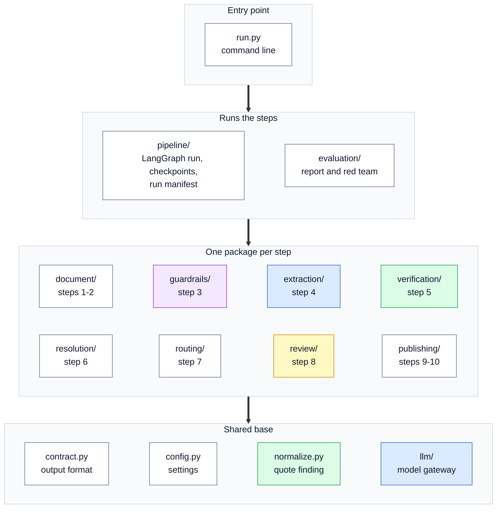
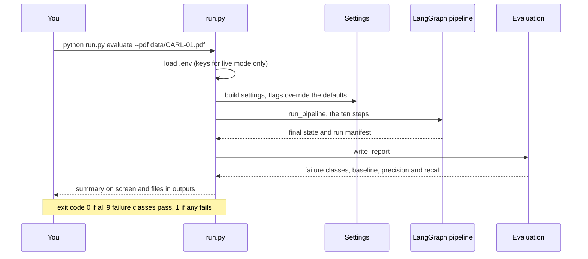

# 🧰 16 — Tech Stack, Config and Commands: the tools, the settings, and how to run everything

> **In one line:** A small set of Python libraries, one settings file, and one command-line tool (`run.py`) run the whole project, and it all works offline with no API key.

---

## 🧭 Where this fits

This is a reference page. Use it to look things up: which library does what, which setting changes what, and which command to run. For the reasons behind the design, see [15 — Decisions, Trade-offs and Limits](15_DECISIONS_TRADEOFFS_AND_LIMITS.md).

**Language:** Python 3.11 or later (from `pyproject.toml`). Project version **0.2.0**.

---

## 🧱 The libraries

From `requirements.txt`. Each one is here for a reason.

| Library | Version | Used for | Why it earns its place |
| :--- | :--- | :--- | :--- |
| **pydantic** | 2.13.4 | The output contract (`contract.py`) | One definition is used four ways: the format the model fills in, the check on every reply, the data the pipeline works on, and what downstream systems receive |
| **pydantic-settings** | 2.15.0 | Settings (`config.py`) | Reads settings from environment variables and `.env`, with types and defaults |
| **pdfplumber** | 0.11.10 | Reading the PDF (step 1) | Gives text with character positions, which makes the published positions real, not approximate |
| **rapidfuzz** | 3.14.5 | The grounding gate's close match; the lexical reranker | Fast fuzzy matching that also says **where** it matched |
| **langgraph** | 1.2.2 | Joining the steps into one run (`pipeline/graph.py`) | Named steps, real branches, and a run that can pause for a person and resume later |
| **litellm** | 1.100.0 | Every model call (the Router) | Named routes, retries and fallback rules. Changing a provider is a settings change |
| **instructor** | 1.17.0 | Structured replies | Every reply is checked against the contract. A reply that does not fit is sent back once with the error |
| **python-dotenv** | 1.2.2 | Loading `.env` | Provider keys for live mode are read from a local file that is never committed |
| **qdrant-client** | 1.19.0 | Optional search backend for reference linking | Named dense and sparse vectors, fused inside Qdrant. Off by default |
| **langgraph-checkpoint-sqlite** | 3.1.1 | Optional: saving a paused run to disk (`--review`) | Lets a run pause in one process and resume in another |
| **pytest** | 8.4.2 | The 109 automated tests | Standard Python test runner |

**Optional means optional.** The core pipeline, the evaluation and all the tests run without Qdrant and without the SQLite checkpointer. `python run.py doctor` shows which ones are installed.

### 🚫 Deliberately not used

| Not used | Why |
| :--- | :--- |
| **LangChain** | Nothing left for it to do: LangGraph runs the steps, LiteLLM calls the models, pdfplumber reads PDFs, and code splits clauses by their numbers |
| **A vector store in extraction** | Extraction reads a document we already have. Search is used only to link references and to match clauses across revisions |
| **A table-extraction engine** | Annex 1 is one clause; its 15 product-to-standard links come from the plain text |
| **An AI judge as a gate** | The optional judge only orders the review queue |

---

## 🔗 How the parts depend on each other

This diagram shows which parts use which. Arrows point from a part to what it uses. The shared base at the bottom is used by almost everything.



A few details from the real imports:
- `extraction/` and `routing/judge.py` call models through `llm/gateway.py`. No other step package calls a model directly. (`guardrails/` receives the gateway as a parameter.)
- `verification/`, `resolution/` and `review/` all use `normalize.py`. The **same** quote-finding code checks a model's quote and a reviewer's correction.
- `publishing/` uses `verification/verify.py` (fact signatures) and `resolution/vectors.py` (clause matching for the diff).

---

## ⚙️ Settings (environment variables)

Settings live in `regextract/config.py`. Each one can be set in the environment or in a local `.env` file (copy `.env.example`). **Nothing is required to run offline.** Command-line flags override some of them (see [Commands](#-commands)).

### 🔌 Run mode

| Variable | Description | Default |
| :--- | :--- | :--- |
| `REGEXTRACT_OFFLINE` | `1` = replay recorded replies or use the offline stand-in (no key, no cost). `0` = call real models (same as `--live`) | `1` (offline) |
| `REGEXTRACT_RECORD` | Save live replies as cassettes, for exact replay later (same as `--record`) | `0` |

### 🧠 Models

| Variable | Description | Default |
| :--- | :--- | :--- |
| `REGEXTRACT_PRIMARY_MODEL` | The main extraction model (route `primary`). It has **no fallback** on purpose | `anthropic/claude-opus-5` |
| `REGEXTRACT_SECOND_MODEL` | The agreement model (route `second`). Must be a **different family** | `openai/gpt-4.1` |
| `REGEXTRACT_SECOND_FALLBACKS` | Backups for the second model. Entries in the primary's family are dropped at start-up | `["groq/openai/gpt-oss-120b"]` |
| `REGEXTRACT_AGREEMENT` | Run the second model at all (`--no-agreement` turns it off) | `1` |
| `REGEXTRACT_GUARDRAIL_MODEL` | The optional safety model (route `guardrail`) | `groq/openai/gpt-oss-safeguard-20b` |
| `REGEXTRACT_JUDGE_MODEL` | The optional triage judge (route `judge`). Deliberately not the primary's family | `groq/openai/gpt-oss-120b` |
| `REGEXTRACT_EMBEDDING_MODEL` | Embeddings for reference linking in live mode | `text-embedding-3-small` |
| `REGEXTRACT_RERANK_MODEL` | A model reranker, e.g. `jina_ai/jina-reranker-v2-base-multilingual`. Empty = the built-in lexical reranker | *(empty)* |

### 📞 Calls and retries

| Variable | Description | Default |
| :--- | :--- | :--- |
| `REGEXTRACT_MAX_TOKENS` | Reply budget per call. On current models it covers thinking **and** output together, so leave headroom | `4000` |
| `REGEXTRACT_TEMPERATURE` | Randomness of the model's replies. 0 = as repeatable as possible | `0.0` |
| `REGEXTRACT_CONCURRENCY` | Parallel calls in live mode | `4` |
| `REGEXTRACT_NUM_RETRIES` | Transport retries per call (rate limits, timeouts, server errors), done by the LiteLLM Router | `2` |
| `REGEXTRACT_REQUEST_TIMEOUT` | Seconds before a call times out | `120.0` |
| `REGEXTRACT_VALIDATION_RETRIES` | How many times a reply that breaks the contract is sent back with the error (Instructor) | `1` |
| `REGEXTRACT_INSTRUCTOR_MODE` | How structure is requested: `tool_call`, `json_schema` or `json` | `tool_call` |

### 🧩 Optional integrations

| Variable | Description | Default |
| :--- | :--- | :--- |
| `REGEXTRACT_USE_GUARDRAILS` | Turn on the safety model. The regex scanner **always** runs anyway | `0` |
| `REGEXTRACT_USE_JUDGE` | Turn on the triage judge (orders the queue only) | `0` |
| `REGEXTRACT_USE_QDRANT` | Use Qdrant for reference-linking search | `0` |
| `QDRANT_URL` | Where Qdrant runs. `:memory:` = inside the process | `:memory:` |
| `QDRANT_COLLECTION` | Qdrant collection name | `regextract_clauses` |

### 🔗 Reference linking

| Variable | Description | Default |
| :--- | :--- | :--- |
| `REGEXTRACT_RESOLVE` | Link external references to the corpus catalogue, or say NOT_FOUND | `1` |
| `REGEXTRACT_CATALOG` | The corpus catalogue file | `data/corpus_catalog.json` |
| `REGEXTRACT_DISTRACTORS` | About 200 unrelated titles mixed in as noise | `data/distractor_titles.txt` |
| `REGEXTRACT_RESOLUTION_MIN_SCORE` | The floor for the lexical reranker. Below it: NOT_FOUND | `0.90` |
| `REGEXTRACT_RESOLUTION_MIN_SCORE_MODEL` | The floor for a model reranker (needs calibrating) | `0.50` |
| `REGEXTRACT_RESOLUTION_CANDIDATES` | How many candidates the search keeps | `10` |

### 🧑‍⚖️ Human review

| Variable | Description | Default |
| :--- | :--- | :--- |
| `REGEXTRACT_REVIEW` | `1` = pause the run at `human_review` for a person (same as `--review`) | `0` |
| `REGEXTRACT_CHECKPOINTS` | Where a paused run is saved | `outputs/checkpoints.sqlite` |

### 🚦 Grounding and routing thresholds

| Variable | Description | Default |
| :--- | :--- | :--- |
| `REGEXTRACT_FUZZY_THRESHOLD` | Minimum similarity (out of 100) for a close match in the grounding gate. Higher = stricter | `92` |
| `REGEXTRACT_THRESHOLD_HIGH` | Auto-publish bar for high-impact facts (plus full agreement and all rule checks) | `0.90` |
| `REGEXTRACT_THRESHOLD_MEDIUM` | Auto-publish bar for medium-impact facts | `0.80` |
| `REGEXTRACT_THRESHOLD_LOW` | Auto-publish bar for low-impact facts | `0.75` |
| `REGEXTRACT_MAX_UNGROUNDED` | If more than this share of quotes is not found, the whole document goes to review | `0.05` (5%) |

> [!WARNING]
> The three routing thresholds are **placeholders**, not calibrated. `.env.example` says so too.

### 🔑 Provider keys (only for `--live`)

| Variable | Used for |
| :--- | :--- |
| `ANTHROPIC_API_KEY` | The default primary model |
| `OPENAI_API_KEY` | The default second model |
| `GROQ_API_KEY` | The second-run fallback, the judge and the safety model |
| `MISTRAL_API_KEY`, `GEMINI_API_KEY` | Accepted as "a key is present"; the live run used Mistral |
| `JINA_API_KEY` | The optional Jina reranker and embeddings |

**Fixed version labels** (in `config.py`, not settings): pipeline `0.2.0`, prompt `extract-v1`, taxonomy `taxonomy-v1-10types`. They are written into every fact's provenance and into the cassette keys.

### 🔒 Security rules

1. **Never** commit `.env`. It is in `.gitignore`, and it was left out of the submitted zip.
2. `.env.example` holds setting names only, never values.
3. If the folder is ever shared with a real `.env` inside it, rotate (replace) the keys.

---

## 💻 Commands

Run everything from the `regextract/` folder. The default document is `data/CARL-01.pdf`.

| Command | What it does | Example |
| :--- | :--- | :--- |
| `doctor` | Checks which libraries are installed and prints the current settings | `python run.py doctor` |
| `extract` | Runs the pipeline and writes the outputs | `python run.py extract --pdf data/CARL-01.pdf` |
| `evaluate` | Runs the pipeline, then writes the evaluation report. **Exits with an error if any failure class fails** | `python run.py evaluate --pdf data/CARL-01.pdf` |
| `redteam` | Adds 7 scripted attacks to real clauses and reports what the guard step caught | `python run.py redteam --pdf data/CARL-01.pdf` |
| `review` | Resumes a run that paused for a person, with their decisions | `python run.py review --thread <run id> --decisions my_decisions.json` |
| `verify-log` | Checks the hash chain of the publish log | `python run.py verify-log` |
| `diff` | Compares two runs (two revisions) and prints the change event | `python run.py diff --previous A.json --current B.json` |

### Flags

| Flag | Works with | What it does |
| :--- | :--- | :--- |
| `--pdf` | extract, evaluate, redteam | The document to read (default `data/CARL-01.pdf`) |
| `--issuer` | extract, evaluate, redteam | The issuer name written into the output (default `ESMA`) |
| `--jurisdiction` | extract, evaluate, redteam | The jurisdiction code (default `AE`) |
| `--out` | extract, evaluate, redteam, review | The output folder (default `outputs/`). For `review` it must match the paused run's folder |
| `--out` | diff | A file to save the change event in |
| `--live` | extract, evaluate, redteam | Call real models (needs a provider key) |
| `--record` | extract, evaluate, redteam | Save live replies to `cassettes/` for exact replay |
| `--qdrant` | extract, evaluate, redteam | Use Qdrant for reference-linking search |
| `--guardrails` | extract, evaluate, redteam | Turn on the safety model (the regex scanner always runs) |
| `--judge` | extract, evaluate, redteam | Turn on the triage judge |
| `--no-agreement` | extract, evaluate, redteam | Single model run only; agreement becomes "unavailable" (0.5), not "agreed" |
| `--inject-faults` | extract, evaluate, redteam | Plant invented text in some quotes, so the grounding gate has something to stop |
| `--review` | extract only | Pause for a person when facts need review |
| `--thread`, `--decisions` | review only | The run id to resume, and the decisions file |
| `--log` | verify-log only | Path to a publish log (default `outputs/publish_log.jsonl`) |
| `--previous`, `--current` | diff only | The two `extractions.json` files to compare |

### How a command runs

This diagram shows what happens when you type `python run.py evaluate`.



---

## 📦 Output files

All written to `outputs/` (or the `--out` folder). The folder is in `.gitignore`: every run makes it again. Saved examples are in `samples/`.

| File | What it contains | Made by |
| :--- | :--- | :--- |
| `clauses.json` | The clause tree: ids, headings, text, page and character ranges | every run |
| `extractions.json` | Every fact, with evidence, rule checks, score, decision, provenance, and a corpus link on external references | every run |
| `review_queue.csv` | What a person still has to check, most urgent first, with reasons | every run |
| `publish_log.jsonl` | The append-only, hash-chained record of every publication and reviewer decision | every run |
| `run_manifest.json` | Every stage: timing, counters, cost, the models that answered, settings, flags | every run |
| `eval_report.md`, `eval_summary.json` | Failure classes, the baseline number, precision and recall, reference linking | `evaluate` |
| `redteam_report.md` | What the guard step caught and missed | `redteam` |
| `pending_review.json`, `decisions.template.json` | The review queue and a blank decisions form | `extract --review` |
| `checkpoints.sqlite` | The saved paused run | `extract --review` |

Reviewer corrections are also appended to `gold/reviewer_corrections.jsonl`.

---

## 🗂️ Project layout

```text
regextract/
  run.py               the command line
  requirements.txt     libraries, with versions
  .env.example         setting names, no values
  README.md            what it is, the stack, the limits
  RUNBOOK.md           how to run and check every part, step by step
  regextract/
    config.py          settings and feature flags
    contract.py        the output contract (pydantic)
    normalize.py       text normalisation and quote finding
    pipeline/          graph.py, checkpointing.py, observability.py
    document/          ingest.py, segment.py              (steps 1-2)
    guardrails/        rails.py                           (step 3)
    extraction/        extract.py, prompts.py             (step 4)
    llm/               gateway.py, routes.py, cassette.py, stub.py
    verification/      verify.py                          (step 5)
    resolution/        retrieval.py, vectors.py           (step 6)
    routing/           route.py, judge.py                 (step 7)
    review/            review.py                          (step 8)
    publishing/        publish.py, publog.py              (steps 9-10)
    evaluation/        evaluate.py, redteam.py
  data/                CARL-01.pdf, corpus_catalog.json, distractor_titles.txt
  gold/                section_5.json, resolution.json (hand-labelled answers)
  cassettes/           recorded replies from the live run
  samples/             saved outputs and reports
  tests/               109 tests
  DOCS/                these documents
```

---

## 🩺 Where to look when something is wrong

From `RUNBOOK.md`.

| Symptom | Look at |
| :--- | :--- |
| A stage errored | `outputs/run_manifest.json`: the `stages` list names it |
| Clauses missing or wrong | `outputs/clauses.json`, then `regextract/document/segment.py` |
| Too much going to review | `review_queue.csv`: the `reasons` column says why for each fact |
| A clause with no facts at all | The `extraction_failed` flag and the top rows of `review_queue.csv` |
| Grounding failures | Usually the quote does not match the source. Check `match` in the queue; many `fuzzy` matches mean the text layer is damaged |
| Costs higher than expected | `model_calls` in the manifest. Check `by_source`: anything not `cassette` was paid for |
| Answers from an unexpected model | `served_models` and `fallbacks_used` in the manifest, `model_version` on each fact |
| Truncated model output | `model_calls.errors`. Raise `REGEXTRACT_MAX_TOKENS`: it caps thinking and output together |
| A reference not linked | The fact's `resolution.reason` says which candidate came closest and why it was refused |
| A review run will not resume | `run.py review` names the problem. The run id must match the paused run, and `--out` must match its output folder |

---

## 📚 See also

- [01 — System Overview](01_SYSTEM_OVERVIEW.md): what the commands actually run
- [05 — Extraction and Model Gateway](05_EXTRACTION_AND_MODEL_GATEWAY.md): routes, retries, cassettes and the offline stand-in
- [12 — Evaluation and Testing](12_EVALUATION_AND_TESTING.md): what `evaluate` and `pytest` check
- [17 — Glossary](17_GLOSSARY.md): every technical word in plain English
- [18 — Presentation Guide](18_PRESENTATION_GUIDE.md): the demo, command by command
