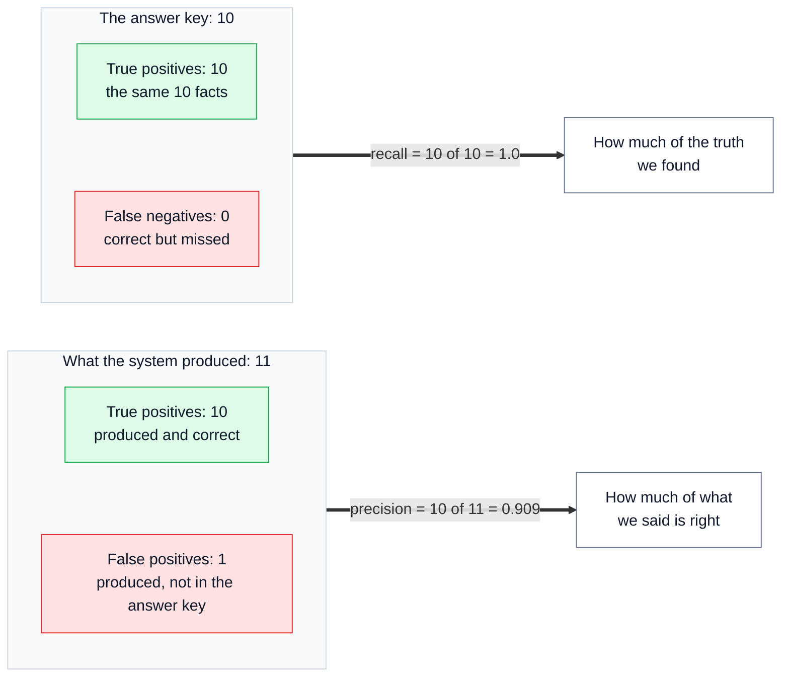
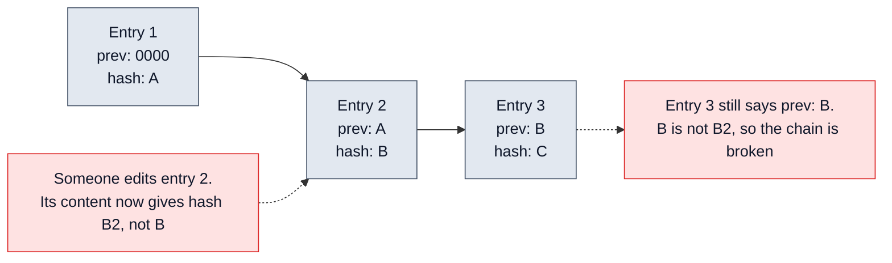

# 📖 17 — Glossary: every technical word, in plain English

> **In one line:** If a word in these docs is new to you, look it up here. Each word has a plain meaning and, where useful, its meaning in this project.

---

## 🧭 How to use this page

- Words are grouped by topic. Inside each group they are in **alphabetical order**.
- **"What it means"** is the general meaning, in simple words.
- **"In this project"** says how regextract uses it, with the file or number where that helps.
- Some words appear in more than one doc. The meaning here is always the same.

**Groups:** [Regulation words](#-1-regulation-and-document-words) · [AI model words](#-2-ai-model-words) · [Files and formats](#-3-files-formats-and-interfaces) · [The output and its checks](#-4-the-output-and-its-checks) · [Calling models](#-5-calling-models) · [Trust, scoring and review](#-6-trust-scoring-and-review) · [Testing](#-7-testing-and-evaluation) · [Security](#-8-security) · [Hashes and the log](#-9-hashes-and-the-audit-log) · [Search](#-10-search) · [Running the pipeline](#-11-running-the-pipeline) · [Production](#-12-production-and-operations) · [Change over time](#-13-change-over-time)

---

## 📜 1. Regulation and document words

| Word | What it means | In this project |
| :--- | :--- | :--- |
| **CARL-01** | The identification number of the sample document | "Requirements for Registration of Low Voltage Equipment", 8 pages, revision 4, from the UAE. It has 73 clauses |
| **Clause** | One numbered part of a legal document, such as "5.1" or "7.1.1.6" | Code builds a tree of clauses from the numbering. Unnumbered parts get made-up ids: FEES, CONTACT, ANNEX-1 |
| **Cross-reference** | A place where the text points to another place: "see clause 4" | Internal ("clause 4 of this document") or external ("clause no. 6 of ECAS General Requirements") |
| **Downstream system** | Any other software that uses our output | Compliance, risk and workflow systems that act on the facts |
| **ECAS** | Emirates Conformity Assessment Scheme | CARL-01 writes it out two different ways ("Scheme" and "Systems"). The system flags this |
| **Entity** | A named thing that matters legally: an organisation, a date, an amount, a product type, a standard | 11 entity types, such as `organisation`, `time_period`, `standard_reference` |
| **ESMA** | Emirates Authority for Standardization and Metrology, the UAE standards body | The issuer of CARL-01 |
| **Federal Law No. 28** | The UAE law that CARL-01 names in clause 5.1 | One of the two real documents in the test catalogue for reference linking |
| **IEC, BS, GSO, UAE.S standards** | Technical standards from different bodies: IEC (international), BS (British), GSO (Gulf), UAE.S (UAE) | Written like "IEC 60335-1: 2007". The year inside is **not** a date entity. Standard codes are matched by exact rules, never by similarity |
| **Jurisdiction** | The country or region where a law applies | CARL-01's jurisdiction is `AE` (the UAE) |
| **Modality** (obligation strength) | How strong a rule is: must, should, may | Values: `shall`, `must`, `should`, `may`, `reserves_right` (the authority may act if it wants) |
| **Obligation** | A duty: someone must (or may, or should) do something | Stored as who (subject), how strongly (modality), what (action) and when (condition) |
| **Revision** | A new version of the same document | CARL-01 is revision 4. Step 10 compares revisions |
| **Taxonomy** | The agreed list of categories | 10 clause types, 11 entity types, and the obligation strengths. Version `taxonomy-v1-10types` |

---

## 🧠 2. AI model words

| Word | What it means | In this project |
| :--- | :--- | :--- |
| **AI model / LLM** | A program trained on a lot of text that can read and write language. LLM means "large language model" | Used only in step 4 to extract facts, plus the optional safety model and judge |
| **Confidence** | A number from 0 to 1 that the model gives about its own answer | The **weakest** signal. Weight 0.20 in the score. It mostly breaks ties |
| **Model family** | Models trained by the same company share a family, and often share blind spots | Primary: Anthropic family. Second: OpenAI family. `groq/openai/gpt-oss-120b` is an OpenAI-family model, served by Groq |
| **Prompt** | The text we send to the model: instructions plus the input | One prompt per clause, version `extract-v1` |
| **Structured output** | A reply in a fixed format (fields and types), not free text | Every reply must fit the pydantic contract |
| **System prompt** | The fixed instructions that come before the input | The same for every clause, so providers can cache it |
| **Temperature** | A setting for how random the model's words are. 0 = as repeatable as possible | Set to `0.0` |
| **Token** | A small piece of text the model reads or writes, about three quarters of a word | Cost is counted in tokens: about 2,000 in and 400 out per call |
| **Truncation** | The model's reply is cut off because it hit its size limit | Recorded as an error (`finish_reason=length`), and the clause fails closed |

---

## 📄 3. Files, formats and interfaces

| Word | What it means | In this project |
| :--- | :--- | :--- |
| **API** | Application Programming Interface: a way for one program to ask another program for something | Model providers are called through their APIs |
| **API key** | A secret password that lets a program use an API | Only needed for `--live`. Kept in `.env`, never committed |
| **HTML** | The format of web pages | Not built yet; phase 3 |
| **JSON** | A common text format for data, with names and values in curly brackets | The outputs `clauses.json` and `extractions.json` |
| **JSON Lines** | A file with one JSON record per line | The publish log `publish_log.jsonl` |
| **OCR** | Optical Character Recognition: turning a picture of text (a scan) into real text | Not built yet. It would change the close-match settings |
| **PDF** | Portable Document Format: a common file type for documents | The input. Read with pdfplumber |
| **Schema** | A description of what fields a piece of data must have, and their types | Made from the pydantic contract and given to the model |
| **Text layer** | The hidden, real text inside a PDF (behind what you see) | It has damage: stray "U" letters left by underlined headings |

---

## ✅ 4. The output and its checks

| Word | What it means | In this project |
| :--- | :--- | :--- |
| **Agreement** | Whether two different models gave the same fact | 1.0 = same fact; 0.0 = different; 0.5 = no second answer (unknown, not "disagree"). Weight 0.45 |
| **Fuzzy match** (close match) | Two texts that are almost, but not exactly, the same | Pass 3 of the grounding gate: similarity ≥ 92 of 100, with the same numbers and "not" words. **Always** goes to a person |
| **Grounded / grounding** | A fact is "grounded" when its supporting words really exist in the source | Our code checks this for every fact. Not grounded = score 0 |
| **Grounding gate** | The check that blocks any fact whose quote we cannot find | The centre of the design. `locate()` in `normalize.py` |
| **Normalisation** | Cleaning text before comparing it: same spaces, same quote marks, lower case | Lets "60335-\n2-13" match "60335-2-13" |
| **Offset** (character position) | The number of characters from the start of the text to a point | We compute it from where **we** found the quote. The model never gives it |
| **Output contract** | The fixed format of the output that other systems rely on | `contract.py`. It is "the product, not the prompt" |
| **Provenance** | The record of where something came from | On every fact: model asked for, model that answered, prompt version, taxonomy version, run id, date |
| **Pydantic** | A Python library that defines data shapes and checks data against them | Defines the contract once; used four ways |
| **Quote** | The exact words from the source that support a fact | The model must copy it word for word, even with typos |
| **rapidfuzz** | A fast Python library for close text matching | Used in pass 3 of the grounding gate and in the lexical reranker |
| **Self-consistency** | Asking the same model twice and comparing | Measures how much one model varies, not whether it is right. We avoid it by using two families |
| **Served model** | The model that actually answered (it can differ from the one asked for) | In the live run, Mistral answered with `ministral-8b-2512` instead of the model requested. Provenance caught it |
| **Validator** (rule check) | A simple coded check on a fact | For example: a money amount must have a currency next to it. Weight 0.35 |

---

## 📞 5. Calling models

| Word | What it means | In this project |
| :--- | :--- | :--- |
| **Fallback** | A backup model used when the first one fails | The primary has **none** on purpose. The second model may fall back, but only to a different family |
| **Gateway** | One single door that all model calls go through | `llm/gateway.py`. It records cost, time and the served model for every call |
| **Instructor** | A Python library that checks a model's reply against a pydantic format and asks again if it does not fit | 1 validation retry: the invalid reply is sent back with the error |
| **LiteLLM** | A Python library that calls many model providers in the same way | Its Router gives named routes, retries and fallbacks |
| **Retry** | Trying the same call again after a failure | 2 transport retries (network errors, timeouts, rate limits) |
| **Route** | A named job for a model: `primary`, `second`, `guardrail`, `judge` | Code asks for a route, never for a model name. Changing provider is a settings change |

---

## 🚦 6. Trust, scoring and review

| Word | What it means | In this project |
| :--- | :--- | :--- |
| **Auto-accept** | Published without a person checking it | Only if grounded, above the bar for its impact tier, and with no warning signs |
| **Calibration** | Setting a threshold from measured results, not from a guess | Planned: precision per type and per confidence band, measured on the gold set |
| **Fail closed** | When something goes wrong or is unknown, stop and ask a person, rather than carry on | A failed call becomes `extraction_failed`, never "no facts" |
| **Human in the loop** | A person checks the system's work at key points | Step 8, with pause and resume |
| **Impact tier** | How much harm a wrong fact could cause: high, medium or low | Sets the bar for auto-publishing (0.90 / 0.80 / 0.75) |
| **LLM-as-judge** | Using an AI model to rate another model's output | Here only for **triage** (ordering the queue). It never decides |
| **Review queue** | The list of facts waiting for a person | `review_queue.csv`, most urgent first, each with reasons |
| **Routing** | Deciding where each fact goes: publish, or to a person | Step 7, `routing/route.py` |
| **Score** | One number from 0 to 1 that combines the checks | 0.45 × agreement + 0.35 × rule checks + 0.20 × confidence. Not grounded = 0 |
| **Silent failure** | An error that looks like a normal result, so nobody notices | For example, an invented fact, or a failed call that looks like "no facts". The design exists to stop these |
| **Threshold** | The minimum score needed to pass | Placeholders today; calibrated in production |
| **Triage** | Deciding the order in which to deal with things, most urgent first | What the optional judge does |

---

## 🧪 7. Testing and evaluation

| Word | What it means | In this project |
| :--- | :--- | :--- |
| **Abstention** | Correctly saying "there is nothing here" | CARL-01 has no money amounts, no named people and no effective date. The system must extract none |
| **Baseline** | A number to compare against | How many facts a pipeline **without** the grounding gate would have published wrongly. With planted faults: 18 of 153 |
| **Cassette** | A saved copy of a real model reply, replayed later | `cassettes/`. The live run replays offline for free |
| **CI** | Continuous Integration: tests that run automatically on every change | `pytest` plus `run.py evaluate` is the gate |
| **Deterministic** | Gives exactly the same output every time for the same input | The stub, the code checks and the item ids are deterministic |
| **F1** | One number that combines precision and recall | Section 5 entities: F1 0.952 (offline) |
| **Failure class** | A common type of problem, with a real example and an automated check | 9 classes, A to I. 9 of 9 pass offline |
| **False negative** | Something correct that the system missed | Lowers recall |
| **False positive** | Something the system found that is wrong (or not in the answer key) | Lowers precision |
| **Gold set** | Answers checked by experts, used to measure the system | Today about a dozen items (section 5). In production, a few hundred documents |
| **Live mode** | Calling real AI models (costs money, needs keys) | `--live` |
| **Offline mode** | Running with no real AI model and no cost | The default. Uses cassettes or the stub |
| **Precision** | Of the facts we produced, how many are correct | Section 5 entities offline: 10 of 11 = 0.909 |
| **Recall** | Of the correct facts, how many we found | Section 5 entities offline: 10 of 10 = 1.0 |
| **Red team** | Testing a system by attacking it on purpose | 7 scripted attacks on the guard step (`run.py redteam`) |
| **Regression** | Something that worked before and is now worse | `evaluate` exits with an error if a failure class regresses |
| **Stub** (stand-in) | A simple rule-based program that plays the part of the AI model | `llm/stub.py`. Labelled `source: stub`. Its numbers prove the checks work, not model quality |
| **True positive** | Something the system found that is correct | Section 5 entities offline: 10 |

This diagram shows how the last few words fit together, with the real section-5 numbers.

> [!NOTE]
> The one "false positive" was `5.3: role: supplier`. It may still be correct: the answer key is not complete. And 11 items are far too few to claim quality. The report says both things.

---

## 🔒 8. Security

| Word | What it means | In this project |
| :--- | :--- | :--- |
| **Guardrail** | A safety check around an AI system | Step 3: two layers that look for hidden instructions |
| **Policy classifier** (safety model) | A small AI model that reads text against a written policy and says "safe" or "unsafe" | Optional layer 2, `gpt-oss-safeguard-20b`. If it cannot check a clause, the clause goes to review |
| **Prompt injection** | Hidden instructions inside the input that try to control the AI, like "ignore previous instructions" | Document text is untrusted, because it goes into the prompt |
| **Regex** | Regular expression: a pattern for finding text | Layer 1: 7 patterns, always on, no model needed |
| **Source integrity** | Making sure a document really comes from its issuer and has not been changed | Download from the issuer, store the content hash, alert if the hash changes without a new revision |

---

## 🔐 9. Hashes and the audit log

| Word | What it means | In this project |
| :--- | :--- | :--- |
| **Append-only** | You can only add to the end. You never edit or delete | The publish log |
| **Content hash** | A short fingerprint computed from the content. Change one letter and the fingerprint changes | Fact ids, the document's source hash, cassette keys and the log all use hashes |
| **Hash chain** | A list where each entry holds the hash of the entry before it, like sealed envelopes that each hold the seal number of the previous one | Editing any old entry breaks the chain at a known line. `run.py verify-log` finds it |
| **Idempotent** | Doing the same thing twice has the same effect as doing it once | Re-running an unchanged document adds no new publications |
| **Object lock** | A storage setting that stops anyone, even an administrator, from changing or deleting a file until a set date | Needed in production to make the log tamper-proof |
| **SHA-256** | A standard way to compute a hash (a 64-character fingerprint) | Used for fact ids (first 12 characters), the log entries, and cassette keys |
| **Tamper-evident** | You can **see** if someone changed it | The PoC log is tamper-evident |
| **Tamper-proof** | Nobody **can** change it | Needs object lock underneath the log |

This diagram shows why editing one entry breaks the chain.

---

## 🔎 10. Search

| Word | What it means | In this project |
| :--- | :--- | :--- |
| **BM25** | A classic keyword-search score. Rare words that match count more | Finds exact tokens such as "No. 28" that vectors blur |
| **Cosine similarity** | A number that says how alike two vectors are: 1 = same direction, 0 = unrelated | Used to compare embeddings and to match clauses across revisions |
| **Dense vector / sparse vector** | Dense: a list of numbers for meaning (every position used). Sparse: mostly zeros, one position per word (like a keyword list) | Qdrant keeps both for each catalogue entry |
| **Embedding / vector** | A list of numbers that stands for a piece of text. Similar texts get similar lists | Live: a provider's embedding model. Offline: simple hashed word counts (not about meaning, and labelled so) |
| **Floor** | The minimum score to accept a search result | 0.90 for the lexical reranker, 0.50 for a model reranker. Below it: NOT_FOUND |
| **Hybrid search** | Keyword search and vector search together | BM25 + vectors, fused with RRF |
| **NOT_FOUND** | The honest answer "we do not hold that document" | A valid result. A wrong link is worse than no link |
| **Qdrant** | A vector database | Optional backend for reference linking; in memory by default |
| **Reciprocal rank fusion (RRF)** | A way to merge two ranked lists: each item gets 1 ÷ (60 + its rank) from each list, and the totals decide | Merges the BM25 and vector rankings without comparing their raw scores |
| **Reranker** | A second, more careful step that re-orders the top search results | Lexical by default; a Jina model reranker in the live run |

---

## 🔧 11. Running the pipeline

| Word | What it means | In this project |
| :--- | :--- | :--- |
| **Checkpoint / checkpointer** | A saved copy of the run's state, and the part that saves it | Lets a run pause for a person and resume later |
| **Conditional edge** | A path in the graph that is taken only if a condition is true | For example: go to `judge` only if it is on and no blocking flag fired |
| **Edge** | A connection from one step to the next in a graph | `ingest` → `segment` → ... → `publish` |
| **Interrupt** | LangGraph's way to pause a run and wait for outside input | Used at `human_review` |
| **LangGraph** | A Python library for running steps as a graph, with state, branches, pause and resume | `pipeline/graph.py` |
| **Node** | One step in the graph | `ingest`, `segment`, `guardrails`, `extract`, `verify`, `resolve`, `document_flags`, `route`, `judge`, `human_review`, `publish` |
| **Postgres** | A widely used database | Planned system of record and checkpoint store in production |
| **Resume** | Continue a paused run from where it stopped | `python run.py review --thread <run id> --decisions <file>`, even in a new process |
| **Runtime context** | Live objects a run needs but that are never saved (settings, the model gateway, the run recorder) | Kept out of the state on purpose: a model client cannot be saved in a checkpoint |
| **SQLite** | A small database stored in one file | Holds the paused run: `outputs/checkpoints.sqlite` |
| **State graph** | A graph of steps that pass a shared set of data (the state) from one to the next | The state holds data only |

---

## 🏭 12. Production and operations

| Word | What it means | In this project |
| :--- | :--- | :--- |
| **Backfill** | Processing a large number of old documents at once | About 5,000 documents per jurisdiction; the most expensive part |
| **Batch processing** | Sending many requests to be done later, at a lower price | About half price; used for backfills |
| **Canary** | Trying a change on a small part (5%) of the work first | Every prompt or model change |
| **Circuit breaker** | An automatic switch that turns something off when problems spike | Turns auto-publish off for one type, one jurisdiction or everything |
| **Metric** | A number tracked over time | For example, grounding-failure rate, review rate, override rate |
| **Observability** | Being able to see what the system is doing, and explain a result later | The run manifest today; spans and metrics in production |
| **Prompt caching** | The provider remembers the fixed first part of a prompt, so it costs less next time | The system prompt is identical for every clause |
| **Rollback** | Going back to the previous version | Metadata only: outputs are versioned and keyed on content hash + pipeline version |
| **Run manifest** | One file that records everything about a run | `run_manifest.json`: stages, timings, counters, models, cost, settings, flags |
| **Shadow mode** | The system runs for real but is only checked, not trusted | Phase 1: people review 100% of facts |
| **Span** | A record of one piece of work, with a start and end time | What each stage becomes in production tracing (OpenTelemetry) |

---

## 🔄 13. Change over time

| Word | What it means | In this project |
| :--- | :--- | :--- |
| **Change event** | A small message telling other systems exactly what changed | `changed_obligations`: counts, the changed obligations, renumbered clauses |
| **Delta** | One difference between two versions: added, removed or changed | Only deltas go back to review |
| **Diff** | Comparing two versions to find the differences | Step 10, `run.py diff` |

---

## 📚 See also

- [01 — System Overview](01_SYSTEM_OVERVIEW.md): the whole system in simple words
- [12 — Evaluation and Testing](12_EVALUATION_AND_TESTING.md): precision, recall and failure classes in use
- [16 — Tech Stack, Config and Commands](16_TECH_STACK_CONFIG_AND_COMMANDS.md): the libraries named here
- [18 — Presentation Guide](18_PRESENTATION_GUIDE.md): how to explain these words out loud
