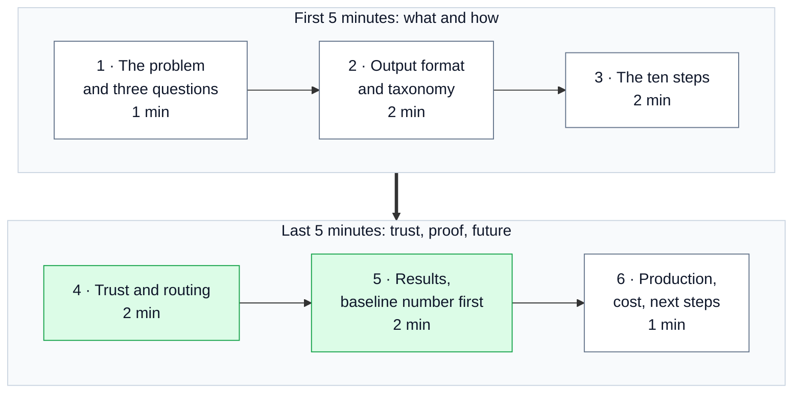
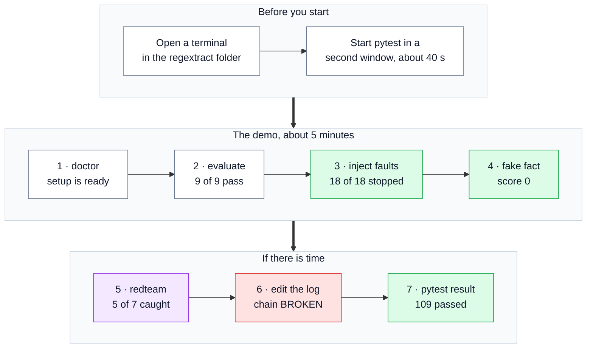
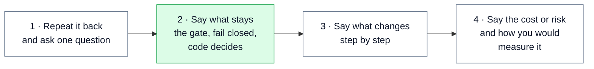

# 🎤 18 — Presentation Guide: how to present this work clearly and with confidence

> **In one line:** Start with the one idea, show the proof with real numbers, name the weak spots yourself, and keep every answer short and simple.

---

## 🧭 How to use this guide

The interview is **90 minutes**. The brief says: "Be ready to walk through your submission, the decisions and alternatives you considered, failure modes, how you would take it into production, and relevant experience." They may also **change a constraint** and ask you to explore an alternative out loud. There is no live coding.

This guide gives you:

1. A **10-minute walkthrough**, with lines you can say and the diagram to show at each point.
2. A **plan for the 90 minutes**.
3. A **live demo script**, command by command.
4. The **numbers to remember**.
5. The **careful points**: small things that are out of date or easy to get wrong.
6. How to handle **"I don't know"** and **a changed constraint**.
7. **Questions to ask them.**

For likely interview questions with answers and follow-up questions, see four separate files next to the submission, outside the code folder: `../../INTERVIEW_QUESTIONS_AND_ANSWERS.md` (65 main questions) `../../INTERVIEW_QUESTIONS_SET_2.md` (50 deeper questions) `../../INTERVIEW_QUESTIONS_SET_3_SENIOR.md` (25 senior-level questions) and `../../INTERVIEW_QUESTIONS_SET_4_PANEL.md` (40 "why this, why not that" panel questions).

---

## ⏱️ The 10-minute walkthrough

This diagram shows the six parts and their timing.



"Diagram N" below means diagram N in `Solution Diagrams.pdf`.

### Part 1 · The problem and the three questions (0:00 to 1:00)

**Show:** `Solution Design.pdf` page 1 (the three-question table), then Diagram 1. **Docs:** [01](01_SYSTEM_OVERVIEW.md).

> "Adherent asked for a system that turns regulatory documents into structured facts that other systems can act on."
>
> "Extracting facts is not the hard part. Models are good at that. The hard part is **trust**."
>
> "So every fact must answer three questions. Where did it come from? How sure are we? Who checks it?"
>
> "My one idea: **the model reads, our code decides.** The model gives us a quote. Our code finds that quote in the document. If we cannot find it, the fact is never published."

### Part 2 · The output format and the taxonomy (1:00 to 3:00)

**Show:** `Solution Design.pdf` section 3, and one real fact from `samples/extractions.sample.json`. **Docs:** [03](03_OUTPUT_CONTRACT.md).

> "I started with the output format, because other systems read the format, not the prompt."
>
> "It is defined once, in pydantic, and used four ways. It is the format the model fills in, the check on every reply, the data the pipeline works on, and what downstream systems receive."
>
> "The model's draft has a quote, but no position. **We** compute the page and character position from where we found the quote."
>
> "Ids come from the content. The same fact always gets the same id, which makes change detection possible."
>
> "The taxonomy has 10 clause types, 11 entity types and 4 obligation strengths."
>
> "An example: clause 11.4 says renewal is required a month before expiry, but never says **who** must renew. If the two models disagree about the subject, the fact goes to a person with the reason `models_disagree`."

### Part 3 · The ten steps (3:00 to 5:00)

**Show:** Diagram 2 (the ten steps), then Diagram 4 (one clause). **Docs:** [01](01_SYSTEM_OVERVIEW.md), [04](04_INGEST_AND_STRUCTURE.md), [05](05_EXTRACTION_AND_MODEL_GATEWAY.md), [06](06_GROUNDING_GATE_AND_VERIFY.md).

> "Ten steps. Only step 4 uses a model to extract. Everything else is normal code with tests."
>
> "Structure is built by code from the numbering. CARL-01 has traps: a clause split across two pages, a section '10' with no full stop, and stray letters left in the text by underlined headings."
>
> "One call per clause, not one per document. That gives exact positions, parallel calls, and a failure costs one clause, not the whole document. It also works for 300-page documents."
>
> "Two model families read every clause. Two families agreeing is evidence. One model agreeing with itself is not."
>
> "The grounding gate tries three ways. First an exact match, then a match with spaces removed. Last, a close match of 92 out of 100 that must keep the same numbers and the same 'not' words. A close match always goes to a person."

### Part 4 · Trust and routing (5:00 to 7:00)

**Show:** Diagram 5 (scoring and routing), Diagram 6 (model routes), Diagram 7 (guard). **Docs:** [07](07_SCORING_AND_ROUTING.md), [08](08_GUARDRAILS.md).

> "Grounding is a gate, not a weight. A fact we cannot find scores zero."
>
> "After the gate, the score is 0.45 for agreement, 0.35 for rule checks and 0.20 for the model's own confidence. Confidence counts least."
>
> "The bar rises with impact. A high-impact fact, such as a date or a validity period, needs 0.90, both models agreeing and every rule check passing."
>
> "Every failure is visible. The primary model has no fallback. If it fails, the clause is flagged, the document is held, and we re-run that clause."
>
> "Document text is untrusted, because it goes into a prompt. Two guard layers look for hidden instructions. A forged sentence written like real regulation passes any filter, so the defence there is source integrity: download from the issuer and watch the content hash."
>
> "An optional AI judge only **orders** the review queue. It never decides anything. The thing being tested cannot also be the test."

### Part 5 · Results, with the baseline number first (7:00 to 9:00)

**Show:** `samples/eval_report_injected_faults.md`, `samples/review_queue.csv`, then Appendix E of the design. **Docs:** [12](12_EVALUATION_AND_TESTING.md), [13](13_LIVE_RUN_RESULTS.md).

> "The baseline first. When I plant **18 invented facts**, the gate stops **all 18**. And because 11.8% is above the 5% limit, the whole document is held. A pipeline without the gate would have published those 18."
>
> "All 9 failure classes pass, and all 109 tests pass."
>
> "To be clear: offline, a rule-based stand-in plays the model. So offline numbers prove the checks work, not how good a model is."
>
> "Then I ran it live, with free-tier models. 146 calls and 353 facts. 18 quotes were not in the source, and the gate stopped them. Nothing was published automatically, because one clause failed and 5.1% of quotes were not found. That is the safe result."
>
> "Provenance caught Mistral answering with a different model from the one I asked for. The live run also found three real bugs, and I fixed them. It cost about two cents."

### Part 6 · Production, cost and next steps (9:00 to 10:00)

**Show:** Diagram 14 (release path), Diagram 13 (quality loop). **Docs:** [14](14_PATH_TO_PRODUCTION.md), [15](15_DECISIONS_TRADEOFFS_AND_LIMITS.md).

> "In production, people first review everything in shadow mode. Then auto-publish is switched on one fact type at a time, only at 95% precision. Every change goes through the evaluation harness, a 5% canary, and a circuit breaker can switch auto-publish off."
>
> "Cost: about $3 for CARL-01 with a frontier model and two runs. A 5,000-document backfill is about $30,000 with batch processing. The backfill is the expensive part, not the monthly running."
>
> "The biggest gap, said plainly: my gold set is about a dozen items, and my thresholds are placeholders. Phase 1 of the rollout exists to fix exactly that."

---

## 🗓️ A plan for the 90 minutes

The interviewers lead. This is only a guide for how your time might go, so you can pace your answers.

| Time | What probably happens | What to have ready |
|---|---|---|
| 0 to 10 min | Your walkthrough | The script above; Diagrams 1, 2, 4, 5 |
| 10 to 25 min | Deep dive on one part (often the grounding gate or routing) | [06](06_GROUNDING_GATE_AND_VERIFY.md), [07](07_SCORING_AND_ROUTING.md); the demo |
| 25 to 45 min | Decisions and alternatives | [15](15_DECISIONS_TRADEOFFS_AND_LIMITS.md): per clause vs whole document, two families, no agent loop, judge not a gate |
| 45 to 60 min | Failure modes and a changed constraint | The 4-step method below; the risk table in [15](15_DECISIONS_TRADEOFFS_AND_LIMITS.md) |
| 60 to 75 min | Production: release, monitoring, cost, scale | [14](14_PATH_TO_PRODUCTION.md) |
| 75 to 85 min | Your experience with systems you shipped | Your own story, mapped with the table below |
| 85 to 90 min | Your questions | The list at the end |

---

## 🖥️ The live demo

Only run the demo if they ask for it, or if a question is easier to answer by showing. Each step is short.

This diagram shows the order.



### Before the interview

- Install once: `pip install -r requirements.txt`. Run the whole demo once the day before.
- Use a bash shell (Git Bash on Windows), from the `regextract/` folder. The `python -c` snippet and `sed` below are bash commands.
- Save the fake-fact snippet (step 4) as a file **outside** the code folder, for example `submission/demo_fake_fact.py`. Then you run `python ../demo_fake_fact.py` and do not have to type it live.
- Running creates an `outputs/` folder inside `regextract/` (and `__pycache__` folders). Git ignores both. **Delete `outputs/` afterwards** if you will zip or push the folder: `rm -rf outputs`.

### The steps

The times are from a real run on 19 September 2026.

| # | Command | What to show | What to say | Time |
|---|---|---|---|---|
| 1 | `python run.py doctor` | Every library `ok`; `agreement: two families (anthropic vs openai)`; `mode: offline` | "It runs for free, with no API key. The two models are from different families." | about 8 s |
| 2 | `python run.py evaluate --pdf data/CARL-01.pdf` | `failure classes 9/9 passing`; the baseline line; section 5 precision and recall | "Nine common problems, each with a real example in CARL-01, all checked automatically." | about 5 s |
| 3 | `python run.py evaluate --pdf data/CARL-01.pdf --inject-faults --out outputs/faults` | `18 of 153 candidate extractions (11.8%) failed the grounding gate` | "I planted invented text in 18 quotes. The gate stopped all 18, and the whole document was held for review." | about 5 s |
| 4 | `python ../demo_fake_fact.py` (the snippet below) | `final score: 0.0`, `decision: review`, `reasons: ['evidence_not_grounded']` | "Confidence 0.99, both models agree, and it still scores zero. Grounding is a gate, not a weight." | about 2 s |
| 5 | `python run.py redteam --pdf data/CARL-01.pdf` | `5 of 7 attacks caught ... 17 ... with it, 5` | "Seven attacks hidden in real clauses. The regex layer catches five. The safety model catches the sixth. The seventh needs source integrity." | about 2 s |
| 6 | the three log commands below | `chain intact`, then `chain BROKEN` and `line 1` | "Every publication is in a hash-chained log. Change one word in an old entry and we can see exactly where." | about 5 s |
| 7 | `python -m pytest -q` (started first, in a second window) | `109 passed` | "109 automated tests, all offline." | about 40 s |

**Step 4, the fake-fact snippet** (copied from `RUNBOOK.md` step 5). Save it as `demo_fake_fact.py`:

```python
import sys; sys.path.insert(0, '.')
from regextract.config import get_settings
from regextract.contract import Evidence, Item, ReviewSignal
from regextract.routing.route import route_item

settings = get_settings(reload=True)
fake = Item(
    item_id='demo', kind='entity', type_name='monetary_threshold', clause_id='11.4',
    payload={'type':'monetary_threshold','text':'AED 50,000','confidence':0.99},
    evidence=Evidence(clause_id='11.4', quote='A penalty of AED 50,000 shall be imposed.', grounded=False),
    review=ReviewSignal(agreement=1.0, validators={'evidence_grounded': False}),
)
routed = route_item(fake, settings)
print('confidence claimed :', fake.payload['confidence'])
print('both models agreed :', fake.review.agreement)
print('final score        :', routed.review.score)
print('decision           :', routed.review.decision.value)
print('reasons            :', routed.review.reasons)
```

**Step 6, edit the log and check it** (after step 2 has written `outputs/publish_log.jsonl`):

```bash
python run.py verify-log                                  # chain intact
cp outputs/publish_log.jsonl outputs/publish_log.backup   # keep a copy
sed -i '1s/auto_accept/reject/' outputs/publish_log.jsonl # change one decision in line 1
python run.py verify-log                                  # chain BROKEN, line 1
cp outputs/publish_log.backup outputs/publish_log.jsonl   # put it back
```

**If something goes wrong during the demo:** stay calm and say what you see. "This stage failed; the run manifest names the stage." Then show the saved result in `samples/` instead. Every demo result is also saved there.

---

## 🔢 Numbers to remember

| What | Number |
|---|---|
| Sample document | CARL-01, 8 pages, **73 clauses** |
| Offline facts | **153**, all found in the source; **133** auto-published, **20** to review (13.1%) |
| Planted fake facts | **18 of 153 (11.8%)**, all stopped; whole document held |
| Document hold trigger | more than **5%** of quotes not found |
| Failure classes | **9 of 9** offline; **6 of 9** live |
| Tests | **109** pass |
| Section 5 precision / recall (offline) | **0.91 / 1.00**, from about **11** hand-labelled items (too few for a quality claim) |
| Reference linking | **8 of 8** offline, **0** wrong links, with about **200** unrelated titles as noise; **6 of 8** live with the Jina reranker |
| Red team | **5 of 7** caught offline (17 → 5 facts auto-published); **6 of 7** live (7 → 3) |
| Live run | **146** calls, **353** facts, **18** stopped, **15** close matches to people, **0** auto-published, **23%** agreement, **77** possible misses, **21** minutes, about **$0.02** |
| Score formula | **0.45** agreement + **0.35** rule checks + **0.20** confidence |
| Thresholds (placeholders) | high **0.90** (plus agreement and all checks), medium **0.80**, low **0.75** |
| Close-match bar | **92** out of 100, same numbers and "not" words |
| Cost (frontier model, 2 runs) | **$0.02** per call; CARL-01 about **$3**; 40 pages about **$12**; backfill about **$60,000**, about **$30,000** with batch |
| Auto-publish rule in production | per type, at **0.95** precision on the gold set |

---

## ⚠️ Careful points

Some small things in the submission are out of date or easy to misstate. Know them before the interview.

| Point | What is true | What to say if asked |
|---|---|---|
| **RUNBOOK.md step 4 says "14 of 153 (9.2%)"** | Re-run on 19 September 2026: **18 of 153 (11.8%)**. `samples/eval_report_injected_faults.md` and the Highlights say 18 too | "That runbook line is from an earlier version of the fault injection. The current number is 18 of 153, as in the saved report." |
| **Diagram 13 says "108 automated tests"** | **109** pass | "The diagram label is one test behind. The suite has 109." |
| **Code comments mention "section 7.3 of the plan"** | "The plan" is my internal planning document, not the submitted design. Section numbers differ | "Those comments point to my working plan. The same content is in the Solution Design, sections 4 and 5." |
| **Offline numbers** | They come from the rule-based stand-in, not a model | "Offline numbers prove the checks work. Model quality needs live runs and a real gold set." |
| **Impact tier of obligations** | It depends on the clause type that the **primary model** gives | "True. A wrong clause label could lower a fact's tier. I would take the stricter tier from both models, or set clause types by code rules." |
| **The "U" heading damage** | Code comments and the design say headings come out as "UINTRODUCTIONU:". With the pinned pdfplumber, the stray "U" sits on its own line and the header/footer rule removes it (26 lines removed in total). The heading-repair rules exist but do not fire on CARL-01; the only 2 repairs unwrap a web link | "I checked this. The result is right, and class A tests the result. The stray letters are removed as repeating lines, not by the repair rules. I would update that comment." |
| **What grounding proves** | The quoted words exist in the source. Not that the model read them correctly | "Grounding stops invented evidence. Wrong readings of real text are caught by agreement, rule checks and review." |

---

## 🙋 When you do not know the answer

It is fine not to know. Guessing is worse. Use three short steps:

1. **Say it plainly.** "I don't know that for certain."
2. **Say how you would find out.** "I would measure it on the gold set" or "I would check the provider's documentation."
3. **Connect it to what you do know.** "What I do know is that the gate would stop an invented quote either way."

---

## 🔄 When they change a constraint

They may say, for example, "What if half the documents are scans?" Use four steps:



**One-line starting answers** (the full answers are in the Q&A file):

| New constraint | Starting answer |
|---|---|
| **Latency now matters** | Keep the gate. Drop the second run for low-impact types. Process clauses as they arrive. |
| **Half the documents are scanned** | OCR at ingest, OCR-tolerant matching, OCR confidence as a routing signal. Expect more review until we have gold data for scans. |
| **Add German** | A language field, German obligation words, a parametrised prompt. Positions work the same. A German gold set before auto-publish. |
| **A new clause type** | Bump the taxonomy version with examples. Run the regression on the gold set. Re-process affected documents and show the differences. |
| **Reviewer capacity is cut in half** | Use the calibration data to lower the bar only for types proven safe, or accept a longer queue. Never loosen the gate or the high-impact bar. Order the queue by impact and uncertainty. Say what it costs in precision. (Raising thresholds would send *more* work to review.) |
| **The provider changes the model** | Pinned versions, provenance of the served model, regression tests, canary, rollback. |
| **"Your cost is too high"** | Batch, cache, cheaper model and single run for low-impact types, re-process only changes, later small models. |

---

## 🎯 Name the weak spot yourself

Say this **before** they ask. It shows ownership, and it takes the question away.

> "The obvious gap is the gold set. It is about eleven items from section 5. That proves the harness computes precision and recall correctly, but it is not a quality claim. My routing thresholds are placeholders for the same reason. The first thing I would build next is a calibration table on a real gold set of a few hundred documents. Phase 1 of the rollout is designed to create exactly that data."

---

## 🧑‍💼 Relevant experience

The brief asks about "systems you have shipped or operated". Use **your own real example**. Map it to this project so the link is clear:

| In this project | In your shipped system |
|---|---|
| Compliance analyst who reviews facts | *(who reviewed your system's output?)* |
| A clause or entity | *(what was your unit of output?)* |
| The taxonomy | *(what rules or categories did you follow?)* |
| Evidence shown to the reviewer | *(how did people see why the system said something?)* |
| Gold set and gates | *(how did you measure quality before release?)* |

Keep it to about two minutes: the problem, your part, one hard decision, and what you measured.

---

## ❓ Good questions to ask them

1. How do your analysts review extractions today, and what does a review decision look like?
2. Do you have labelled data from past analyst work that could seed a gold set?
3. How do your customers use changes: events, an API, or reports?
4. What share of your documents are scans or HTML, and which languages come next?
5. Who owns the taxonomy, and how often does it change?
6. How do you handle model upgrades from providers today?

---

## 🗣️ Say it like this (the 30-second version)

> "regextract turns a regulation into structured facts. The model reads, but our code decides. Every fact carries the exact words it came from, and our code must find those words in the document before the fact can be published. Two different model families read every clause, simple rules check each fact, and the riskier the fact, the higher the bar. Any failure is loud, never silent. When I planted 18 fake facts, the gate stopped all 18."

---

## 📚 See also

- [01 — System Overview](01_SYSTEM_OVERVIEW.md): the whole system, for Part 1 of the walkthrough
- [12 — Evaluation and Testing](12_EVALUATION_AND_TESTING.md): the numbers behind Part 5
- [13 — Live Run Results](13_LIVE_RUN_RESULTS.md): the live run story
- [14 — Path to Production](14_PATH_TO_PRODUCTION.md): Part 6 in detail
- [15 — Decisions, Trade-offs and Limits](15_DECISIONS_TRADEOFFS_AND_LIMITS.md): alternatives and weak spots
- [17 — Glossary](17_GLOSSARY.md): plain meanings, if a word needs explaining
- `../../INTERVIEW_QUESTIONS_AND_ANSWERS.md`: likely questions, answers and follow-ups
- `../../INTERVIEW_QUESTIONS_SET_2.md`: 50 deeper questions: the code, debugging, concepts, harder documents, extensions
- `../../INTERVIEW_QUESTIONS_SET_3_SENIOR.md`: 25 senior-level questions: leading the work, architecture, production AI, risk, ownership
- `../../INTERVIEW_QUESTIONS_SET_4_PANEL.md`: 40 panel questions: why this flow, tool and model, why not RAG or agents, how to cut cost
