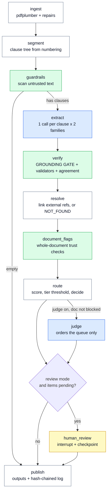

# 2️⃣ How it works

> **In one line:** A LangGraph state machine of eleven nodes, where every model call is bracketed by deterministic code that validates its shape, locates its evidence, checks its claims and decides whether a person must look.

---

## 🔁 The pipeline



The nodes are plain functions from the other modules. The graph adds orchestration, not logic — which is what keeps every stage unit-testable on its own.

**Why a graph at all:** the conditional edges are real (an empty document skips extraction; the judge is skipped when the document is already fully flagged, because ordering a queue nobody will triage is wasted money), and the checkpointer lets a run **pause for a person and resume in another process days later**.

**What never goes in the state:** settings, the model gateway, the run recorder. Those travel in LangGraph's runtime context. A model client is not serialisable, and putting it in the state breaks the checkpointer outright.

---

## 📦 The output contract

`contract.py` is the deliverable. Downstream systems read these objects, never the prompts. One pydantic definition, used four ways:

1. the JSON Schema handed to the model as an enforced output format
2. runtime validation of the reply
3. the shape `verify` and `route` operate on
4. the shape published downstream

**The critical split:** `*Draft` models are what the LLM may produce. They contain a `quote` and **no offsets**.

```python
class Evidence(BaseModel):
    clause_id:  str
    page:       int | None      # computed by us
    char_start: int | None      # computed by us
    char_end:   int | None      # computed by us
    quote:      str             # claimed by the model
    grounded:   bool = False
    match_kind: MatchKind = NONE    # exact | fuzzy | none
    match_score: float = 0.0
```

An `Item` is **flat on purpose** — facts are not nested inside clauses — because routing, review queues and evaluation all work over a single list whatever kind of fact it is.

---

## 🔧 Stage by stage

### 1. Ingest
pdfplumber for the text layer with character positions. Repairs the text-layer damage that would otherwise break everything downstream: header/footer furniture removed (26 lines on CARL-01), headings damaged by underline artefacts repaired (2), soft hyphens and unicode punctuation folded. Records a `source_hash` — which is also the change-detection anchor and the source-integrity signal.

### 2. Segment
Builds the clause tree from **numbering**, not from a model. Distinguishes a clause number from a table row (Annex 1's 15 rows are not 15 clauses). Handles irregular numbering — "10" with no full stop, unnumbered FEES/CONTACT sections get synthetic ids, depth 4 (7.1.1.6). Emits a `structure_report`: numbering gaps, duplicate ids, max depth. Gaps and duplicates become blocking document flags.

### 3. Guardrails
The document is **untrusted input** — it is fetched from an issuer's website and its text goes into a prompt. A deterministic pattern scanner always runs; an optional policy classifier runs when enabled. Any clause either layer flags is **forced to review at routing**, regardless of score. High-severity findings also raise a document flag.

> The clause still goes to the model. Refusing to extract would create a blind spot exactly where someone wants one.

### 4. Extract
**One call per clause**, with the parent headings and a digest of the document's definitions as context. Per clause rather than per document gives exact offsets, parallelism, bounded cost, and per-clause retry and evaluation.

With agreement on, every clause is extracted **twice** — once with the primary, once with a **different provider family**. Two samples from one model measure that model's variance; two families disagreeing is evidence.

**The gateway** (`llm/gateway.py`) is the only place a model is called. Callers name a *route* (`primary`, `second`, `judge`, `guardrail`), never a provider. Behind it: LiteLLM Router (transport retries, fallback policy), Instructor (every reply validated against the contract, invalid replies sent back with the error), and cassettes/stub for offline.

Every call returns a `CallMeta` carrying the model **configured** and the model that **actually answered**. This is not bookkeeping — in the live run, Mistral was asked for `open-mistral-nemo` and served `ministral-8b-2512` on all 72 calls, silently.

**Truncation is treated as an error, not an answer.** `max_tokens` caps thinking *and* output together, so a tight budget cuts a reply off mid-way with no exception raised — a short, complete-looking, wrong answer. The gateway checks `finish_reason` and records `truncated` as an error.

### 5. Verify — where trust is decided

**(a) The grounding gate.** Three passes, cheapest and strictest first:

| Pass | What it does | Why it exists |
|---|---|---|
| 1 | Exact match after collapsing whitespace and folding unicode punctuation | The common case |
| 2 | Exact match with **all** whitespace removed | The PDF breaks tokens across lines: `UAE.S 60335-\n2-13`. A model quoting that writes it whole |
| 3 | Fuzzy at threshold 92, **guarded** — the quote must fit inside the source, and its numbers and negations must match | OCR-style noise, without allowing a change of meaning |

Every pass maps its answer back to offsets in the **original** text via an index map, so published `char_start`/`char_end` always point at the real source.

**(b) Validators.** Deterministic per-type checks: a standard reference must match the standard pattern; a monetary value must have a currency nearby (a number with no currency is almost always a misread); a numeric threshold's digits must appear in the quote; an internal cross-reference must point at a clause that exists; a date must parse.

**(c) Agreement.** Normalised comparison against the second family's output. `1.0` agree, `0.0` disagree, **`0.5` = no second run at all** — an unavailable signal is deliberately distinct from a contested one.

**(d) Possible misses.** Facts the *second* family found and the primary did not are kept, marked `second_model_only`, and routed to a person. The gate catches **wrong** facts; it cannot see **missing** ones. The second family is the only channel that makes misses visible — 77 of them in the live run.

### 6. Resolve
Links external references to documents in the corpus catalogue via hybrid search (BM25 + dense, RRF fusion) → rerank → a score floor below which the answer is **`not_found`**. Most references point at documents we do not hold, and `not_found` is a correct answer — a wrong link is worse than no link. Resolution is **information for downstream, never a routing signal**.

Standard codes (`IEC 60335-1` vs `IEC 60335-2-13`) are handled by exact normalisation rules, not similarity — those two strings look nearly identical to a vector and are different standards.

### 7. Document flags
Whole-document trust checks. When these fire, item-level scores stop being trusted:

| Flag | Blocking? | Meaning |
|---|---|---|
| `extraction_failed` | ✅ | A clause returned nothing usable. A hole looks exactly like "no facts here" |
| `high_grounding_failure_rate` | ✅ | >5% of quotes not located — at this rate, trust nothing else either |
| `numbering_gaps`, `duplicate_clause_ids` | ✅ | The tree is wrong, so clause ids are unreliable |
| `low_ocr_confidence` | ✅ | (reserved for the OCR path) |
| `conflicting_definition` | ❌ **targeted** | A term defined two ways — escalates only the items *using* that term |
| `prompt_injection_suspected` | ❌ targeted | From a high-severity guardrail finding |

### 8. Route
```
score = 0.45·agreement + 0.35·validators + 0.20·confidence      (only if grounded)
```

| Rule | Effect |
|---|---|
| Not grounded | score 0, `evidence_not_grounded`. No score can rescue it |
| Score ≥ tier threshold | auto-accept candidate |
| **High tier** | *also* requires `agreement == 1.0` **and** every validator passing |
| **Fuzzy match** | always downgraded to review — a close match is evidence, not proof |
| `second_model_only` | always review — a possible miss by the primary |
| `primary_call_error` | always review — the call returned *something*, but not trustworthy |
| Blocking document flag | every item on the document → review |

The review queue is ordered by impact tier, then judge priority (if it ran), then score ascending.

### 9. Judge — optional, and deliberately powerless
A third model, from neither the primary's nor the second's family, scores triage priority. It only ever changes the **order** of the review queue. It cannot publish, reject or override. It is skipped entirely when the document is already fully flagged.

### 10. Human review
A real pipeline stage, not a CSV someone must remember to open. The graph pauses at `human_review` via LangGraph's `interrupt()`, the pause is **checkpointed**, and `run.py review` resumes it — in another process — with the reviewer's decisions.

| Decision | Effect |
|---|---|
| `accept` | Publishes as extracted, stamped with the reviewer |
| `reject` | Never publishes |
| `correct` | A new version publishes; the original is **kept** and marked `superseded` |

**One rule applies to all three: a reviewer cannot publish unsupported evidence either.** Accepting an ungrounded item is refused. A corrected quote goes through the same grounding gate. Corrections are appended to the gold set, because reviewer corrections are how the gold set grows.

### 11. Publish, and the log
`published_items()` requires **both** an accepted decision **and** grounded evidence — the second is redundant today, and is there because this is the last boundary before downstream.

`publish_log.jsonl` is append-only and **hash-chained**: every entry carries its own SHA-256 and the hash of the entry before it. `run.py verify-log` names the line where the chain breaks if anything was edited, deleted or reordered. Re-running an unchanged document adds a run record and no new publications.

> A file gives tamper **evidence**, not tamper **resistance**. In production the log also sits in object storage under a compliance lock.

### Stage 10 of the plan — diff
Not a graph node; a comparison between two runs. Clauses are paired **id first, text second** — insert a new 11.2 and the old 11.2 becomes 11.3, so a same-id pair must also look alike, and leftovers are matched by text similarity. Facts are keyed by `(clause, kind, signature)`, so a renumbered clause with unchanged facts produces **no deltas**.

This is the product: a customer who has read revision 4 wants the six obligations that changed in revision 5, not a re-extraction.

---

## 🧪 Offline mode

Default on. Replays recorded responses from `cassettes/` if one exists, otherwise a deterministic rule-based stub answers. No API key, no cost, fully deterministic — which is what makes 109 tests and the whole evaluation harness free to run.

The cassette key is `sha256(model | prompt_version | taxonomy_version | tag | system | user)`, so editing a prompt invalidates the recording rather than silently replaying a stale one.

---

**Next:** [3 — Evidence](3_EVIDENCE.md)
