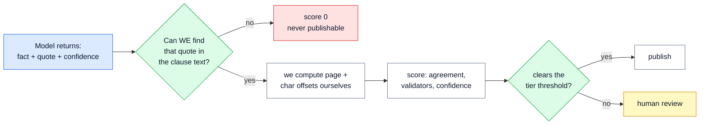

# 📘 regextract — the brief guide

> **Four documents, read in an hour.** The full set in `DOCS/` is nineteen documents written for a mixed audience. This is the same material condensed for an engineer, with the evidence and the limits moved to the front instead of positions 13 and 15.

---

## 🧭 Reading order

| # | Document | What it answers | Read if you have |
|---|---|---|---|
| — | **This page** | The numbers, and the one idea | 3 minutes |
| **1** | [Problem and approach](1_PROBLEM_AND_APPROACH.md) | What was asked, what was built, what was rejected and why | 15 minutes |
| **2** | [How it works](2_HOW_IT_WORKS.md) | The ten stages, the output contract, the trust model | 20 minutes |
| **3** | [Evidence](3_EVIDENCE.md) | What was measured, offline and live, and what the numbers do not show | 15 minutes |
| **4** | [Limits and production](4_LIMITS_AND_PRODUCTION.md) | Known defects, trade-offs, and the path to running this for real | 10 minutes |

**If you have three minutes, read this page and §"What the live run proved" in [3](3_EVIDENCE.md).**

---

## 🎯 The one idea

> A model returns a **quote** and never an offset. **Our code** locates that quote in the clause's own source text and computes the page and character offsets itself. A fact whose quote cannot be located scores zero and can never be published — whatever confidence the model attached to it.

Everything else in the system is downstream of that sentence. The model proposes; code disposes.

---

## 🔢 The numbers

### The system

| | |
|---|---|
| Python | ~5,800 lines, 10 stages, 21 modules |
| Tests | 109, all offline, ~4 seconds, no API key |
| Recorded model responses | 144 cassettes — every live reply, replayable for free |
| Taxonomy | 10 clause types, 11 entity types, 5 modalities |
| Sample document | CARL-01, 8 pages, UAE low-voltage product registration → **73 clauses** |

### The live run (11 Sep 2026, free-tier models, ~$0.02)

| Measure | Value |
|---|---|
| Model calls | 146 (73 clauses × 2 families) — 144 answered, **2 failed on output budget** |
| Facts produced | 353 |
| Quotes found exactly | 320 |
| Found fuzzily (always reviewed) | 15 |
| **Not found — stopped by the gate** | **18 (5.1%)** |
| **Auto-published** | **0 of 353** — two blocking flags held the document |
| Two families agreed | 23% (measurement artefact — see [3](3_EVIDENCE.md)) |
| Facts only the second family found | 77, all routed to review as possible misses |
| Provider silently served a different model | Yes — caught by provenance |
| Wall clock | ~23 min (93.1% in extract, 1 request at a time on free tier) |

### The offline run (deterministic stub, no model)

| Measure | Clean | With injected faults |
|---|---|---|
| Candidate extractions | 153 | 153 |
| Failed the gate | 0 | **18 (11.8%)** |
| Published | 133 | **0** |
| Would have published without the gate | 133 | **18** |
| Failure classes passing | 9 of 9 | 9 of 9 |
| Held for review | 20 (13.1%) | all |

---

## ⚠️ Read this before you trust any number above

| Claim | Status |
|---|---|
| The **machinery** works end to end with real providers | ✅ Demonstrated |
| The gate stops real fabricated quotes | ✅ 18 of 18 in the live run |
| A failed or truncated call holds the document | ✅ Demonstrated |
| Provenance catches a silent model swap | ✅ Demonstrated |
| **Quality** — precision, recall, at any useful scale | ❌ **Not shown.** ~11 labelled items, one document, one jurisdiction, small free models |
| The thresholds are right | ❌ **Placeholders.** Not derived from data, and the code says so in every run manifest |

**The live run used small free-tier models, not the Claude Opus 5 / GPT-4.1 pair the design names.** That was deliberate — the point was to test the brakes, not the engine.

---

## 🗂️ Where the full documents are

This guide condenses `DOCS/01`–`DOCS/18`. Go to the originals for: the PDF text-layer repairs in detail (`04`), the guardrail red-team methodology (`08`), reference linking and the reranker floor (`09`), change detection (`11`), and the full decision log with every rejected alternative (`15`).

`RUNBOOK.md` in the project root has the commands.
